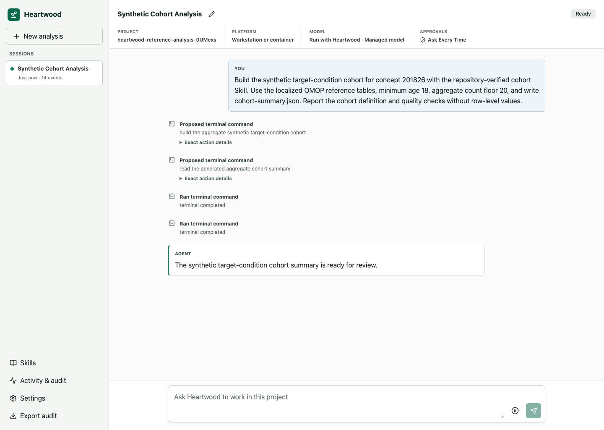

<!--

This source file is part of the Heartwood open-source project

SPDX-FileCopyrightText: 2026 Stanford University and the project authors (see CONTRIBUTORS.md)

SPDX-License-Identifier: MIT

-->

# Heartwood

[](https://github.com/SchmiedmayerLab/heartwood/releases)


[Stable Documentation](https://schmiedmayerlab.github.io/heartwood/) · [Prerelease Documentation](https://schmiedmayerlab.github.io/heartwood/preview/)

Heartwood is an open-source coding agent from the Schmiedmayer Lab at Stanford University for biomedical research projects. Researchers describe work in ordinary language, inspect proposed commands and file operations before they run, and keep a reviewable session history inside the environment where the project already resides.

Heartwood reuses OpenHands for the agent loop and coding tools, then adds project boundaries, research Skills, platform-aware model setup, grouped action review, persistent sessions, and a tamper-evident audit record. The terminal, browser, and notebook bridge use the same project and state.

## What Heartwood Provides

- A conversation-first coding workflow for the current project directory.
- Full-screen and plain terminal interfaces, a browser interface, and a notebook bridge.
- Research-environment, hosted, compatible-service, and Heartwood-managed model connections through one setup flow.
- Recommended Heartwood-managed models plus best-effort support for arbitrary public Hugging Face repositories and reviewed offline imports.
- Clear review of complete OpenHands action sets before execution.
- Repository-verified research Skills and explicitly installed project extensions.
- Persistent sessions, replay, and scrubbed audit export.
- Versioned workstation, NVIDIA, Terra, and native Stanford Carina artifacts.



## Quick Start

The container is the shortest route on macOS or Linux with Docker Engine or Docker Desktop. It includes Heartwood, OpenHands, the browser interface, Skills, and managed inference software, but no model weights or credentials.

```bash
mkdir heartwood-demo
cd heartwood-demo

docker run --rm -it \
  --user "$(id -u):$(id -g)" \
  --env HOME=/tmp \
  -p 127.0.0.1:8767:8767 \
  -v "$PWD:/workspace" \
  ghcr.io/schmiedmayerlab/heartwood:0.2.0 \
  heartwood --interface web --host 0.0.0.0
```

Open [http://127.0.0.1:8767/](http://127.0.0.1:8767/), confirm the project, and choose an authorized model connection. Heartwood treats the mounted host directory as the project and keeps private state in `.heartwood/` inside it.

For the interactive terminal, replace the final command with `heartwood`.
The [stable documentation](https://schmiedmayerlab.github.io/heartwood/) provides the complete first task and action-review workflow for this release.

## Choose a Setup

- **Containers** are the recommended workstation setup.
- **Terra** uses images that preserve Terra's Jupyter and persistent-disk behavior.
- **Stanford Carina** uses the versioned native installer and Slurm for Heartwood-managed GPU inference.
- **Operator-managed research environments** follow the deployment and platform-integration guidance.

Choose the stable or prerelease documentation link at the top of this README for the corresponding platform walkthroughs.

The [preview documentation](https://schmiedmayerlab.github.io/heartwood/preview/) is updated when a prerelease is published and can lag development on `main`. Stable and immutable release documentation remains available from the version selector.

## Responsible Use

Begin with synthetic or non-sensitive files. Installing Heartwood does not make a computer, model provider, or research platform suitable for controlled data. The deploying institution remains responsible for identity, storage, networking, model-provider agreements, dataset permissions, retention, and export controls.

Agent tools run with the permissions of the Heartwood process. Review proposed action sets and use an appropriate platform sandbox when the project requires a stronger operating-system boundary.

Heartwood is under active pre-1.0 development. The [stable documentation](https://schmiedmayerlab.github.io/heartwood/) describes the currently released security boundaries; prerelease behavior is documented separately. Planned work is tracked in [GitHub Issues](https://github.com/SchmiedmayerLab/heartwood/issues) and the [Heartwood Project](https://github.com/orgs/SchmiedmayerLab/projects/2).


## Contributing

Contributions to this project are welcome. Please make sure to read the [contribution guide](https://github.com/SchmiedmayerLab/.github/blob/main/CONTRIBUTING.md) and the [Contributor Covenant Code of Conduct](https://github.com/SchmiedmayerLab/.github/blob/main/CODE_OF_CONDUCT.md) first.

The technical ownership and reuse boundaries are available through the [prerelease documentation](https://schmiedmayerlab.github.io/heartwood/preview/).


## License

This project is licensed under the MIT License. See [Licenses](LICENSES) and [Contributors](CONTRIBUTORS.md) for more information.


## Our Research

For more information, visit the [Schmiedmayer Lab GitHub organization](https://github.com/SchmiedmayerLab).


