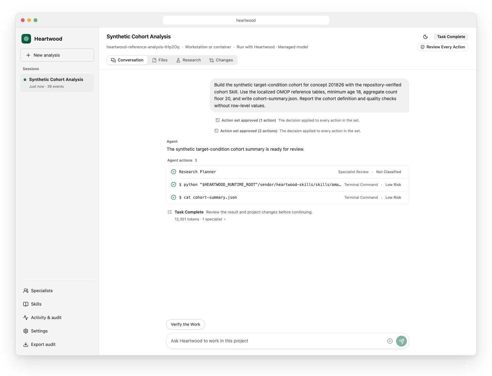
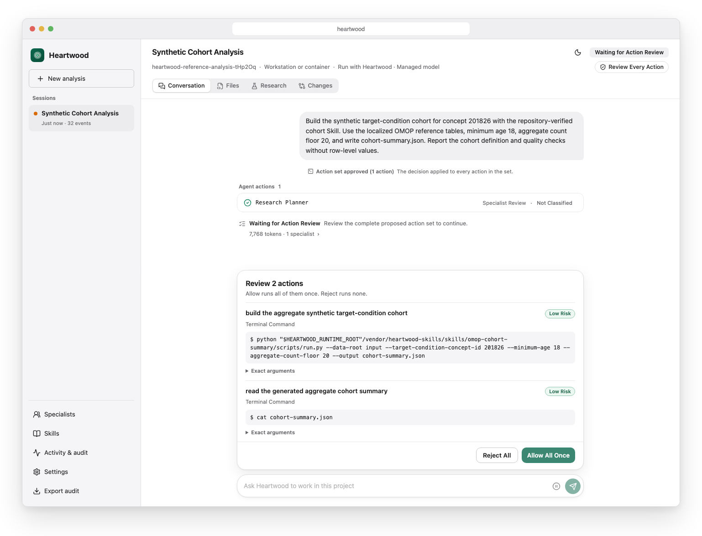
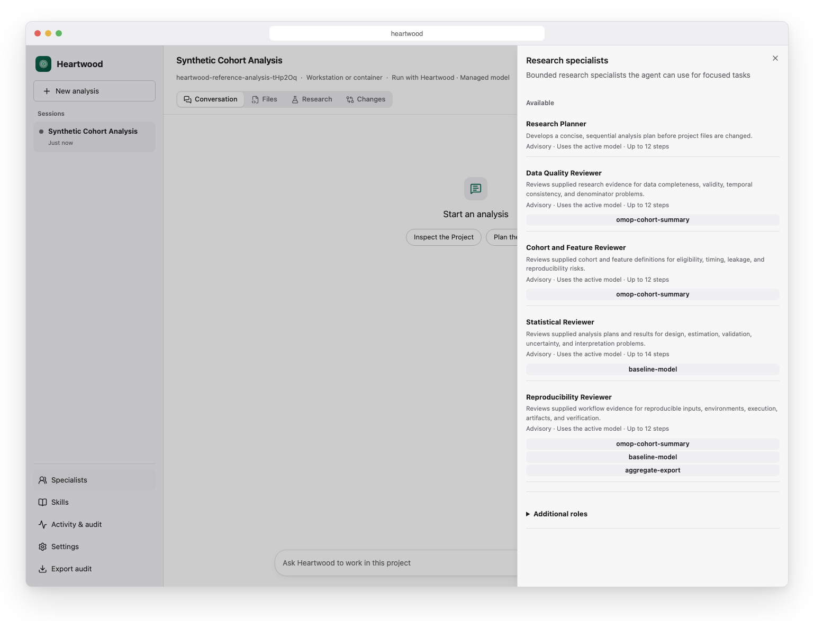

<!--

This source file is part of the Heartwood open-source project

SPDX-FileCopyrightText: 2026 Stanford University and the project authors (see CONTRIBUTORS.md)

SPDX-License-Identifier: MIT

-->

# Heartwood

[](https://github.com/SchmiedmayerLab/heartwood/actions/workflows/main-validation.yml)
[](https://api.reuse.software/info/github.com/SchmiedmayerLab/heartwood)
[](LICENSE.md)
[](https://github.com/SchmiedmayerLab/heartwood/releases)

[Stable Documentation](https://schmiedmayerlab.github.io/heartwood/) · [Prerelease Documentation](https://schmiedmayerlab.github.io/heartwood/preview/)

Heartwood is an open-source, auditable coding agent for biomedical research environments. Researchers can work with code and analysis projects through ordinary language while keeping the active folder as an explicit boundary, reviewing proposed changes before they run, and retaining a verifiable session history.

Heartwood reuses OpenHands for the agent loop and coding tools, then adds project-scoped state, research Skills and specialists, platform-aware model setup, grouped action review, replay, and tamper-evident audit records. One gateway keeps the terminal, browser, and notebook bridge aligned on the same configuration and session state.

## What Heartwood Provides

- A current-directory project boundary with private configuration, models, sessions, and audit state under `.heartwood/`.
- Full-screen and plain terminal interfaces, a browser interface, and a notebook bridge over one shared session contract.
- Read-only file and change inspection alongside clear review of complete OpenHands action sets before execution.
- Model connections for institution-managed environments, ChatGPT sign-in, hosted APIs, OpenAI-compatible services, and models managed by Heartwood.
- Qualified model recommendations, best-effort planning for other public Hugging Face models, and verified offline model transfer.
- Repository-reviewed research Skills, signed extension catalogs, and explicitly approved project installations.
- Bounded research-planning, data-quality, cohort, statistical, and reproducibility specialists delegated through OpenHands.
- Persistent sessions, deterministic replay, scrubbed audit export, and provider-neutral signed audit checkpoints.
- Versioned multi-architecture workstation containers, NVIDIA GPU images, Terra images, and native Linux releases for environments such as Stanford Carina.

<picture>
  <source media="(prefers-color-scheme: dark)" srcset="documentation/assets/screenshots/browser-conversation-dark.png">
  
</picture>

## Quick Start

The container is the shortest route on macOS or Linux with Docker Engine or Docker Desktop. It includes Heartwood, OpenHands, the browser interface, Skills, and managed inference software, but no model weights or credentials.

```bash
mkdir heartwood-demo
cd heartwood-demo

docker run --rm -it \
  --user "$(id -u):$(id -g)" \
  --env HOME=/tmp \
  -p 127.0.0.1:8767:8767 \
  -v "$PWD:/workspace" \
  ghcr.io/schmiedmayerlab/heartwood:0.3.0 \
  heartwood --interface web --host 0.0.0.0 --host-loopback-publication
```

Open [http://127.0.0.1:8767/](http://127.0.0.1:8767/), confirm the project, and choose an authorized model connection. Heartwood treats the mounted host directory as the project and keeps private state in `.heartwood/` inside it.

For the interactive terminal, replace the final command with `heartwood`.
The [prerelease documentation](https://schmiedmayerlab.github.io/heartwood/preview/) provides the complete first task and action-review workflow for this release.

## Review Before Execution

OpenHands may propose several related commands or file operations through one confirmation callback.
Heartwood shows the complete action set, its affected paths and risk information, and applies one allow-or-reject decision to the group.

<picture>
  <source media="(prefers-color-scheme: dark)" srcset="documentation/assets/screenshots/browser-action-review-dark.png">
  
</picture>

## Research Skills and Focused Review

The parent agent can ask one bounded specialist at a time to plan an analysis or review supplied evidence for data-quality, cohort, statistical, or reproducibility concerns.
Specialists use the active model and verified Skills, remain advisory without project tools, and return their result to the parent conversation.

<picture>
  <source media="(prefers-color-scheme: dark)" srcset="documentation/assets/screenshots/browser-specialists-dark.png">
  
</picture>

## Choose a Setup

- **Containers** are the recommended workstation setup.
- **Terra** uses images that preserve Terra's Jupyter and persistent-disk behavior.
- **Stanford Carina** uses the versioned native installer and Slurm for Heartwood-managed GPU inference.
- **Operator-managed research environments** follow the deployment and platform-integration guidance.

Choose the stable or prerelease documentation link at the top of this README for the corresponding platform walkthroughs.

The [preview documentation](https://schmiedmayerlab.github.io/heartwood/preview/) is updated when a prerelease is published and can lag development on `main`. Stable and immutable release documentation remains available from the version selector.

## Responsible Use

Begin with synthetic or non-sensitive files. Installing Heartwood does not make a computer, model provider, or research platform suitable for controlled data. The deploying institution remains responsible for identity, storage, networking, model-provider agreements, dataset permissions, retention, and export controls.

Agent tools run with the permissions of the Heartwood process. Review proposed action sets and use an appropriate platform sandbox when the project requires a stronger operating-system boundary.

Heartwood is under active pre-1.0 development. The [stable documentation](https://schmiedmayerlab.github.io/heartwood/) describes the currently released security boundaries; prerelease behavior is documented separately. Planned work is tracked in [GitHub Issues](https://github.com/SchmiedmayerLab/heartwood/issues) and the [Heartwood Project](https://github.com/orgs/SchmiedmayerLab/projects/2).

## Contributing

Contributions to this project are welcome. Please make sure to read the [contribution guidelines](https://github.com/SchmiedmayerLab/.github/blob/main/CONTRIBUTING.md) and the [contributor covenant code of conduct](https://github.com/SchmiedmayerLab/.github/blob/main/CODE_OF_CONDUCT.md) first. You can find a list of contributors in the [CONTRIBUTORS.md](CONTRIBUTORS.md) file.

## License

This project is licensed under the MIT License. See [LICENSE.md](LICENSE.md) for more information.

## Citation

If you use this software, please cite it using the metadata in [CITATION.cff](CITATION.cff), which GitHub surfaces through the [*Cite this repository*](https://docs.github.com/en/repositories/managing-your-repositorys-settings-and-features/customizing-your-repository/about-citation-files) button.

## Our Research

For more information, visit the [Schmiedmayer Lab GitHub organization](https://github.com/SchmiedmayerLab).


