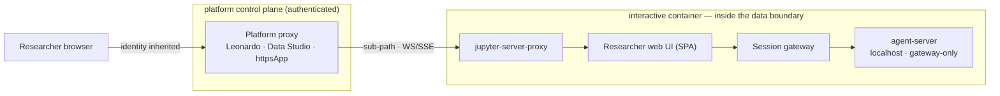

<!--

This source file is part of the Heartwood open-source project

SPDX-FileCopyrightText: 2026 Stanford University and the project authors (see CONTRIBUTORS.md)

SPDX-License-Identifier: MIT

-->

# 02 — Platforms

## Shared model

Every target environment splits into a **control plane** (web app, data catalog, auth) and a **compute plane** (VMs that run code). The compute plane has two lanes, and Docker is the unit in both:

- **Interactive lane** — a long-lived VM that boots a container you type into (Jupyter / RStudio / shell); state persists on an attached disk; it autopauses when idle. **heartwood runs here** — its session gateway, the OpenHands agent-server, and the researcher web UI all run inside this container and are reached through the platform's own authenticated proxy; no nested Docker is required.
- **Batch lane** — a workflow engine (Cromwell / a CWL executor / Nextflow) that runs an ephemeral container per task. heartwood *emits* code for this lane; it does not live in it.

## Target environments

### Terra / All of Us / AnVIL
Runs on GCP and Azure. The **Leonardo** service provisions a Cloud Environment — a VM that boots a Docker container running Jupyter/RStudio, with `/home` on a detachable disk that survives autopause. Optional Dataproc/Spark (for Hail) and GPU. Custom interactive images **extend a Terra base image** (`terra-jupyter-python`, etc.); home is `/home/jupyter`; images come from GAR/GCR, GHCR, or public Docker Hub. All of Us curated data (the CDR) is OMOP-derived in **BigQuery**, wrapped by a **VPC Service Controls** perimeter. Public PyPI is blocked; images must be self-contained. In-container web UIs are surfaced through **`jupyter-server-proxy`** under the Leonardo proxy, inheriting Terra identity.

### Seven Bridges / Velsera (CGC, Cavatica, BioData Catalyst)
CWL-first, primarily AWS. **Data Studio** launches JupyterLab/RStudio on a chosen instance — the interactive home here. Batch tools pair a Docker image with a CWL description that maps input/output ports. Images live in the Seven Bridges Image Registry (`images.sbgenomics.com`).

### DNAnexus / UK Biobank RAP
Runs on AWS; compute is apps/applets. Interactive jobs expose a browser UI via an HTTPS proxy; **JupyterLab runs inside a Docker container** (a session snapshot is a tarball of the container). Docker is loaded via `docker pull` or, offline, `docker save` → a DNAnexus Asset → `docker load`. **Network is off by default** unless a job explicitly requests it. A browser UI is exposed either through **`jupyter-server-proxy`** inside dxJupyterLab or by declaring **`httpsApp`** ports, which the worker's HTTPS proxy authenticates by project role. DNAnexus's own **Omics Data Agent** reaches models compliantly via **Bedrock over VPC endpoints / PrivateLink** (no public egress, in-region, under a BAA) — the same in-perimeter pattern heartwood uses.

### Generic
Any Linux/Jupyter VM. The generic adapter runs heartwood without platform lock-in and is the baseline for development and self-hosted TREs.

## In-boundary models

Egress is blocked, so models are reached **inside the perimeter**:

| Cloud | In-perimeter model path | Mechanism |
|---|---|---|
| GCP (Terra / All of Us) | Claude & Gemini on **Vertex AI** | VPC-SC + Private Service Connect, CMEK, audit logs |
| Azure (Terra-Azure) | **Azure OpenAI** | BAA, in-region, no training on data, VNet + private endpoint |
| AWS (Seven Bridges / DNAnexus) | **Bedrock** | PrivateLink — traffic stays in the AWS network |
| Any | **Local** vLLM / Ollama | Runs in-container/cluster; zero egress |

One LiteLLM configuration routes across all four; a per-platform policy profile flips between "local-only" and "in-perimeter endpoint." The model-policy layer fronts LiteLLM as an egress proxy, so the agent-server never reaches a model endpoint directly.

## Surfacing the interface

Every target centers on a Jupyter interactive lane behind an authenticated platform proxy, so one mechanism surfaces the researcher web UI everywhere: serve it in-container and expose it through that proxy. No new ingress and no heartwood-owned login are introduced.

| Platform | Surfacing mechanism | Identity |
|---|---|---|
| Terra / All of Us / AnVIL | `jupyter-server-proxy` under the Leonardo proxy | Terra / Google |
| Seven Bridges / Velsera | `jupyter-server-proxy` under Data Studio | Data Studio session |
| DNAnexus / UK Biobank RAP | `jupyter-server-proxy` first; `httpsApp` ports as a platform-native upgrade | Worker HTTPS proxy, gated by project role |
| Generic | `jupyter-server-proxy`, or a direct localhost port for development | Whatever fronts Jupyter |

The web UI is built for sub-path serving (relative asset and API/WS bases), ships self-contained assets (no external CDN), uses WebSocket with a Server-Sent Events fallback, and rehydrates on reconnect by replaying the event log — so it survives autopause and proxy quirks. The OpenHands agent-server binds localhost only and is reachable exclusively through the session gateway; identity is always inherited from the platform proxy.

## Data-use policy (a hard constraint)

Technical reachability is not permission. Flagship datasets constrain the use case:

- **All of Us** prohibits sending individual-level data to external AI/ML APIs; only aggregate results (subject to the **≥20-participant** count floor) may leave the perimeter; models trained on participant-level data may not be disseminated.
- **UK Biobank RAP** permits trained-model use but constrains outputs to minimum-count rules.

Consequences, built into the platform: **in-boundary-only is the default**, the model layer **provably blocks non-compliant egress**, aggregate-export skills enforce the count floor, and an **egress attestation** is produced for review.

## Portability (batch lane)

Emitted pipelines target **Dockstore** over **GA4GH DRS/WES/TES/TRS**: a pinned-image CWL/WDL/Nextflow workflow reading inputs via DRS runs across all platforms. This shapes how emitted code is structured.

## Embedding

One air-gapped image per platform variant (built from the platform adapter's base; Terra variant extends `terra-jupyter-python`), with dependencies and verified skills vendored and signature-checked at build time. The agent runs in a non-Docker Local runtime inside this image; the sandbox boundary is bubblewrap plus the platform's egress-deny, not a nested Docker container.
