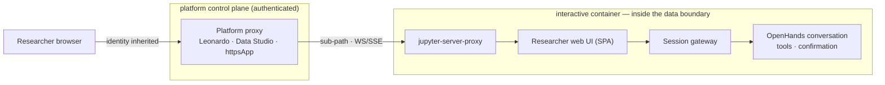

<!--

This source file is part of the Heartwood open-source project

SPDX-FileCopyrightText: 2026 Stanford University and the project authors (see CONTRIBUTORS.md)

SPDX-License-Identifier: MIT

-->

# 02 — Platforms

This document records platform rationale, common deployment assumptions, and interoperability boundaries. Current implementation and validation status is maintained separately in [Platform Support](../docs/platform-support.md).

## Shared Model

Every target environment splits into a **control plane** (web app, data catalog, auth) and a **compute plane** (VMs that run code). The compute plane has two lanes, and Docker is the unit in both:

- **Interactive lane** — a long-lived VM that boots a container used through Jupyter, RStudio, or a shell; state persists on an attached disk and may autopause when idle. Heartwood runs here: its session gateway, OpenHands SDK conversation, coding tools, and researcher web UI run inside this container and are reached through the platform's authenticated proxy; no nested Docker is required.
- **Batch lane** — a workflow engine such as Cromwell, a CWL executor, or Nextflow runs an ephemeral container per task. Heartwood does not emit batch workflows; batch execution remains outside the interactive runtime.

## Current Support Boundary

The generic image and Terra-derived image are implemented and CI-validated. The Terra path still requires live synthetic workspace validation before it can be called live-validated. All of Us, AnVIL, Seven Bridges, Velsera, DNAnexus, and UK Biobank Research Analysis Platform remain design targets rather than current support claims.

## Design Targets

### Terra / All of Us / AnVIL
Runs on GCP and Azure. The **Leonardo** service provisions a Cloud Environment — a VM that boots a Docker container running Jupyter/RStudio, with `/home` on a detachable disk that survives autopause. Optional Dataproc/Spark (for Hail) and GPU. Custom interactive images **extend a Terra base image** (`terra-jupyter-python`, etc.); home is `/home/jupyter`; images come from GAR/GCR, GHCR, or public Docker Hub. All of Us curated data (the CDR) is OMOP-derived in **BigQuery** inside the Researcher Workbench boundary. Runtime package access may be restricted by workspace networking, so deployment images must be self-contained. In-container web UIs are surfaced through **`jupyter-server-proxy`** under the Leonardo proxy, inheriting Terra identity.

### Seven Bridges / Velsera (CGC, Cavatica, BioData Catalyst)
CWL-first, primarily AWS. **Data Studio** launches JupyterLab/RStudio on a chosen instance — the interactive home here. Batch tools pair a Docker image with a CWL description that maps input/output ports. Images live in the Seven Bridges Image Registry (`images.sbgenomics.com`).

### DNAnexus / UK Biobank RAP
Runs on AWS; compute is apps/applets. Interactive jobs expose a browser UI via an HTTPS proxy; **JupyterLab runs inside a Docker container** (a session snapshot is a tarball of the container). Docker is loaded via `docker pull` or, offline, `docker save` → a DNAnexus Asset → `docker load`. **Network is off by default** unless a job explicitly requests it. A browser UI is exposed either through **`jupyter-server-proxy`** inside dxJupyterLab or by declaring **`httpsApp`** ports, which the worker's HTTPS proxy authenticates by project role. Institution-approved Bedrock endpoints can use VPC endpoints or PrivateLink; the deployment remains responsible for agreements, regional settings, logging, retention, and data-use authorization.

### Generic
Any Linux/Jupyter VM. The generic adapter runs heartwood without platform lock-in and is the baseline for development and self-hosted TREs.

## In-Boundary Models

Egress is blocked, so models are reached **inside the perimeter**:

| Cloud | Example in-perimeter model path | Deployment controls required |
|---|---|---|
| GCP (Terra / All of Us) | Vertex AI | Applicable agreement, covered model/service, regional controls, VPC-SC or private connectivity where required, and endpoint allowlisting. |
| Azure (Terra-Azure) | Azure OpenAI | Applicable agreement, covered deployment, regional and retention controls, VNet/private endpoint where required, and endpoint allowlisting. |
| AWS (Seven Bridges / DNAnexus) | Amazon Bedrock | Applicable agreement, covered model/service, regional and retention controls, PrivateLink/VPC endpoint where required, and endpoint allowlisting. |
| Any | Local Ollama, vLLM, SGLang, or llama.cpp | Reviewed model artifact, sufficient hardware, loopback/private binding, and platform egress controls. |

OpenHands `LLM` and LiteLLM provide provider compatibility across these paths. Heartwood discovers models through built-in or platform-provided connections, materializes the selection as one non-secret model profile, and denies the turn unless the profile's declared normalized policy endpoint is allowlisted. Catalog discovery has its own exact endpoint allowlist. A configured custom base URL must share those endpoints' origin; provider-native routing without a custom base remains subject to authoritative platform network controls. No connection is itself a compliance claim.

Local inference uses one OpenAI-compatible model-server contract rather than one runtime in every artifact. The portable generic and platform-derived images retain the reviewed llama.cpp CPU runtime because it is small, works on AMD64 and ARM64, and does not require a vendor GPU stack. Explicit NVIDIA image variants may add a pinned vLLM runtime when throughput, concurrency, and GPU-native model formats justify the larger vendor-specific artifact. The portable images remain the default; GPU variants are no-weight, initially AMD64-only, and share the same Heartwood application payload and command contract. Generic deployments may alternatively compose the portable image with a digest-pinned upstream vLLM service. Terra requires a separately validated GPU-derived image because one custom environment image must preserve its Jupyter base, entrypoint, user, storage, and Leonardo contract while adding the GPU runtime. Heartwood owns runtime discovery, policy, readiness checks, and reproducible launch profiles; it does not fork either inference engine or maintain a second agent path.

Stanford deployments may also expose the Stanford AI API Gateway as a platform-provided OpenAI-compatible research connection. The gateway configuration uses its exact model aliases, external Bearer-token reference, `GET /v1/models` catalog route, and `POST /v1/chat/completions` route through the existing connection and policy contracts. The gateway normalizes access to models from several upstream providers and supports streamed chat-completion deltas; Heartwood must therefore discover aliases rather than maintain the provider list captured in documentation. Stanford's current service documentation and GenAI Evaluation Matrix remain authoritative for data classifications, covered models, required agreements, and project review. Technical connectivity, a Stanford-hosted endpoint, or a gateway API key does not independently authorize protected health information or agent tool access.

## Surfacing the Interface

Every target centers on a Jupyter interactive lane behind an authenticated platform proxy, so one mechanism surfaces the researcher web UI everywhere: serve it in-container and expose it through that proxy. No new ingress and no heartwood-owned login are introduced.

| Platform | Surfacing mechanism | Identity |
|---|---|---|
| Terra / All of Us / AnVIL | `jupyter-server-proxy` under the Leonardo proxy | Terra / Google |
| Seven Bridges / Velsera | `jupyter-server-proxy` under Data Studio | Data Studio session |
| DNAnexus / UK Biobank RAP | `jupyter-server-proxy` first; `httpsApp` ports as a platform-native upgrade | Worker HTTPS proxy, gated by project role |
| Generic | `jupyter-server-proxy`, or a direct localhost port for development | Whatever fronts Jupyter |

The web UI is built for sub-path serving (relative asset and API/WS bases), ships self-contained assets (no external CDN), uses WebSocket with a Server-Sent Events fallback, and rehydrates on reconnect by replaying the event log — so it survives autopause and proxy quirks. Identity is inherited from the platform proxy, and the session gateway is the only browser-facing application API.

## Data-Use Policy

Technical reachability is not permission. Platform adapters and deployment policy must encode the current dataset rules rather than assuming that infrastructure access permits a model or export route:

- **All of Us.** Current policy prohibits transferring individual-level participant data to an external artificial-intelligence or machine-learning service, applies dissemination controls to counts from 1 through 20, and restricts export of models trained on participant-level data. The implementation must bind these rules to a versioned deployment policy and revalidate them against the current [Policy Questions](https://support.researchallofus.org/hc/en-us/articles/34814131370388-Policy-Questions) and [Data And Statistics Dissemination Policy](https://support.researchallofus.org/hc/en-us/articles/22346276580372-Data-and-Statistics-Dissemination-Policy).
- **UK Biobank Research Analysis Platform.** Current download guidance prohibits individual-level data downloads and permits only summary outputs that do not contain individual-level information. The implementation must validate the current output-review mechanism and small-number publication rules before assigning export policy; see [Guidance On Data Downloads And Exemptions](https://community.ukbiobank.ac.uk/hc/en-gb/articles/31972311370013-Guidance-on-Data-Downloads-and-Exemptions) and [Reporting Small Numbers In Research Outputs](https://community.ukbiobank.ac.uk/hc/en-gb/articles/24842092764061-Reporting-small-numbers-in-results-in-research-outputs-using-UK-Biobank-data).

The target deployment keeps participant-level processing in boundary, uses platform network controls as the authoritative egress boundary, denies unallowlisted model routes in Heartwood, applies dataset-specific aggregate-export policy, and produces an egress attestation for review. The current repository demonstrates these application contracts with synthetic data; controlled-data enforcement and platform policy require separate live validation.

## Batch Portability Boundary

Heartwood does not emit batch pipelines. Portable batch execution belongs in a pinned image and established CWL, WDL, or Nextflow infrastructure, with Dockstore and GA4GH DRS, WES, TES, and TRS as interoperability boundaries.

## Platform Image Rationale

One no-weight image per platform variant is built from the base declared in the platform manifest; the Terra variant extends `terra-jupyter-python`. Dependencies, OpenHands, local runtime binaries, and repository-verified Skills are vendored and checked at build time, while model weights live on a mounted platform disk or behind a configured endpoint. OpenHands LocalWorkspace tools run inside the interactive container; deployments requiring stronger isolation must use a validated remote workspace or platform sandbox.
