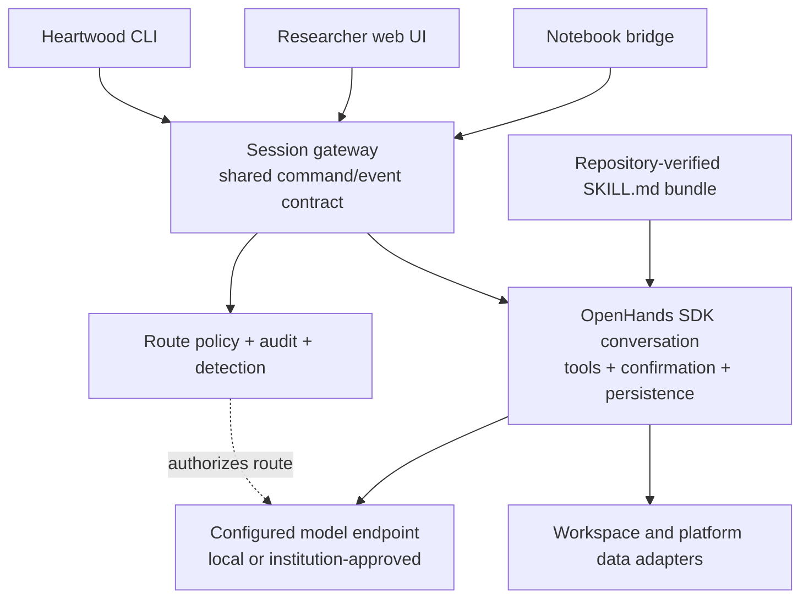
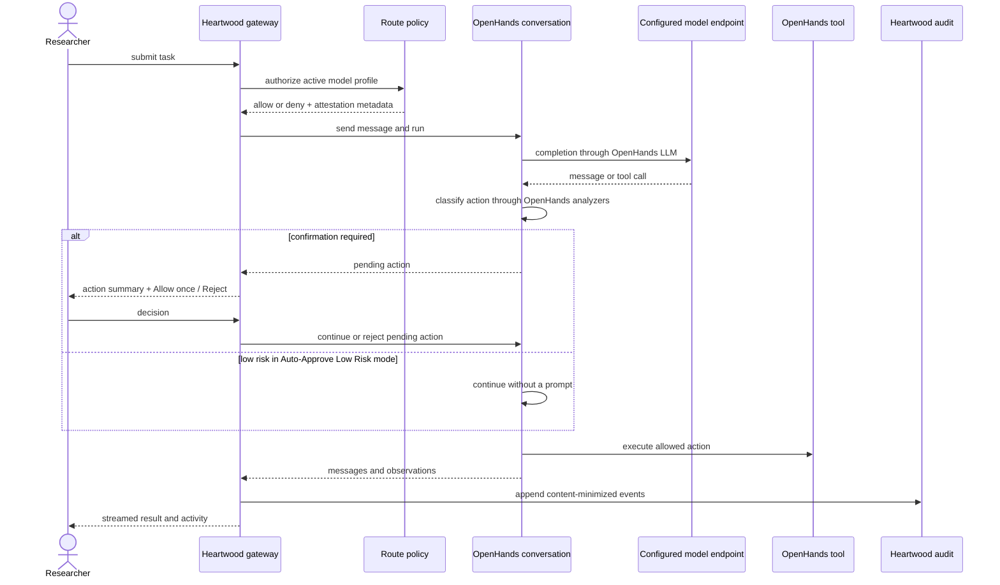

<!--

This source file is part of the Heartwood open-source project

SPDX-FileCopyrightText: 2026 Stanford University and the project authors (see CONTRIBUTORS.md)

SPDX-License-Identifier: MIT

-->

# 03 — Architecture

## Principles

1. Reuse the agent engine; own only the biomedical, policy, platform, and audit layer.
2. Keep model authorization separate from action confirmation: model routes and permitted confirmation modes are configured by the deployment, while researchers use the selected OpenHands confirmation policy for concrete actions.
3. Ship runtimes and repository-verified Skills, never model weights or provider credentials.
4. Keep the platform-agnostic core small; platform-specific behavior stays behind adapters.
5. Use one session command/event contract for the CLI, notebook bridge, web UI, scripts, and tests.
6. Make the common researcher path conversation-first; detection, skills, policy status, and audit remain visible without becoming separate workflows.
7. Treat offline and in-perimeter operation as first-class deployment modes, not separate products.
8. Prefer upstream OpenHands and LiteLLM capabilities over Heartwood-owned provider clients, agent loops, tool schemas, skill loaders, or confirmation engines.

## Upstream Reuse Rule

Every agent-runtime requirement must first be mapped to the pinned OpenHands SDK, OpenHands tools, LiteLLM, or an established platform service. Heartwood may configure, authorize, adapt, and audit an upstream capability; it must not fork or independently reproduce that capability unless the upstream interface cannot satisfy a documented requirement.

The following boundaries are mandatory:

- OpenHands-specific imports, event interpretation, security configuration, and conversation lifecycle remain confined to the gateway's OpenHands adapter and its conformance tests.
- Provider-specific request construction, retries, tool-call parsing, and authentication protocols remain in OpenHands and LiteLLM. Heartwood stores only the minimum non-secret profile and policy metadata required for selection and authorization.
- Terminal and file actions execute only through the OpenHands conversation. Heartwood never invokes an SDK tool directly or implements a second tool executor.
- Action risk and confirmation use OpenHands analyzers and confirmation policies. Heartwood supplies deployment allowlists, plain-language labels, event projection, and audit records, but no parallel risk taxonomy or classifier.
- Biomedical Skills use the OpenHands `SKILL.md` loader. Heartwood adds curation, metadata validation, trust decisions, and platform or dataset selection without introducing another runtime Skill format.
- The web UI and notebook bridge remain projections of the Heartwood session contract. New interface features must expose existing gateway or OpenHands behavior rather than create browser-only agent state.
- Stronger isolation must use a supported OpenHands remote workspace or platform-native sandbox. Heartwood must not grow its own container-orchestration or remote-execution service.

An OpenHands upgrade is accepted only when the adapter unit tests, native Skill loader tests, offline loopback conversation, confirmation-mode tests, persistence and resume tests, and container integration smokes pass against the resolved dependency set.

## Ownership Boundary

| Capability | Owner | Heartwood responsibility |
|---|---|---|
| Conversation loop, tool execution, pause/resume, persistence, and action confirmation | OpenHands Software Agent SDK | Configure the SDK, translate its events, and keep the dependency behind a narrow adapter. |
| Provider compatibility and model request formatting | OpenHands `LLM` and LiteLLM | Store non-secret model profiles, resolve secret references at runtime, and authorize the selected endpoint before task submission or any approved or resumed continuation that may call the model. |
| Local inference | External OpenAI-compatible runtime or the packaged llama.cpp runtime | Configure the endpoint and optionally download a reviewed artifact into a mounted cache; do not place weights in an image layer. |
| Skills | OpenHands `SKILL.md` loader | Verify, curate, bundle, and select biomedical skills before passing them to `AgentContext`. |
| Model/data policy | Heartwood | Deny unapproved routes, enforce platform data-use rules, and emit attestations. |
| Audit and compliance export | Heartwood | Translate execution events into a content-minimized, hash-chained record and explicit export artifacts. |
| User interfaces | Heartwood | Render the same session contract in a coding-agent-style CLI and conversation-first web UI. |

The current runtime satisfies this ownership boundary for the agent loop and interfaces. Platform and data-source adaptation is not complete: runtime construction currently uses `GenericPlatformAdapter` and the synthetic OMOP data-source adapter unless a caller injects alternatives. A real platform adapter must replace those defaults before controlled workspace data is described as detected or supported.

## Runtime Shape

The default deployment uses an in-process OpenHands SDK conversation because it is the smallest reliable integration for one researcher inside one trusted interactive container. The gateway remains the public API and event-translation boundary. An OpenHands remote workspace or agent-server is an adapter choice for deployments that require process or host isolation; it is not a second product path and clients never depend on its private API.

## Model Profiles

A model profile is non-secret deployment configuration: a stable profile id, LiteLLM model identifier, base URL when needed, declared normalized policy endpoint, capability tier, and one credential reference. Credential references point to an environment variable, mounted file, or platform-managed identity; raw secrets are never accepted in profile files, browser payloads, logs, or image metadata. The deployment policy separately lists allowed capability tiers and action-confirmation modes. Capability tier and action confirmation remain independent settings.

The gateway publishes non-secret provider presets and owns the simplified provider connection operation. The common UI sends only a preset id and provider model name; the gateway expands the model prefix, endpoint, base URL, credential-reference kind, and profile id, then saves and selects the resulting profile. Presets that require deployment-specific endpoints remain in the advanced profile editor. This keeps provider semantics out of the browser while preserving the full profile contract for operators and the CLI.

The selected profile is resolved before initial task submission and before an approved or resumed continuation that may call the model. Heartwood evaluates its declared policy endpoint, capability tier, action-confirmation mode, and non-secret credential reference against the active platform policy and records the decision without the credential value. Rejecting a pending action does not continue the model and therefore remains available without authorizing a route. A missing credential reference fails before a route decision, and a denied profile cannot submit or continue a model turn or make a model request. An allowed profile is converted directly to OpenHands `LLM` configuration, leaving provider-specific request formatting, retries, tool calling, and response parsing to OpenHands and LiteLLM. When a custom base URL is present, it must share the policy endpoint's origin. For provider-native routes without a custom base URL, the policy endpoint is an audited deployment assertion rather than a network interceptor; platform network controls remain the authoritative enforcement boundary for actual traffic.

When the selected model credential is an environment-variable reference, Heartwood resolves it into the in-process OpenHands `LLM`. Every environment-variable reference in the configured model profiles is overridden with an empty value in OpenHands terminal subprocesses, including inactive profiles. This removes direct child-environment inheritance for configured model keys, but it is not general process isolation: same-user process inspection, a readable credential file, and a platform managed identity intentionally available to analysis code remain within reach of workspace code. Deployments that require model-only credentials to be inaccessible to tools must provide process or workspace isolation through a supported OpenHands remote workspace or platform-native boundary.

Local profiles use the same contract. A researcher can point at Ollama, vLLM, SGLang, llama.cpp, or another OpenAI-compatible endpoint. The image may include a portable llama.cpp server binary, but model artifacts live in a mounted cache or platform disk and are selected explicitly. The model catalog is guidance and reproducible download metadata, not a set of weights embedded in the image. Background downloads report transferred and expected bytes through the gateway; the web UI polls only while a transfer is active and displays integrity verification failures without treating download completion as runtime readiness or model capability.

An institution-approved API is not compliant merely because it is listed as a preset. The deployment must separately establish the applicable agreement, covered service, regional and retention settings, private networking where required, and an exact endpoint allowlist in the platform policy.

## Approval Model

The normal workflow has three distinct decisions:

1. **Deployment authorization:** a platform administrator configures model endpoints, credentials, and data-use policy once for the environment. This is a hard policy gate, not a per-turn researcher approval button.
2. **Extension trust:** repository-verified bundled Skills load automatically; community or experimental Skills require explicit installation approval and verification before they enter the runtime Skill directory. Skill activation is recorded but does not repeatedly ask the researcher to approve the same repository-verified capability.
3. **Action confirmation:** OpenHands proposes concrete tool actions. **Ask Every Time** maps to OpenHands `AlwaysConfirm` and remains the default. **Auto-Approve Low Risk** maps to OpenHands `ConfirmRisky` with a `MEDIUM` threshold and `confirm_unknown=True`; low-risk actions execute, while medium-, high-, and unknown-risk actions present the same **Allow once** and **Reject** controls in the CLI and web UI. While a confirmation is pending, the session service rejects new tasks and resume commands so only the explicit action decision can continue or reject that action. Both modes use the upstream `EnsembleSecurityAnalyzer` with `PolicyRailSecurityAnalyzer`, `PatternSecurityAnalyzer`, and `LLMSecurityAnalyzer` in strict unknown-propagation mode. The deterministic analyzers provide local action-boundary checks, and the model assessment adds context; Heartwood does not implement a parallel risk engine.

The active platform policy lists the confirmation modes that a deployment permits. Generic synthetic development permits both modes; managed deployments default to **Ask Every Time** until their workspace isolation and review evidence justify risk-based execution. OpenHands `NeverConfirm` is not exposed through researcher settings because the current trusted interactive container is not a hardened unattended-execution boundary. A future remote or sandboxed backend may support it only as deployment-owned configuration with dedicated tests and evidence.

Exports remain explicit user commands and are subject to platform export controls. Model-route authorization, skill trust, action confirmation, and export authorization must not be represented as one generic approval type because they have different owners and lifetimes.

## Skills

Heartwood verifies checked-in and installed `SKILL.md` packages, then loads the repository-verified bundle with the OpenHands native Skill loader and passes it to `AgentContext`. OpenHands owns progressive disclosure and invocation. Heartwood owns biomedical metadata, trust tiers, installation decisions, platform and dataset matching, and review evidence. This keeps Skills portable and avoids a parallel runtime loading mechanism.

## Interaction Surfaces

The implemented CLI and web UI expose the same core conversation actions: address a persisted session id, submit a task, inspect messages and tool activity, allow or reject a pending action, select an allowed action-confirmation mode, pause or resume execution, and export the audit record. The CLI also exposes model-profile and artifact-management commands for administrators and technical users.

The session-oriented researcher experience below is the implemented presentation contract. The web UI uses gateway-owned session metadata, progressive disclosure, typed event projections, responsive overlays, and the same command vocabulary as the CLI. Boundary evidence, workflow progress, and other states that do not yet have typed gateway records are shown as planned or omitted; target-user validation remains an acceptance requirement in [Priority 2](09-implementation-plan.md).

The web UI opens on the conversation and follows one information architecture:

- A collapsible session rail creates, lists, and resumes gateway-owned sessions using persisted session metadata; browser storage is never the source of truth.
- A compact session header shows the session title and only the platform, dataset, model route, confirmation mode, and boundary status supplied by detector, settings, policy, and session events. Unknown or unconfigured state is explicit. The UI never infers that an endpoint is compliant, data stayed in perimeter, egress was blocked, or an artifact is exportable.
- The transcript presents researcher messages, model responses, tool summaries, and real plan or workflow progress in one chronological surface. Progress appears only when OpenHands or a typed Heartwood workflow event supplies it; the shell does not encode a fixed cohort, quality-check, model, or export sequence.
- Pending OpenHands confirmations appear inline near the conversation with the proposed tool, upstream risk, summary, and any structured scope or network intent supplied by OpenHands. Missing metadata is omitted rather than inferred. **Allow once** and **Reject** remain the only per-action decisions.
- The composer supports the shared session commands and plain-language tasks. Empty-state suggestions may use verified detector evidence, but they remain optional prompt starters rather than a separate workflow engine.
- Skills, activity and audit, and model setup are secondary views. Repository-verified Skills and installed extensions use the same trust language as the Skill contract. Model setup leads with active-route status and validation, offers a gateway-owned provider preset and model-name path, reports local-artifact transfer progress, and places complete profile fields under advanced options. Platform policy is read-only in the researcher interface.
- Audit export is available from the activity view and the CLI. Compliance evidence packages remain maintainer or reviewer tooling rather than a primary researcher action.

Every interactive state is projected from the gateway contract. The browser does not synthesize action outcomes, workflow completion, policy decisions, Skill verification, model capability, or audit integrity. Provider presets and artifact entries are gateway-supplied data rather than vendor-specific interface code.

The desktop layout uses a compact session rail and modal secondary sheets; smaller viewports collapse the session rail into a left sheet while preserving the conversation and composer. Semantic landmarks, accessible names, focus trapping, transcript and status announcements, text reflow, and narrow Jupyter-proxy layout are automated interface requirements. A keyboard and assistive-technology acceptance pass with representative users remains required before release.

Notebook support reuses the gateway and web UI through the platform's authenticated proxy. Notebook widgets remain a compact status and launch bridge rather than a third full interaction design.

## Adapters

- **`PlatformAdapter`** detects the environment and supplies data mounts, credential names, and the default policy profile. Declarative platform manifests own image-base and registry requirements.
- **`DataSourceAdapter`** supplies scoped data access and deterministic schema fingerprints.
- **`RegistryAdapter`** resolves and verifies skill packages.
- **Agent runtime adapter** translates OpenHands SDK events into the Heartwood session contract and allows a remote OpenHands workspace later without changing clients.

Provider-specific adapters are not part of the default architecture. A platform adapter may supply identity or endpoint metadata, but OpenHands/LiteLLM remains the provider compatibility layer.

## Audit And Durability

OpenHands persists the operational conversation state needed for resume. Heartwood records researcher and agent messages in its in-boundary session event stream so every client can reconstruct the same transcript, and derives a separate hash-chained audit record from the session events. The audit record stores route ids, endpoint decisions, tool names, risk levels, result status, activated Skill ids, and human decisions. Prompt text, model response text, action summaries, filesystem paths, row values, and secrets are excluded from exported records; message content and action summaries remain available only in the in-boundary conversation and session event stores.

Session state and downloaded model artifacts live on the workspace or platform disk so they survive container replacement and platform autopause. The generic container currently uses one state volume and one model-cache volume; action and model settings, sessions, installed Skills, OpenHands state, workspaces, and audit data resolve from the state root. No external Heartwood database is required for the single-user interactive deployment. [Issue #22](https://github.com/SchmiedmayerLab/heartwood/issues/22) tracks a canonical versioned root, one-volume default with an optional split model cache, migration, restart validation, and first-run setup shared by every interface.

## Data Flow

