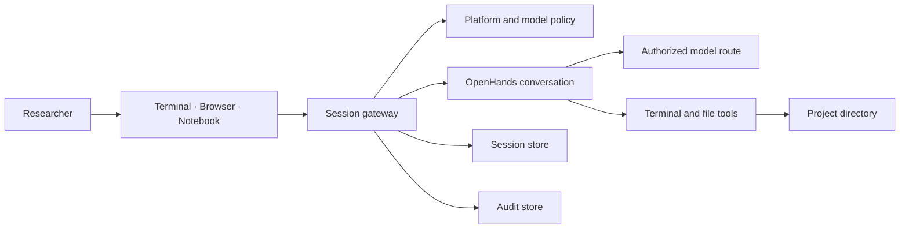

<!--

This source file is part of the Heartwood open-source project

SPDX-FileCopyrightText: 2026 Stanford University and the project authors (see CONTRIBUTORS.md)

SPDX-License-Identifier: MIT

-->

# System Architecture

Heartwood is a policy and presentation layer around an OpenHands coding agent. It owns stable project, model, session, interface, and audit contracts while delegating agent execution to public upstream APIs.

## Upstream Reuse

Heartwood uses:

- **OpenHands SDK** for the conversation, agent loop, coding tools, action confirmation, persistence, and context condensation;
- **LiteLLM** through OpenHands for provider compatibility;
- **Hugging Face Hub** for repository metadata and artifact transfer;
- **llama.cpp** and **vLLM** as OpenAI-compatible local inference servers;
- **Textual** for the full-screen terminal presentation;
- **Stanford Spezi Web**, React, and standard browser APIs for the web presentation;
- **Jupyter** for notebook execution and authenticated proxy routing.

Heartwood does not fork the OpenHands agent loop, implement provider-specific chat clients, or execute coding tools outside the OpenHands conversation.

## Component Ownership

| Component | Owns |
|---|---|
| Project context | Current-directory boundary and private state paths |
| Platform adapter | Environment evidence, default policy, scheduler, persistence, and proxy behavior |
| Model settings | Non-secret connections, profiles, local artifacts, and active selection |
| Policy engine | Exact model catalog and completion routes, credentials, capabilities, and action modes |
| Session gateway | Stable command and event API shared by every interface |
| OpenHands adapter | Translation between gateway commands and public OpenHands conversations and events |
| Skill manager | Bundled Skills and validated project extension installation |
| Audit store | Content-minimized decision and outcome records |
| CLI conversation, web, notebook | Gateway-backed presentation and user input |
| CLI launcher | Local-model resource planning, scheduler requests, model staging, runtime startup, supervision, and cleanup |

## Project Contract

The process current directory is the project root. Heartwood creates `.heartwood/` inside it for configuration, sessions, models, Skills, audit, runtime state, logs, and caches.

Heartwood's file editor rejects paths outside the project and its reserved control directory. OpenHands terminal actions run with process permissions and therefore rely on deployment isolation for a stronger filesystem boundary.

The terminal, browser, and notebook resolve the same project. Browser storage is never the source of truth.

## Session Contract

Interfaces submit typed commands and consume ordered typed events through the gateway. Commands cover task submission, grouped allow or reject, pause, resume, replay, and audit export.

The gateway persists the researcher-facing event stream and an OpenHands conversation store for each session. Session identifiers are project-local. In-process synchronization serializes one gateway instance, but the file-backed session store does not enforce an interprocess lock. Interfaces therefore require one active writer per session.

The OpenHands adapter translates messages, action groups, tool observations, errors, and lifecycle state. Public interfaces do not read OpenHands private persistence formats.

## Model Contract

A connection describes a model service, its catalog route, completion route, and non-secret credential binding. A profile selects a model and deployment-reviewed capability tier. Credential values remain process- or platform-owned.

Guided setup supports local, OpenAI, Anthropic, and Stanford gateway sources. Generic deployments may add one explicitly selected Custom API origin. Managed platform policy must be configured by the operator.

For public Hugging Face repositories, the local-model planner resolves an immutable revision, selects a supported artifact, estimates resources, downloads into project state, verifies content, and records provenance. The launcher selects a context size from model capacity and observed resources, then configures the local server and OpenHands consistently.

## Action Confirmation

OpenHands owns action analysis and confirmation stops. Heartwood configures one of two deployment-permitted modes:

- `always-confirm` requires review for every action group;
- `confirm-risky` permits OpenHands to execute low-risk groups and stops for medium, high, or unknown risk.

One confirmation stop may contain several actions. Every interface presents one decision for the complete group. Proposed actions and the resolved group decision remain visible in replay and audit projections.

## Skills

Bundled and installed Skills are supplied to the OpenHands native Skill loader. Heartwood validates extension sources, rejects path escapes and symbolic links, copies atomically into project state, and records explicit installation approval.

## Interfaces

The CLI conversation, browser, and notebook are adapters over the gateway:

- Textual renders the default interactive terminal; the plain client supports basic terminals and scripts.
- The browser uses REST plus incremental event transport and relative paths for Jupyter proxy compatibility.
- `NotebookSession` exposes project, model, task, decision, replay, and audit operations in Python.

The CLI also owns deployment-facing orchestration that is not part of the conversation contract. `heartwood launch` requests supported scheduler resources when necessary, stages local model files, starts and supervises the selected inference runtime, and cleans it up when the interface exits. The browser and notebook consume the resulting model connection; they do not duplicate that lifecycle.

No interface synthesizes model responses, action outcomes, or independent session state.

## Data Flow

Policy is checked before model discovery, initial submission, and continuation after an action decision. Audit records derive from durable gateway events rather than from a separate execution path.
