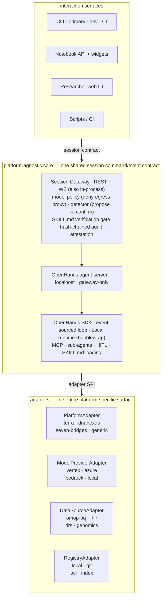
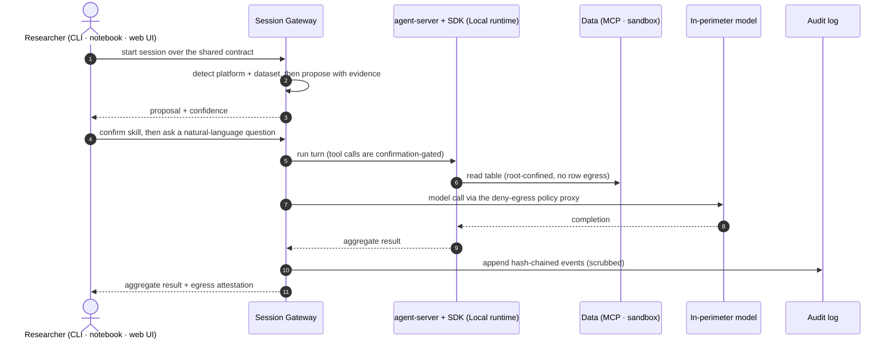

<!--

This source file is part of the Heartwood open-source project

SPDX-FileCopyrightText: 2026 Stanford University and the project authors (see CONTRIBUTORS.md)

SPDX-License-Identifier: MIT

-->

# 03 — Architecture

## Principles

1. Reuse the agent loop; own the medical and compliance layer.
2. In-boundary by default — reaching a model is an explicit, policy-gated, audited action.
3. Platform-agnostic core; all platform-specific code lives behind an adapter.
4. Detection proposes, a human confirms — nothing loads or runs silently.
5. Standards-based, portable extension (`SKILL.md`, MCP).
6. Offline/air-gapped is the primary path.
7. One shared session contract for every surface; the CLI is the primary/dev/CI contract, and notebook and web UI are presentation adapters over it.
8. The agent-server is owned by the session gateway and reachable only through it — every control is enforced in that one path.

## Core and adapters

## The foundation: OpenHands Software Agent SDK and agent-server

The core builds on `openhands-sdk`/`openhands-tools` and the `openhands-agent-server` (all MIT), consumed as a **pinned dependency behind a stable facade** (`Agent`/`Tool`/`Conversation`/`EventLog`). The SDK provides, out of the box: an event-sourced agent loop (deterministic replay, pause/resume/fork), sandboxed execution, a native MCP client, sub-agent delegation, two-layer human-in-the-loop control (confirmation policies + a risk-scored analyzer), **native `SKILL.md` loading** (progressive disclosure, keyword/always triggers, MCP-tools-per-skill), model routing via LiteLLM, and conversation export. The agent-server exposes that loop over REST + WebSocket with a file-backed event log, so every surface can stream the same session state.

heartwood adopts the agent-server as its execution service and runs it in a non-Docker **Local runtime** inside the platform's own container — the sandbox boundary is bubblewrap plus platform egress-deny, never a nested Docker container. The SDK stack is reused rather than forked; the facade absorbs its rapid release cadence and keeps the core swappable. The OpenHands web UI and its commercially-licensed Cloud components are deliberately not adopted; heartwood keeps first-party code MIT and ships its own surfaces.

## The session gateway

The **session gateway** is the single control point and the only public surface. It embeds the model policy layer, detector, verification gate, count-floor, audit, and attestation; it manages the OpenHands agent-server as a **localhost-only, gateway-only-reachable** managed child; and it translates the shared session command/event contract to and from the agent-server's event stream. It runs as a REST + WebSocket service for the notebook and web UI, and is importable in-process for the CLI and offline commands. Because every client speaks the one contract and no client can reach the agent-server directly, each control is enforced exactly once, server-side.

## The adapter SPI

Four interfaces are the entire platform-specific surface. Reference implementations ship for the priority platforms; the `generic` adapter is the baseline. Adding a platform means writing an adapter, not changing the core.

- **`PlatformAdapter`** — detects the platform from the environment; provides data mount paths, the credential allowlist, the Docker base image, and the default egress policy.
- **`ModelProviderAdapter`** — configures an in-perimeter endpoint through provider routes, reports its capability tier, invokes supported routes after approval, and emits egress-attestation records.
- **`DataSourceAdapter`** — scoped read plus the schema/format fingerprint the detector uses.
- **`RegistryAdapter`** — resolves and verifies skills from a source.

## What the platform adds on top of the SDK

The SDK is the engine; heartwood contributes: (1) the **session gateway** that owns the agent-server and enforces every control in one path; (2) the **model policy layer**; (3) the **environment/dataset detector** that decides which skills activate; (4) the **`heartwood.*` metadata** semantics and a **verification gate** before skills reach the SDK's skill directory; (5) the **compliance kit** and **egress attestation**; (6) **hash-chained audit + scrubbed export**; (7) the **adapters**; (8) the **analyst interaction surfaces** (CLI, notebook, and web UI over one contract).

## Interaction model

The CLI is the main product interface, the development harness, and the stable target for CI. It supports both scripted commands and an agentic interactive session: chat turns, proposed actions, visible tool/code events, approve/deny prompts, pause/resume, replay, and audit export.

Notebook interfaces do not own separate behavior. They attach to the same session API and event stream, rendering a friendlier view for Terra/Jupyter users: chat, detected dataset cards, proposed skills, approval controls, policy status, activity trace, and export buttons. This keeps the non-technical experience approachable without creating a second execution path.

The **researcher web UI** is the primary surface for the non-technical analyst. It is a heartwood-owned, single-page app that attaches to the same gateway over REST, WebSocket, and Server-Sent Events fallback, then renders the same events: chat, dataset cards, proposed skills, plain-language approvals, policy status, activity trace, and count-floored export with an attestation. It is built in TypeScript on the Stanford Spezi web stack and surfaced through the platform's authenticated Jupyter proxy (see [02](02-platforms.md)). No surface owns separate execution behavior; each is a view over the one contract.

## Model policy layer

Provider routes handle model endpoint selection; a future LiteLLM adapter can be added behind the same `ModelProviderAdapter` boundary if a platform needs broader provider compatibility. On top, a per-platform **policy profile** denies egress by default, allows only the configured in-perimeter endpoint, enforces the model's **capability tier** (caps autonomous tool-loop depth for weaker models), and records every call to the audit log for the egress attestation. The gateway fronts provider invocation as an **egress proxy**, so the policy decision gates the actual model call and the agent-server never reaches an endpoint directly.

## Tools

Platform and data access are exposed as Python MCP servers: a data gateway, OMOP/BigQuery, FHIR, DRS, and a headless notebook driver. TypeScript is used for the researcher web UI (see [08](08-development.md)); no other JavaScript surface is planned.

## Durability

The agent-server event log is persisted to the **workspace disk** (survives autopause) via its `FileStore`; heartwood keeps a separate, hash-chained **audit log derived from the translated session events** for tamper-evidence, plus a `resume` command. The two logs are kept distinct — execution substrate versus compliance record — and content-bearing events are scrubbed before export. No external database.

## Data flow

