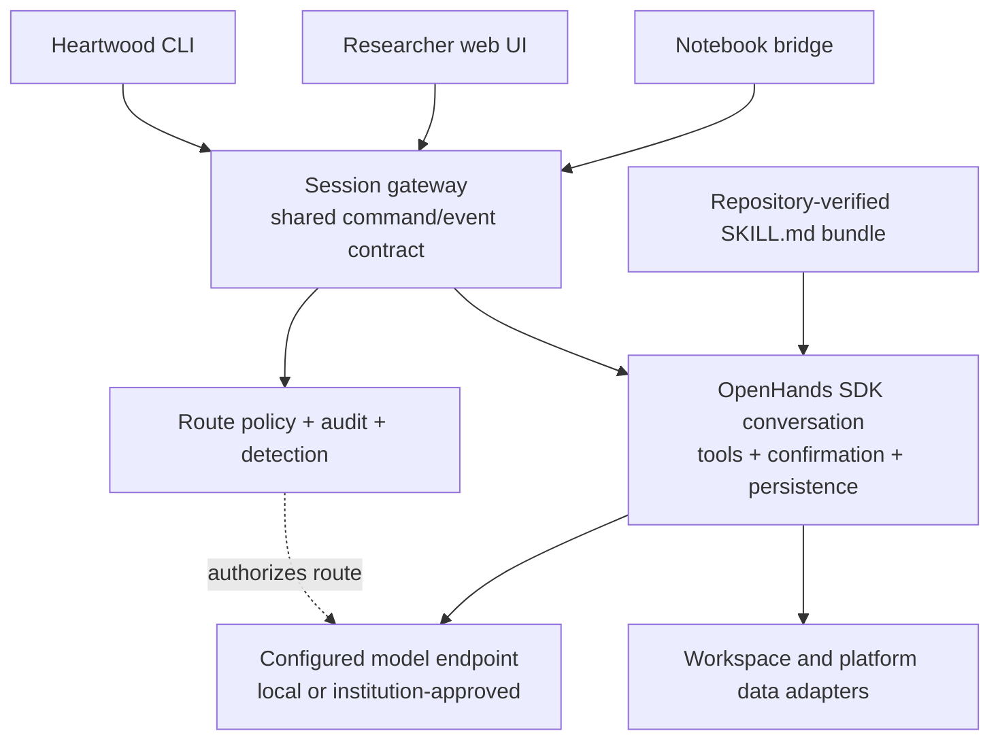
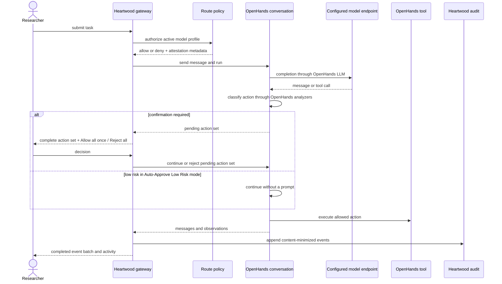

<!--

This source file is part of the Heartwood open-source project

SPDX-FileCopyrightText: 2026 Stanford University and the project authors (see CONTRIBUTORS.md)

SPDX-License-Identifier: MIT

-->

# System Architecture

This document defines the technical ownership and runtime contracts behind the user-facing guides. Begin with [Runtime Shape](#runtime-shape) and [Project and State Contract](#project-and-state-contract) for the system model. Model integration, action confirmation, interfaces, adapters, and audit behavior follow in progressively greater detail.

## Principles

1. Reuse the agent engine; own only the biomedical, policy, platform, and audit layer.
2. Keep model authorization separate from action confirmation: model routes and permitted confirmation modes are configured by the deployment, while researchers use the selected OpenHands confirmation policy for concrete actions.
3. Ship runtimes and repository-verified Skills, never model weights or provider credentials.
4. Keep the platform-agnostic core small; platform-specific behavior stays behind adapters.
5. Use one session command/event contract for the CLI, notebook bridge, web UI, scripts, and tests.
6. Make the common researcher path conversation-first; detection, skills, policy status, and audit remain visible without becoming separate workflows.
7. Treat offline and in-perimeter operation as first-class deployment modes, not separate products.
8. Prefer upstream OpenHands and LiteLLM capabilities over Heartwood-owned provider clients, agent loops, tool schemas, skill loaders, or confirmation engines.
9. Treat the directory from which Heartwood starts as the project and agent working directory; keep Heartwood-owned configuration and durable state in its `.heartwood/` subdirectory.

## Upstream Reuse Rule

Every agent-runtime requirement must first be mapped to the pinned OpenHands SDK, OpenHands tools, LiteLLM, or an established platform service. Heartwood may configure, authorize, adapt, and audit an upstream capability; it must not fork or independently reproduce that capability unless the upstream interface cannot satisfy a documented requirement.

The following boundaries are mandatory:

- OpenHands-specific imports, event interpretation, security configuration, and conversation lifecycle remain confined to the gateway's OpenHands adapter and its conformance tests.
- Provider-specific request construction, retry execution, tool-call parsing, and authentication protocols remain in OpenHands and LiteLLM. Heartwood stores only the minimum non-secret profile and policy metadata required for selection and authorization, and configures a bounded provider-neutral retry budget for interactive sessions.
- Terminal and file actions execute only through the OpenHands conversation. Heartwood never invokes an SDK tool directly or implements a second tool executor.
- Action risk and confirmation use OpenHands analyzers and confirmation policies. Heartwood supplies deployment allowlists, plain-language labels, event projection, and audit records, but no parallel risk taxonomy or classifier.
- Biomedical Skills use the OpenHands `SKILL.md` loader. Heartwood adds curation, metadata validation, trust decisions, and platform or dataset selection without introducing another runtime Skill format.
- The web UI and notebook bridge remain projections of the Heartwood session contract. New interface features must expose existing gateway or OpenHands behavior rather than create browser-only agent state.
- Stronger isolation must use a supported OpenHands remote workspace or platform-native sandbox. Heartwood must not grow its own container-orchestration or remote-execution service.

An OpenHands upgrade is accepted only when the adapter unit tests, native Skill loader tests, offline loopback conversation, confirmation-mode tests, persistence and resume tests, and container integration smokes pass against the resolved dependency set.

## Ownership Boundary

| Capability | Owner | Heartwood responsibility |
|---|---|---|
| Conversation loop, tool execution, pause/resume, persistence, and action confirmation | OpenHands Software Agent SDK | Configure the SDK, translate its events, and keep the dependency behind a narrow adapter. |
| Provider compatibility and model request formatting | OpenHands `LLM` and LiteLLM | Store non-secret model profiles, resolve credential bindings at runtime, and authorize the selected endpoint before task submission or any approved or resumed continuation that may call the model. |
| Model catalog discovery | Official provider SDKs, OpenAI-compatible model-list endpoints, and platform configuration | Expose one normalized catalog contract, authorize discovery before network access, annotate entries with upstream OpenHands and LiteLLM metadata, and materialize the selected entry as a model profile. |
| Local inference | External OpenAI-compatible runtime, packaged llama.cpp, packaged vLLM, and Hugging Face Hub | Configure the endpoint; normalize a small recommendation catalog; inspect a user-supplied `owner/model`; select a compatible CPU or NVIDIA GPU representation; download into project storage; and never place weights in an image layer. |
| Skills | OpenHands `SKILL.md` loader | Verify, curate, bundle, and select biomedical skills before passing them to `AgentContext`. |
| Model/data policy | Heartwood | Deny unapproved routes, enforce platform data-use rules, and emit attestations. |
| Audit and compliance export | Heartwood | Translate execution events into a content-minimized, hash-chained record and explicit export artifacts. |
| User interfaces | Heartwood | Render the same session contract in a coding-agent-style CLI and conversation-first web UI. |
| Terminal presentation | Textual | Wire Textual into Heartwood's framework-neutral interaction controller for rendering, input, and workers while leaving conversation and agent state in the gateway. |

The current runtime satisfies this ownership boundary for the agent loop and interfaces. Runtime construction selects the detected generic, Terra, or Carina platform adapter and applies the project policy, but data-source adaptation is not complete: session detection still uses the synthetic OMOP data-source adapter unless a caller injects another implementation. A real data-source adapter must replace that fixture before controlled project data is described as detected or supported.

## Runtime Shape



The default deployment uses an in-process OpenHands SDK conversation because it is the smallest reliable integration for one researcher inside one trusted interactive container. The gateway remains the public API and event-translation boundary. An OpenHands remote workspace or agent-server is an adapter choice for deployments that require process or host isolation; it is not a second product path and clients never depend on its private API.

## Project and State Contract

Heartwood resolves the process working directory once at startup and treats it as the project root. It does not search parent directories, infer a root from Git metadata, or require a workspace option. OpenHands file and terminal tools start in that project, and project-relative actions may address the project root or its descendants except for the reserved `.heartwood/` control directory. Heartwood file APIs reject paths that resolve outside the project or inside `.heartwood/`; a hard boundary for arbitrary terminal processes remains the responsibility of a supported OpenHands remote workspace or platform sandbox.

Every interface receives one typed project context from the gateway. The CLI, web interface, notebook bridge, container entrypoint, and platform launcher do not independently select session, model, cache, or policy roots. Configuration changes use gateway operations that persist the same project record; a fresh process observes them without translation, and the browser refreshes them when settings open, the window regains focus, or an active model download changes state. Scheduler and container transitions preserve the directory in which the user invoked Heartwood as the logical project root.

Heartwood owns one project-local control directory:

```text
.heartwood/
├── config.toml
├── state.json
├── sessions/
├── models/
├── skills/
├── audit/
├── runtime/
├── logs/
└── cache/
```

`config.toml` is the typed user-facing configuration for model connections and selection, local runtime choices, action confirmation, and platform-supplied defaults. `state.json` records the state schema. The remaining directories contain only Heartwood-owned persistence. Heartwood creates the control directory with restrictive permissions, places an internal Git ignore rule at its root, and applies mutable configuration updates as atomic transactions under a project-scoped interprocess lock so concurrent CLI, browser, and notebook processes do not overwrite unrelated settings. It rejects symbolic-link escapes in its file APIs and excludes `.heartwood/` from Heartwood-owned project paths and agent instructions. Researchers manage it through Heartwood commands rather than by passing paths between commands. Arbitrary terminal commands still run with the process user's filesystem permissions and require a platform sandbox when instruction-level exclusion is insufficient.

Researcher-facing runtime configuration does not depend on `HEARTWOOD_*` path or state variables. Build parameters, test controls, platform detection, and private process-to-process wiring may still use environment variables as implementation details, but they are not a supported project setup interface. Provider secrets remain outside project configuration: the gateway accepts a session-only token or resolves a non-secret binding to an environment-backed platform secret, mounted file, or managed identity. It does not expose the secret through command arguments, project configuration, API responses, logs, session events, or audit exports. Terminal subprocess environments blank every configured environment-backed provider key, while stronger same-user isolation remains a deployment responsibility.

## Model Connections and Profiles

A model connection is a non-secret description of one selectable model source: a stable connection id, display label, provider protocol, model prefix, catalog endpoint, completion endpoint, base URL and existing provider profile options when needed, credential binding, and source such as built-in, platform-provided, or user-configured. A connection may expose one or many models. Platform-provided research services therefore remain one connection even when their current identity can access several model identifiers.

The gateway owns one model-catalog service. OpenAI and Anthropic catalogs use their maintained SDK model-list operations, OpenAI-compatible services use the maintained OpenAI client against the configured base URL, and active local runtimes use the same OpenAI-compatible discovery path. Heartwood does not maintain cloud model identifiers, provider request construction, pagination, or capability tables. The gateway normalizes upstream records, preserves exact identifiers, uses provider display names only when supplied, and annotates compatibility from the pinned OpenHands and LiteLLM stack. Unknown hosted models remain visible as experimental, while models known to be unsuitable for the OpenHands conversation are visible but unavailable. A platform that must suppress identifiers exposes only the policy-approved subset through its catalog endpoint or static connection manifest.

A model profile remains the single non-secret execution configuration consumed by policy and OpenHands: a stable profile id, LiteLLM model identifier, base URL when needed, declared normalized completion endpoint, capability tier, and one credential binding. Selecting a catalog entry materializes or replaces one profile for that connection. Researcher interfaces do not require profile ids, credential-storage details, policy endpoints, or LiteLLM prefixes.

Hosted model limits remain upstream-owned. The catalog projects context metadata reported by the provider and the pinned OpenHands/LiteLLM stack, while OpenHands owns provider-specific request shaping. Heartwood does not maintain a second cloud-model limit table. A Heartwood-managed local profile additionally persists the selected runtime context, passes the total capacity to the inference server, and divides it into an input allowance and bounded output budget through OpenHands' native token options. OpenHands' per-event character guard is derived from that input allowance so code and tool output are not prematurely truncated by its smaller default. The runtime, agent, CLI, browser, and notebook therefore describe one capacity.

A credential binding identifies a managed identity, environment-backed platform secret, mounted file, or session-only value. Project configuration stores the binding, never the secret. The CLI and same-origin web interface use the same gateway operation to establish a selection; a submitted token is never returned, logged, audited, written to project state, or accepted as a command-line argument. Session-only values must be entered again after the gateway restarts; durable bindings are owned and protected by the deployment.

Catalog discovery is an egress operation separate from model completion. The deployment policy lists exact allowed catalog endpoints independently from completion endpoints. The gateway authorizes the catalog endpoint and non-secret credential binding before invoking an upstream SDK. Static platform catalogs and local artifact metadata require no network call, but selecting any entry still requires the normal completion-route decision. Catalog responses remain in the gateway's bounded memory cache and are not copied into model settings or session audit records; subsequent model-route records identify the selected non-secret profile and route decision.

The selected profile is resolved before initial task submission and before an approved or resumed continuation that may call the model. Heartwood evaluates its declared policy endpoint, capability tier, action-confirmation mode, and non-secret credential binding against the active platform policy and records the decision without the credential value. Rejecting a pending action set does not continue the model and therefore remains available without authorizing a route. A missing credential binding fails before a route decision, and a denied profile cannot submit or continue a model turn or make a model request. An allowed profile is converted directly to OpenHands `LLM` configuration with a bounded provider-neutral timeout and retry budget suitable for an interactive session. CPU-local profiles receive a longer bounded request timeout than hosted profiles because prompt evaluation can exceed hosted API latency; OpenHands and LiteLLM continue to own provider-specific request formatting, retry execution, tool calling, and response parsing. When a custom base URL is present, it must share the policy endpoint's origin. For provider-native routes without a custom base URL, the policy endpoint is an audited deployment assertion rather than a network interceptor; platform network controls remain the authoritative enforcement boundary for actual traffic.

After policy authorizes a credential binding, the gateway resolves it and supplies the value directly to the in-process OpenHands `LLM`. Provider credentials are not inherited by OpenHands terminal subprocesses. This is not general process isolation: same-user process inspection, a readable platform secret, and a managed identity intentionally available to analysis code may remain within reach of workspace code. Deployments that require model-only credentials to be inaccessible to tools must provide process or workspace isolation through a supported OpenHands remote workspace or platform-native boundary.

Local profiles use the same contract. The local connection lists models reported by an active Ollama, vLLM, SGLang, llama.cpp, or other OpenAI-compatible runtime. For a Heartwood-managed runtime, the gateway also exposes a deliberately small recommendation catalog assembled from declarative CPU-artifact and GPU-snapshot records. The catalog is the only source of recommended choices for the CLI, web UI, notebook bridge, and REST API; updating it changes every interface without interface-specific model lists.

An **Other model** path accepts a Hugging Face `owner/model` identifier and an optional revision. The gateway uses the maintained Hugging Face client to inspect repository metadata and resolve the request to a full immutable commit. When an NVIDIA vLLM deployment is available, it selects a complete snapshot only when the repository has standard configuration and weights and reports a text-generation architecture supported by the packaged tool-call parser; embedding models and unknown parser families fail before transfer. Otherwise, when the portable llama.cpp runtime is available, it selects one single-file GGUF and prefers a uniquely identifiable balanced quantization such as Q4_K_M. It rejects split GGUF files, ambiguous choices, repositories without complete size or digest metadata, unsupported formats, and runtime mismatches with a not-yet-supported message linked to the repository issue chooser. This is intentionally a best-effort compatibility layer rather than a model-format framework.

Before transfer, the normalized plan contains the chosen runtime, immutable source, selected file when applicable, expected bytes, minimum free space, a conservative CPU/RAM/GPU estimate, context window, source-reported license posture, and `recommended` or `user-selected` catalog provenance. Reviewed recommendations declare a 32,768-token local context. User-selected models use supported repository metadata up to that same cap and fall back to 16,384 tokens when no usable value is available. Heartwood keeps this deterministic instead of silently shrinking context according to the current machine; the launcher compares the persisted choice with observed RAM and GPU memory and warns before startup when the conservative estimate exceeds available resources.

The plan and verified download metadata persist in `.heartwood/config.toml`, so a new gateway process projects the same state. Single-file GGUF content is checked against its source SHA-256; snapshots are staged atomically and receive an exact local manifest. The image may include a portable llama.cpp server binary or an explicit GPU vLLM runtime, but model weights live in project storage or a platform disk. NVIDIA images isolate a hash-locked CUDA 11.8 vLLM environment and verify its CUDA build during image construction. A live launch initializes CUDA before starting the server so a missing GPU or incompatible driver fails at preflight rather than after model loading begins. Background downloads report transferred and expected bytes through the gateway; successful verification records the standard loopback model profile. Download completion produces `compute-required`, not runtime readiness or a model-capability claim, until `heartwood launch` starts and verifies the selected server.

An institution-approved API is not compliant merely because it is listed as a preset. The deployment must separately establish the applicable agreement, covered service, regional and retention settings, private networking where required, and an exact endpoint allowlist in the platform policy.

## Approval Model

The normal workflow has three distinct decisions:

1. **Deployment authorization:** a platform administrator configures model endpoints, credentials, and data-use policy once for the environment. This is a hard policy gate, not a per-turn researcher approval button.
2. **Extension trust:** repository-verified bundled Skills load automatically; community or experimental Skills require explicit installation approval and verification before they enter the runtime Skill directory. Skill activation is recorded but does not repeatedly ask the researcher to approve the same repository-verified capability.
3. **Action confirmation:** OpenHands proposes concrete tool actions. **Ask Every Time** maps to OpenHands `AlwaysConfirm` and remains the default. **Auto-Approve Low Risk** maps to OpenHands `ConfirmRisky` with a `MEDIUM` threshold and `confirm_unknown=True`; low-risk actions execute, while medium-, high-, and unknown-risk actions require review. The OpenHands public conversation API exposes all unmatched actions from one confirmation stop as one pending set: continuing approves the set and `reject_pending_actions()` rejects the set. Heartwood therefore persists and displays every member, then presents one **Allow all once** or **Reject all** decision in the CLI, web UI, and notebook projection. It does not mutate OpenHands state to claim unsupported selective member execution. A tool-call or legacy request identifier may address the set for automation, but normal interaction requires no identifier. While a confirmation is pending, the session service rejects new tasks and resume commands so only the explicit set decision can continue or reject the work. Both modes use the upstream `EnsembleSecurityAnalyzer` with `PolicyRailSecurityAnalyzer`, `PatternSecurityAnalyzer`, and `LLMSecurityAnalyzer` in strict unknown-propagation mode. The deterministic analyzers provide local action-boundary checks, and the model assessment adds context; Heartwood does not implement a parallel risk engine.

The active platform policy lists the confirmation modes that a deployment permits. Generic synthetic development permits both modes; managed deployments default to **Ask Every Time** until their workspace isolation and review evidence justify risk-based execution. OpenHands `NeverConfirm` is outside the researcher-facing contract because the current trusted interactive container is not a hardened unattended-execution boundary.

Exports remain explicit user commands and are subject to platform export controls. Model-route authorization, skill trust, action confirmation, and export authorization must not be represented as one generic approval type because they have different owners and lifetimes.

## Skills

Heartwood verifies checked-in and installed `SKILL.md` packages, then loads the repository-verified bundle with the OpenHands native Skill loader and passes it to `AgentContext`. OpenHands owns progressive disclosure and invocation. Heartwood owns biomedical metadata, trust tiers, installation decisions, platform and dataset matching, and review evidence. This keeps Skills portable and avoids a parallel runtime loading mechanism.

## Interaction Surfaces

The CLI and web UI expose the same researcher operations through gateway-owned services: inspect project readiness; choose a model source; discover, select, validate, and remove model profiles; list recommended local models; inspect and prepare a user-selected Hugging Face model; inspect and install Skills; address a persisted session id; submit a task; inspect messages and tool activity; allow or reject a pending OpenHands action set; select an allowed action-confirmation mode; pause or resume execution; and export the audit record. The CLI additionally exposes stable one-shot commands for automation and owns host-process or scheduler launch because those operations may replace the running web server or require explicit compute consent. Advanced profile fields remain available in the browser under progressive disclosure rather than defining a separate configuration path.

The default CLI is a full-screen Textual application over a framework-neutral terminal controller and the gateway command/event contract. Textual supplies terminal rendering, keyboard input, background workers, and headless application tests; it does not own conversation state or agent behavior. The line-oriented client remains available for basic terminals and automation, and one-shot commands remain stable for scripts and CI. Heartwood does not import the OpenHands CLI application's private widgets or conversation manager: those components own a separate OpenHands conversation and settings lifecycle, are not a supported frontend library, and currently resolve a different SDK dependency set. The terminal adapter follows the upstream interaction pattern while the Heartwood gateway remains the only conversation owner.

Gateway commands return a completed event batch. Terminal clients execute that blocking operation in a worker so input rendering and elapsed-time status remain responsive, but they do not imply token streaming or mid-turn cancellation. The terminal controller is independent of Textual so SSH, Carina, and other clients can reuse the same command path. Every interactive client distinguishes request activity from workflow progress: it immediately reports that a submitted operation is active, adds elapsed-time and latency guidance when the wait becomes noticeable, and clears the indicator when the command resolves. This presentation state never names an internal agent step. Concrete workflow progress appears only from typed gateway or OpenHands events, while model transfers use measured byte counts from the gateway download service.

The session-oriented researcher experience below defines the presentation contract. The web UI uses gateway-owned session metadata, progressive disclosure, typed event projections, responsive overlays, and the same command vocabulary as the CLI. Boundary evidence, workflow progress, and other states require typed gateway records and are omitted when those records are absent.

The web UI opens on the conversation and follows one information architecture:

- A collapsible session rail creates, lists, and resumes gateway-owned sessions using persisted session metadata; browser storage is never the source of truth.
- A compact session header shows the session title and only the platform, dataset, model route, confirmation mode, and boundary status supplied by detector, settings, policy, and session events. Unknown or unconfigured state is explicit. The UI never infers that an endpoint is compliant, data stayed in perimeter, egress was blocked, or an artifact is exportable.
- The transcript presents researcher messages, model responses, tool summaries, request activity, and real plan or workflow progress in one chronological surface. Request activity communicates that the browser is waiting and, after a delay, that response time depends on the selected model and task. Progress appears only when OpenHands or a typed Heartwood workflow event supplies it; the shell does not encode a fixed cohort, quality-check, model, or export sequence.
- Pending OpenHands confirmations appear inline near the conversation as one action-set review with every proposed tool, upstream risk, summary, and any structured scope or network intent supplied by OpenHands. Missing metadata is omitted rather than inferred. **Allow all once** and **Reject all** match the upstream set-level decision; no interface implies that one member can execute selectively.
- The composer supports the shared session commands and plain-language tasks. Empty-state suggestions may use verified detector evidence, but they remain optional prompt starters rather than a separate workflow engine.
- Skills, activity and audit, and project settings are secondary views. Repository-verified Skills and installed extensions use the same trust language as the Skill contract. An unconfigured project opens settings automatically. The readiness summary projects the same content-free checks as `heartwood doctor`; model setup lists active local services, centrally recommended CPU and GPU downloads, an **Other model** Hugging Face identifier field, platform-provided research connections, and user-configurable providers; it reports the automatic local plan and transfer progress, gates the composer on runtime readiness, and places complete provider profile fields under advanced options. Action-confirmation settings are a separate tab. Platform policy is read-only in the researcher interface.
- Audit export is available from the activity view and the CLI. Compliance evidence packages remain maintainer or reviewer tooling rather than a primary researcher action.

Every interactive state is projected from the gateway contract. The browser does not synthesize action outcomes, workflow completion, project readiness, policy decisions, Skill verification, model capability, local-model recommendations, resource estimates, or audit integrity. Model-source choices, connections, normalized catalog entries, local-model plans, download status, and readiness checks are gateway-supplied data rather than vendor-specific interface code.

The desktop layout uses a compact session rail and modal secondary sheets; smaller viewports collapse the session rail into a left sheet while preserving the conversation and composer. Automated checks cover semantic landmarks, accessible names, focus trapping, transcript and status announcements, text reflow, and the narrow Jupyter-proxy layout. Repository evidence does not include acceptance testing with representative assistive-technology users.

Notebook support reuses the gateway and web UI through the platform's authenticated proxy. Its Python adapter can inspect the same readiness, model source, recommendations, arbitrary Hugging Face plans and downloads, action settings, sessions, and events, while notebook widgets remain a compact status and launch bridge rather than a third full interaction design.

## Adapters

- **`PlatformAdapter`** detects the environment and supplies data mounts, credential names, and the default policy profile. Declarative platform manifests own image-base and registry requirements.
- **`DataSourceAdapter`** supplies scoped data access and deterministic schema fingerprints.
- **`RegistryAdapter`** resolves and verifies skill packages.
- **Agent runtime adapter** translates OpenHands SDK events into the Heartwood session contract and allows a remote OpenHands workspace later without changing clients.

Provider-specific execution adapters are not part of the default architecture. A platform adapter may supply identity, endpoint, visibility, and static-catalog metadata. Narrow catalog adapters call maintained SDK listing operations only; OpenHands and LiteLLM remain the provider execution and compatibility layer.

### Installation and Launch Lifecycle

Native deployments use a small standalone installer only before the `heartwood` command exists. The installer verifies a versioned GitHub Release bundle, places its immutable source payload under a versioned installation root, creates locked runtime environments, and publishes a stable command link. It never downloads model weights, stores credentials, submits compute jobs, or selects a data route.

After installation, `heartwood launch` owns the common lifecycle contract. A platform launch adapter detects whether compute is already provisioned, returns a typed resource proposal, and optionally constructs a scheduler request. Scheduler submission requires a separate explicit user decision and is never implied by action-confirmation settings. Once compute is available, the command verifies the selected model snapshot, stages it into platform scratch when required, starts the configured OpenAI-compatible runtime, waits for readiness, opens the normal Heartwood conversation, and cleans up only the processes and temporary files it created.

Carina implements scheduler acquisition through Slurm. Terra and generic container environments report already-provisioned compute and use the same post-allocation lifecycle without invoking Slurm. The `heartwood launch` command is the only researcher-facing launch path; release bootstrap internals do not own model policy, session state, compute acquisition, or agent execution.

## Audit and Durability

OpenHands persists the operational conversation state needed for resume. Heartwood records researcher and agent messages in its in-boundary session event stream so every client can reconstruct the same transcript, and derives a separate hash-chained audit record from the session events. The audit record stores route ids, endpoint decisions, tool names, risk levels, result status, activated Skill ids, and human decisions. Prompt text, model response text, action summaries, filesystem paths, row values, and secrets are excluded from exported records; message content and action summaries remain available only in the in-boundary conversation and session event stores.

Session state and downloaded model artifacts live under the project's `.heartwood/` directory so they survive process restart, container replacement, and platform autopause. A deployment makes the project directory durable and may mount separate platform storage at `.heartwood/models/` without changing the logical layout. Configuration, sessions, installed Skills, OpenHands persistence, runtime records, logs, caches, and audit data resolve from the same project context. No external Heartwood database is required for the single-user interactive deployment.

## Data Flow


