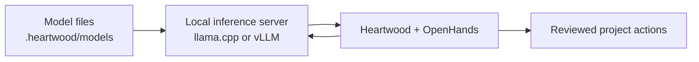

<!--

This source file is part of the Heartwood open-source project

SPDX-FileCopyrightText: 2026 Stanford University and the project authors (see CONTRIBUTORS.md)

SPDX-License-Identifier: MIT

-->

# Run a Model Locally

A local model processes Heartwood requests inside the current machine or research environment instead of sending them to a hosted provider. This can support offline work and deployment-owned data boundaries, but it also requires enough storage and compute to run the selected model.

Heartwood images and native runtime bundles contain inference software, not model weights. A model is downloaded only after an explicit user request and remains in the current project's `.heartwood/models/` directory.

## Understand the Three Parts

Local inference involves three distinct parts:

1. **Model files** contain the learned weights and model configuration. They can be several gigabytes and remain on persistent project storage.
2. **The inference server** loads those files into memory and exposes a private model API on the local machine. Heartwood uses llama.cpp for its portable CPU path and vLLM for supported NVIDIA GPU paths.
3. **Heartwood and OpenHands** send the conversation to that private API, interpret the response, and propose coding actions for review.



Downloading a model prepares the files but does not leave a server running. `heartwood launch` starts the server, waits until the selected model is ready, opens the terminal or browser, and stops the server when the session ends. The downloaded files remain available for the next launch.

## Choose a Local Setup

| Setup | Use it when | Heartwood manages |
|---|---|---|
| Existing OpenAI-compatible service | Ollama, vLLM, SGLang, llama.cpp, or another compatible server is already running | Connection, route authorization, and model selection |
| Portable CPU model | Docker or a supported portable image is available and slower local inference is acceptable | Model selection, download, verification, llama.cpp startup, and shutdown |
| NVIDIA GPU model | The explicit GPU image or Carina runtime is available with enough GPU memory | Model selection, download, verification, vLLM startup, and shutdown |

An existing service avoids another model download when the model is already managed elsewhere. The portable CPU path is the most widely compatible demonstration. The GPU path starts faster inference but requires a compatible NVIDIA environment and usually much more storage and accelerator memory.

## Check the Requirements First

Run the guided local-model catalog from the project directory:

```bash
heartwood models local
```

Each recommendation shows its download size, expected storage, memory, processor, and runtime. These are conservative planning estimates derived from the model artifact, not performance guarantees.

Current recommendations include a quantized Qwen2.5 7B demonstration model for CPU use, a coding-oriented CPU alternative, and a Qwen2.5 7B snapshot for supported NVIDIA deployments. The installed release's catalog is authoritative because recommendations may change between releases.

A recommended model is one for which Heartwood maintains reproducible source and runtime metadata. It does not mean that the model is appropriate for biomedical work, production use, a particular dataset, or an institution's requirements.

## Let Heartwood Prepare a Model

The easiest path is to run `heartwood`, choose **On this device**, and select a recommendation. The browser offers the same choices under **Settings** and reports download progress.

The equivalent terminal flow is:

```bash
heartwood models local
heartwood models download qwen25-7b-instruct-q4_k_m
heartwood launch --dry-run
heartwood launch
```

Heartwood performs the following work:

1. resolves the model source to an immutable revision;
2. selects a representation supported by the available CPU or GPU runtime;
3. reports the expected transfer, free-space, memory, and processor requirements;
4. downloads into a temporary project-local location and reports progress;
5. verifies source and content metadata before making the artifact active;
6. saves the non-secret model and runtime selection for the project;
7. starts the local server only when `heartwood launch` is requested.

The dry run changes no external state. It shows which project, model, runtime, and compute request a real launch would use.

## Use Another Hugging Face Model

Choose **Other Hugging Face model** in guided setup or provide the repository identifier directly:

```bash
heartwood models inspect <owner/model>
heartwood models download <owner/model>
```

`inspect` does not download model weights. It resolves the repository, chooses one supported plan, and displays the exact artifact and resources Heartwood would use. `download` repeats that resolution, transfers and verifies the content, and selects it for the project. Supply `--revision <branch-tag-or-commit>` only when the repository's default revision is not appropriate.

The CPU runtime accepts a repository with one complete GGUF file and source digest metadata. When several files exist, Heartwood prefers a uniquely identifiable balanced quantization such as Q4_K_M and rejects an ambiguous choice. A supported NVIDIA deployment accepts a standard snapshot with `config.json` and safetensors or PyTorch weights for vLLM.

Split GGUF files, custom model code, incomplete metadata, unsupported weight formats, and repositories without a representation for the installed runtime fail before transfer. The error links to the GitHub issue chooser so support can be evaluated without silently guessing.

Public repositories need no credential. For a private or gated repository, run `hf auth login` before Heartwood. The standard Hugging Face credential store owns that token; Heartwood does not write it into project configuration, events, logs, or audit exports.

## Start and Stop the Local Server

Start the terminal experience with:

```bash
heartwood launch
```

Start the model and browser together with:

```bash
heartwood launch --web
```

During launch, Heartwood reports each stage while it verifies the model, checks the runtime, starts the loopback server, waits for model readiness, validates the shared project setup, and opens the selected interface. Large models can take several minutes to load. Heartwood reports elapsed time every 15 seconds and writes runtime details to `.heartwood/logs/local-model.log`.

Leave the launch command running while using the terminal or browser. Press `Ctrl+C` or exit the interface to stop the server. The model files and project state remain on disk.

Run these diagnostics when the next step is unclear:

```bash
heartwood doctor
heartwood launch --dry-run
```

`compute-required` means the model is verified but its local server is not running. This is the expected state between launches. `recovery-required` means configuration, artifact, runtime, or platform evidence needs attention.

## Understand CPU and GPU Behavior

| Environment | Runtime | Model representation | Notes |
|---|---|---|---|
| Generic portable image | llama.cpp on CPU | Single-file GGUF | Works on supported AMD64 and ARM64 hosts; an attached GPU does not accelerate this baseline path |
| Generic NVIDIA image | vLLM on NVIDIA GPU | Standard Hugging Face snapshot | AMD64 and compatible NVIDIA drivers required |
| Terra portable image | llama.cpp on CPU | Single-file GGUF | Retains Terra's Jupyter and persistent-disk behavior |
| Terra NVIDIA image | vLLM on NVIDIA GPU | Standard Hugging Face snapshot | Requires a compatible Terra GPU environment and live validation |
| Stanford Carina native installation | vLLM on an allocated NVIDIA GPU | Standard Hugging Face snapshot | `heartwood launch` requests explicit scheduler consent and stages the model to job-local storage |

Heartwood chooses only among runtimes installed and declared by the current deployment. It does not claim that every Hugging Face model can run in every environment.

## Connect an Existing Local Service

When a compatible model server is already running on loopback port `8765`, ask it for available models and choose one:

```bash
heartwood models refresh local
heartwood models connect local <model-id>
heartwood
```

For another address, use **Custom API** in the browser or the CLI `--base-url` option. In this mode, the external service owns model loading and process lifecycle; do not run `heartwood launch` for that connection.

## Run the Container Offline

Use one persistent project mount for analysis files, configuration, sessions, models, logs, and audit data. First download while network access is available:

```bash
docker volume create heartwood-project

docker run --rm -it \
  -v heartwood-project:/workspace \
  ghcr.io/schmiedmayerlab/heartwood:0.2.0 \
  heartwood models download qwen25-7b-instruct-q4_k_m
```

Then start a terminal session with container networking disabled:

```bash
docker run --rm -it \
  --network none \
  -v heartwood-project:/workspace \
  ghcr.io/schmiedmayerlab/heartwood:0.2.0 \
  heartwood launch --plain
```

The inference server and model connection remain on loopback. The agent can still read and modify files in the mounted project, so network isolation does not replace action review. For browser use, publish port `8767` and apply the deployment's reviewed egress controls rather than Docker's `none` network.

A host directory can replace the named volume when it is writable by container user `10001`. [Container Images](container-images.md) explains user mapping, GPU access, tags, and deployment controls.

## Prepare an Air-Gapped Environment

An air-gapped deployment must receive all required inputs through an authorized transfer process before network access is removed:

- the exact Heartwood image or native release bundle;
- the verified model and its provenance and integrity metadata;
- the project and required data;
- deployment policy and platform configuration;
- any additional Skills that already passed review.

Keep the model under the project's `.heartwood/models/` layout and preserve its exact integrity and provenance files. Run `heartwood doctor` and `heartwood launch --dry-run` before opening a session.

Repository continuous integration uses a deterministic loopback model fixture to validate OpenHands orchestration, policy, grouped confirmation, Skills, audit, CLI, browser, and notebook contracts without claiming model quality. A separately triggered capable-model acceptance downloads a pinned recommendation, requires a real OpenHands tool call, verifies the resulting synthetic artifact, and runs with container networking disabled.

From a repository checkout, run the deterministic gate with:

```bash
docker compose -f images/generic/compose.yaml run --rm --build heartwood
```

The resource-intensive capable-model workflow is available through the `run_capable_model` option on the Container Smoke Test workflow. It does not replace model-quality evaluation for the intended research tasks.

## Review Actions and Audit Activity

Local inference changes where the model runs, not what the agent may do. Heartwood still defaults to OpenHands `AlwaysConfirm`, displays the complete pending action set, and records whether it was allowed or rejected. A platform may permit **Auto-Approve Low Risk**, but medium-, high-, and unknown-risk action sets still require review.

Export the scrubbed activity record after validation:

```bash
heartwood audit export
```

The export omits prompts, model responses, action details, paths, row values, and credentials. Review it before moving it outside the deployment boundary.
