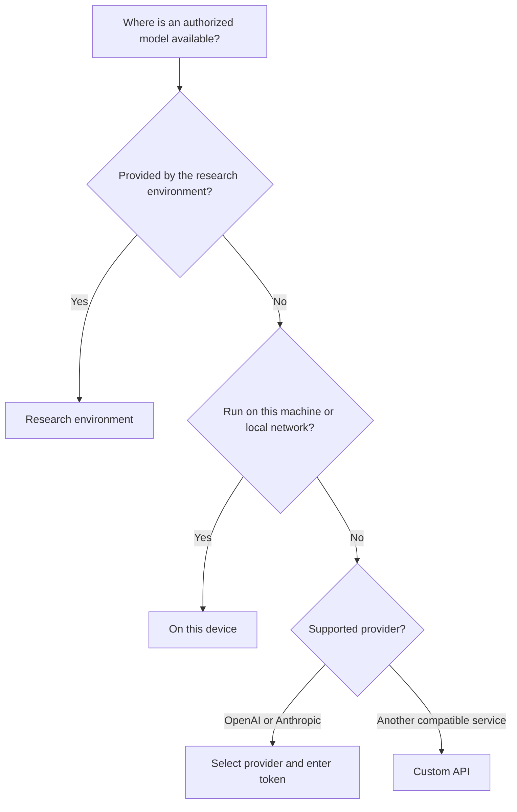

<!--

This source file is part of the Heartwood open-source project

SPDX-FileCopyrightText: 2026 Stanford University and the project authors (see CONTRIBUTORS.md)

SPDX-License-Identifier: MIT

-->

# Connect a Model

Heartwood needs a language model to understand requests and decide which coding actions to propose. A model connection tells Heartwood where that model runs and how the current deployment is allowed to reach it.

Heartwood asks the selected service for its available models whenever possible. It does not maintain a handwritten list of current OpenAI, Anthropic, or research-platform model identifiers.

!!! note "Connection is not authorization"

    A successful model connection proves that Heartwood can reach the service. The project owner must still confirm that the exact endpoint, account, retention settings, agreements, and data classification are appropriate for the intended work.

## Choose the Simplest Source

| Choose | Best when | You provide |
|---|---|---|
| **Research environment** | Your platform or institution already provides an approved model service | Usually only a model choice |
| **On this device** | A model should run on the same machine or an existing local service is available | A recommended model, another Hugging Face `owner/model` identifier, or a model reported by the running service |
| **OpenAI** | Your project is authorized to use an OpenAI service | A provider token, then a model returned by OpenAI |
| **Anthropic** | Your project is authorized to use an Anthropic service | A provider token, then a model returned by Anthropic |
| **Custom API** | Another service follows the OpenAI API format | Its base URL, optional token, and model choice |

Use the research-environment option when it is available. It can hide credentials and endpoint details that the platform already manages. Use **On this device** when prompts must remain on the current machine or network boundary. A hosted-provider choice is appropriate only when the exact route is authorized for the project data.



## Use Guided Setup

Start Heartwood from the project directory:

```bash
cd /path/to/project
heartwood
```

An unconfigured project opens model setup automatically. Choose a source and then choose one of the models returned by that source. The browser presents the same choices under **Settings**.

The setup sequence is the same in both interfaces:

1. choose a model source;
2. provide a credential only when the source requires one;
3. choose a model discovered from the service or local catalog;
4. review the connection and action-confirmation settings;
5. let Heartwood validate the route before conversation begins.

For local inference, setup shows:

- models reported by an already running local service;
- a short, centrally maintained recommendation list;
- **Other Hugging Face model**, which accepts an `owner/model` identifier and prepares a compatible plan when possible.

After a local model download, run `heartwood launch` to start its inference server before opening the conversation. [Run a Model Locally](getting-started-offline.md) explains that complete lifecycle.

## Understand Each Source

### Research Environment

Choose this when the platform or institution supplies the endpoint and identity. The interface shows every model exposed to the current identity without requiring users to enter implementation-specific URLs. The deployment remains responsible for describing which models and data classifications are approved.

### On This Device

Choose this for an already-running loopback service or a Heartwood-managed download. Heartwood lists models reported by the service, shows a small maintained recommendation catalog, and accepts another Hugging Face `owner/model` identifier when it can determine a supported runtime plan.

### OpenAI or Anthropic

Choose the provider, enter a token at the private prompt, and select a model returned by the provider API. Heartwood does not hard-code a provider model list. The token remains in the current process and must normally be entered again after restart.

### Custom API

Choose this for another service that implements compatible OpenAI model-list and chat-completion routes. Provide its base URL, optional token, and model choice. Prefer a platform-managed research connection when the endpoint is already configured for the environment.

## Keep Credentials Out of Project State

Heartwood never stores provider token values in `.heartwood/config.toml`, command arguments, session events, logs, or audit exports.

- A token entered in the terminal or browser remains only in the running Heartwood process. Enter it again after restart unless the deployment supplies an approved persistent secret binding.
- A managed research environment may provide a platform identity, mounted secret, or other credential that the user never handles directly.
- A private or gated Hugging Face repository uses the standard credential store created by `hf auth login`; Heartwood does not copy that token into project state.
- The CLI has no token command-line argument because shell history and process listings are inappropriate places for secrets.

Heartwood supplies the selected credential to the OpenHands model client after authorizing the route. It removes configured environment-backed provider keys from OpenHands terminal subprocess environments, but this is not a complete same-user process sandbox. A deployment that must isolate model credentials from tools needs a supported OpenHands remote workspace or platform-native boundary.

## Use Advanced Terminal Commands

The guided setup is the normal path. These commands expose the same shared gateway operations for automation and troubleshooting:

```bash
heartwood models list
heartwood models refresh <connection-id>
heartwood models connect <connection-id> <model-id>
heartwood models validate
```

`refresh` authorizes the catalog route before contacting it. `connect` saves the selected non-secret profile in the current project's `.heartwood/config.toml`. `validate` checks that the credential binding and model route are available without printing a secret.

For a model service already running on the standard loopback endpoint:

```bash
heartwood models refresh local
heartwood models connect local <model-id>
```

The local connection works with Ollama, vLLM, SGLang, llama.cpp, and other services that expose compatible OpenAI model-list and chat-completion routes. Use [Run a Model Locally](getting-started-offline.md) when Heartwood should download the model and supervise the server as well.

## Configure a Research Environment Connection

A research platform may expose one model or a full catalog through an identity it already manages. Heartwood normalizes these deployments through the `heartwood.model-connections.v1` connection contract so the terminal, browser, and notebook bridge see the same choices.

Stanford Carina includes a guided **Stanford AI API Gateway** choice. Start Heartwood and select it, or request that source explicitly:

```bash
heartwood setup --model-source stanford-ai-api-gateway
```

Heartwood obtains current model aliases from the service rather than embedding them in the application. The Stanford service agreement, project review, data classification, and platform controls determine which route may receive particular data.

## Configure a Custom API

The Custom API path accepts an absolute HTTPS base URL, or loopback HTTP for a service on the same machine. Remote services require a token or managed platform credential, and the configured policy endpoint must use the same origin as the model service.

When the service provides a `/models` route, Heartwood shows the exact identifiers it returns. If it cannot list models, the browser permits a manual identifier and the CLI provides the equivalent advanced command:

```bash
heartwood models connect custom-api <model-id> \
  --base-url https://models.example.org/v1 \
  --manual
```

OpenHands and LiteLLM remain responsible for provider-specific requests and tool-call formatting. Heartwood does not implement a second provider client.

## Understand Route Authorization

Finding a model and sending project content to that model are separate decisions. Heartwood authorizes the catalog route before discovery and authorizes the completion route before each initial, approved, or resumed model turn.

A successful connection means the software can use the configured route. It does not establish a business associate agreement, Health Insurance Portability and Accountability Act eligibility, dataset authorization, acceptable retention, regional controls, or institutional approval. The deployment owner must verify those conditions for the exact service and project.

## Continue from Here

- Return to [Get Started](getting-started.md#step-4-choose-an-interface) after the project has an active model.
- Use [Run a Model Locally](getting-started-offline.md) for downloads, CPU and GPU runtime selection, resource checks, and offline operation.
- Use [Troubleshooting](troubleshooting.md#resolve-connection-problems) when discovery, credentials, policy, or completion routes fail.
- Operators should read [Deploy Heartwood](deployment.md#configure-model-access) before supplying managed identities or persistent secret bindings.
