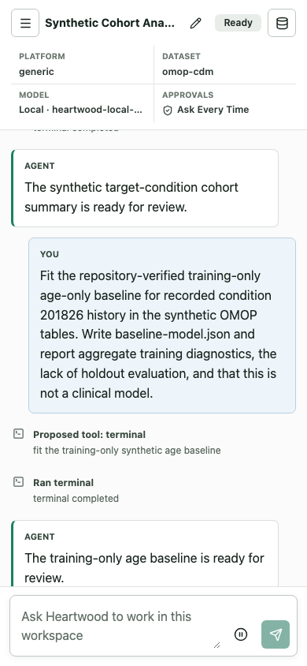

<!--

This source file is part of the Heartwood open-source project

SPDX-FileCopyrightText: 2026 Stanford University and the project authors (see CONTRIBUTORS.md)

SPDX-License-Identifier: MIT

-->

# Heartwood on Terra

Use the Terra image when an analysis already lives in a Terra workspace and Heartwood should be available beside its notebooks and files. The image preserves Terra's normal Jupyter environment and adds the Heartwood terminal command, browser interface, notebook kernel, and local-model support.

The complete release workflow has not yet been live-validated in Terra. Follow this guide in a synthetic workspace containing no protected health information while collecting that evidence.

## Before You Begin

You need permission to create a Terra Cloud Environment with a custom image and a persistent disk large enough for the project. A hosted model needs an authorized route and credential. A local model also needs storage and enough CPU or GPU capacity for the resource guidance Heartwood displays.

Terra keeps `/home/jupyter` on the persistent disk. Create a separate analysis directory there; that directory, rather than all of `/home/jupyter`, becomes the Heartwood project.

## Start the Terra Environment

Use the immutable release image:

```text
ghcr.io/schmiedmayerlab/heartwood:0.2.0-terra
```

Create a Terra workspace containing no protected health information, select the custom image, and start Jupyter. Confirm that:

- the normal notebook file browser opens rather than returning a 404;
- the `Python 3 (Heartwood)` kernel is available;
- the notebook survives the expected Leonardo route prefix;
- `/home/jupyter` is backed by the persistent disk selected for the environment.

If the file browser does not open normally, stop before model or project setup and record the Cloud Environment error. Do not install Heartwood again inside the image.

## Create a Synthetic Project

Terra opens terminals and notebooks on its persistent `/home/jupyter` disk. Create one directory for the analysis, place the notebook and localized inputs there, and open that copy of the notebook from the Jupyter file browser:

```bash
mkdir -p /home/jupyter/heartwood-demo/input
cp /opt/heartwood/docs/terra-jupyter-demo.ipynb \
  /home/jupyter/heartwood-demo/
cp /opt/heartwood/fixtures/synthetic/omop-like/*.csv \
  /home/jupyter/heartwood-demo/input/
cd /home/jupyter/heartwood-demo
heartwood detect
heartwood doctor
```

`heartwood-demo` is only the tutorial's project name. Heartwood has no fixed Terra workspace path: the directory containing the terminal command, notebook, or web-server process is the project, and the agent works only on that directory and its descendants. Heartwood creates `.heartwood/` inside that project for configuration, sessions, models, Skills, logs, and audit data. Both project files and Heartwood state survive a container restart when the Terra persistent disk is retained.

The fixture contains 24 synthetic people, 39 condition-occurrence rows, and 20 people with condition concept `201826`. It contains no protected health information. Terra workspace buckets and data tables are separate storage; files must be localized into the project before the agent can use them.

## Configure a Model

The image contains no model weights and no provider credentials. Choose one path.

### Research Environment or Hosted Model

Open the Heartwood browser interface and select a platform-provided research service, OpenAI, Anthropic, or Custom API. The interface asks only for values required by that connection and lists models returned by the service itself. The deploying institution must authorize the exact provider, route, identity, retention settings, and data classification. For controlled data, the route must be covered by an institution-approved business associate agreement when one is required.

The CLI exposes the same model catalog:

```bash
heartwood models list
heartwood models refresh <connection-id>
heartwood models connect <connection-id> <model-id>
```

### Local Model

Choose a machine and persistent-disk size that meet the guidance shown by `heartwood models local`, then select a recommendation or another supported Hugging Face model:

```bash
heartwood models local
heartwood models download qwen25-7b-instruct-q4_k_m
# Or inspect and download another repository:
heartwood models inspect <owner/model>
heartwood models download <owner/model>
heartwood launch --web
```

The portable Terra image chooses a supported single-file GGUF model for its CPU llama.cpp runtime. Heartwood resolves the repository to an immutable revision, displays estimated storage and memory requirements, downloads it into the current project's `.heartwood/models/` directory, verifies it, and persists the shared selection. The launcher supervises both the model and browser interface. First inference on CPU can be slow, and attaching a GPU does not accelerate this portable image's llama.cpp path.

The explicit Terra GPU image is `ghcr.io/schmiedmayerlab/heartwood:0.2.0-terra-gpu-nvidia`. It contains the pinned vLLM runtime but still contains no model weights. In that image, Heartwood prefers a supported standard Hugging Face snapshot and reports approximate GPU-memory requirements. GPU selection, model suitability, and live platform validation must match the deployment evidence before it replaces the CPU path.

## Open the Browser Interface

For a hosted or already running model, start the interface from the project directory:

```bash
cd /home/jupyter/heartwood-demo
heartwood serve
```

For a Heartwood-managed local model, use `heartwood launch --web` instead so the model remains supervised. Open the authenticated Jupyter proxy route for port `8767`; it normally ends in `/proxy/8767/`. Treat this as a synthetic validation workflow until the exact release image completes the route, persistence, and resume checks in a real Terra control plane.



The screenshot shows the responsive layout used by the automated notebook-viewport test. It is not evidence of live Leonardo behavior or model quality.

## Run the Synthetic Workflow

Open session `terra-demo` and submit:

```text
Build the synthetic target-condition cohort for concept 201826 with the repository-verified cohort Skill. Read the tables in input, require age 18 or older, apply an aggregate count floor of 20, write cohort-summary.json, and report aggregate quality checks without row-level values.
```

Review every member of the pending OpenHands action set. Select **Allow all once** only when the commands, paths, and outputs match the request. Exercise **Reject all** on a separate synthetic proposal.

The expected cohort result reports 24 source participants, 39 source condition rows, 20 cohort participants, 35 cohort condition rows, passing integrity checks, and no row-level values. A successful synthetic result validates integration behavior, not biomedical correctness for another dataset.

Use Activity to inspect the ordered event trace and Export Audit to produce the scrubbed record. Action confirmation defaults to **Ask Every Time**. When policy permits **Auto-Approve Low Risk**, medium-, high-, and unknown-risk action sets continue to require grouped review.

## Verify the Same Session

After the web conversation is idle, replay it from a terminal in the same project:

```bash
cd /home/jupyter/heartwood-demo
heartwood --session-id terra-demo replay
heartwood --session-id terra-demo audit export \
  --output terra-demo-audit.jsonl
```

Open the copied notebook from the project directory with the Heartwood kernel. Its process starts in the notebook directory, so the notebook bridge resolves the same project without another path setting:

```python
from pathlib import Path

from heartwood.notebook import NotebookSession, jupyter_proxy_url

project_root = Path.cwd().resolve()
session = NotebookSession(session_id="terra-demo")
view = session.replay()
assert session.project.root == project_root
print(view.event_count)
print(jupyter_proxy_url(port=8767))
```

The terminal, notebook bridge, and browser interface read the same project session and must report the same persisted events. Use them sequentially; independently running writers to one file-backed session are not a supported coordination pattern.

## Record Live-Validation Evidence

Record only synthetic evidence:

- Heartwood image and Terra base image digests;
- machine shape, persistent-disk size, startup time, and autopause/resume behavior;
- notebook route, Heartwood kernel, and proxy behavior;
- selected non-secret model profile and route-policy decision;
- optional local artifact identifier and digest;
- one allowed and one rejected action set;
- matching web, CLI, and notebook replay results;
- scrubbed audit export location;
- observed platform identity and network controls.

## Understand the Image Contract

The release extends the pinned Terra Jupyter Python base recorded in `images/platforms.toml`. It preserves the `jupyter` user, persistent home, notebook server, kernel registration, entrypoint, and Leonardo proxy behavior.

The public tag is a `linux/amd64` Docker schema-2 manifest with media type `application/vnd.docker.distribution.manifest.v2+json`. Terra Leonardo image auto-detection rejects an Open Container Initiative index, so the Terra tag intentionally differs from the generic multi-platform tag. `edge-terra` follows the latest validated `main` build and is appropriate only for development testing.

Record both the Heartwood image and Terra base image digests when collecting deployment evidence. Passing the image and proxy checks establishes software compatibility, not authorization for workspace data, a model provider, or controlled-data use.

A real Terra workspace validation is still distinct from institutional approval. Do not introduce controlled data until the exact image, model route, credentials, project storage, network path, and intended use have passed institutional review.

## Terra References

- [Terra custom cloud environment tutorial](https://support.terra.bio/hc/en-us/articles/360037143432-Docker-tutorial-Custom-Cloud-Environments-for-Jupyter-Notebooks)
- [Starting and customizing a Jupyter app](https://support.terra.bio/hc/en-us/articles/5075814468379-Starting-and-customizing-your-Jupyter-app)
- [Terra architecture and persistent disks](https://support.terra.bio/hc/en-us/articles/360058163311-Terra-architecture-where-your-data-and-tools-live)
- [Accessing workspace-bucket data from a notebook](https://support.terra.bio/hc/en-us/articles/360046617372-Accessing-data-from-the-workspace-Bucket-in-a-notebook)
- [DataBiosphere Terra Docker images](https://github.com/DataBiosphere/terra-docker)
