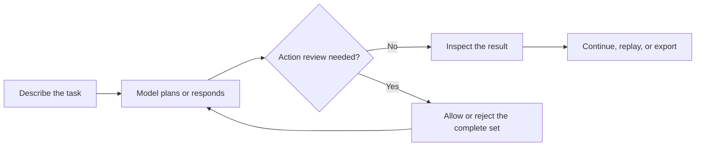

<!--

This source file is part of the Heartwood open-source project

SPDX-FileCopyrightText: 2026 Stanford University and the project authors (see CONTRIBUTORS.md)

SPDX-License-Identifier: MIT

-->

# Work with the Agent

This guide covers the recurring workflow after Heartwood is installed: open a project, ask for work, review the complete proposed action set, and preserve or export the session. Complete [Get Started](getting-started.md) first if the project does not yet have a model connection.

## Open or Resume a Project

Change into the analysis directory before starting Heartwood:

```bash
cd /path/to/analysis-project
heartwood
```

Heartwood does not search parent directories or require a workspace option. Starting it from a nested directory creates a separate project there. Run `pwd` first when the boundary matters.

On the first run, Heartwood guides you to a model connection. Local setup offers a small recommendation list and an **Other Hugging Face model** choice; Heartwood determines the supported runtime and shows resource guidance. A configured project opens the interactive conversation directly. A downloaded local model that needs managed compute directs you to `heartwood launch`.

Use the read-only diagnostic at any time:

```bash
heartwood doctor
```

`ready`, `setup-required`, and `compute-required` describe normal next steps. `recovery-required` identifies configuration or runtime evidence that must be corrected before work continues.

## Follow the Agent Workflow



### Ask for a Bounded Result

Enter a specific task at the `heartwood>` prompt. State the inputs, expected outputs, and constraints that matter for review. For example:

```text
Inspect the CSV files in input, summarize missing values by column, and write the aggregate result to missingness-summary.csv. Do not include row-level values.
```

Heartwood sends the request to the selected model together with the reviewed Skills available to the project. The agent may respond directly or propose coding actions. Heartwood records the messages, proposed actions, decisions, and tool outcomes in the project session.

For automation or a basic terminal, submit one task without opening the full-screen interface:

```bash
heartwood chat --plain --prompt "Summarize the analysis scripts and their outputs."
```

### Understand Waiting States

Heartwood displays activity while the model is preparing a response or while an approved tool is running. Local models and complex tasks can take longer than hosted-model conversations. The interface reports elapsed time when a wait becomes noticeable; it does not invent workflow steps that the agent has not reported.

If the process exits or remains unavailable, run `heartwood doctor`. For a downloaded local model, confirm that `heartwood launch` or `heartwood launch --web` is still running. See [Troubleshooting](troubleshooting.md) for the common readiness and runtime checks.

### Review the Complete Action Set

Heartwood defaults to **Ask Every Time**. When OpenHands reaches a confirmation stop, Heartwood shows every member of the pending action set with its tool, summary, arguments, and risk classification.

- Choose **Allow all once** only when every action in the set is appropriate.
- Choose **Reject all** when any member is unnecessary, unsafe, out of scope, or unclear.

The OpenHands SDK approves or rejects one confirmation stop as a group. Heartwood does not imply that individual actions can be executed independently when the upstream runtime cannot support that behavior.

The optional **Auto-Approve Low Risk** mode lets actions classified by OpenHands as low risk execute automatically. Medium-, high-, and unknown-risk action sets still stop for review. The selected platform policy determines whether this mode is available.

!!! warning "Reject uncertainty"

    Reject the complete set when any action has an unexpected command, path, destination, data scope, or side effect. Clarify the request and let the agent propose a new set.

## Control the Session

The terminal interface supports arrow-key navigation and displays available actions at each confirmation stop. Type `/help` for the current command list. Common commands include:

| Command | Result |
|---|---|
| `/status` | Show the selected model, credential status, action mode, and policy decision. |
| `/allow` | Allow the complete pending action set once. |
| `/reject` | Reject the complete pending action set. |
| `/pause` and `/resume` | Pause or resume the current session. |
| `/replay` | Reprint the persisted session history. |
| `/audit-export` | Create a scrubbed JSON Lines audit export. |
| `/exit` | Close the interface without deleting project state. |

Use a session identifier when separate conversations should share the same project files:

```bash
heartwood --session-id cohort-review
heartwood --session-id manuscript-review
```

Return to a session by starting Heartwood with the same identifier. The browser interface lists sessions recorded in the current project.

## Continue in Another Interface

The terminal, browser, and notebook are presentation layers over the same project configuration and session record. Finish the active turn before switching interfaces, and use the same project directory and session identifier.

### Browser

Start the shared gateway and web application from the project directory:

```bash
heartwood serve
```

Open `http://127.0.0.1:8767/`. The browser uses the same project configuration, sessions, action settings, model profiles, Skills, and audit store as the terminal. See [Use the Browser and Notebooks](web-interface.md) for model setup and notebook-proxy use.

An unconfigured project opens the shared setup view automatically. Changes made through the browser are visible to the next terminal or notebook command, and opening **Settings** refreshes changes made by another interface. A downloaded local model still needs the terminal-owned `heartwood launch --web` lifecycle before the browser can submit a task.

### Notebook

The notebook bridge also binds to the notebook process's current directory:

```python
from heartwood.notebook import NotebookSession

session = NotebookSession(session_id="cohort-review")
view = session.replay()
print(view.event_count)
```

Run terminal, web, and notebook writes to the same session sequentially. File-backed sessions protect one process at a time; independently running writers are not a supported coordination mechanism.

## Preserve or Move the Project

Heartwood stores configuration, conversations, downloaded models, Skills, logs, and audit data in `.heartwood/` inside the project. Keep that directory with the project, do not commit it, and do not ask the agent to inspect or modify it.

[Project Files and State](project-state.md) explains the complete layout, persistence behavior, interface sharing, and project migration.

## Export an Audit Record

The in-boundary session contains conversation content needed for resume. Audit export is a separate, content-minimized record of route decisions, action classifications, approvals or rejections, tool outcomes, and Skill activation.

```bash
heartwood --session-id cohort-review audit export
```

Review the export before moving it outside the deployment boundary. A scrubbed export is evidence about Heartwood activity, not automatic authorization to disclose data or results.

## Continue from Here

- Read [Browser and Notebooks](web-interface.md) for visual setup, notebook APIs, Jupyter routing, and shared-session examples.
- Review [Project Files and State](project-state.md) before moving, backing up, or resetting a project.
- Consult [Troubleshooting](troubleshooting.md) when readiness, model startup, or an interface does not behave as expected.
- Review [Audit and Reproducibility](../design/06-observability-audit.md) for the technical distinction between resumable sessions and content-minimized audit records.
