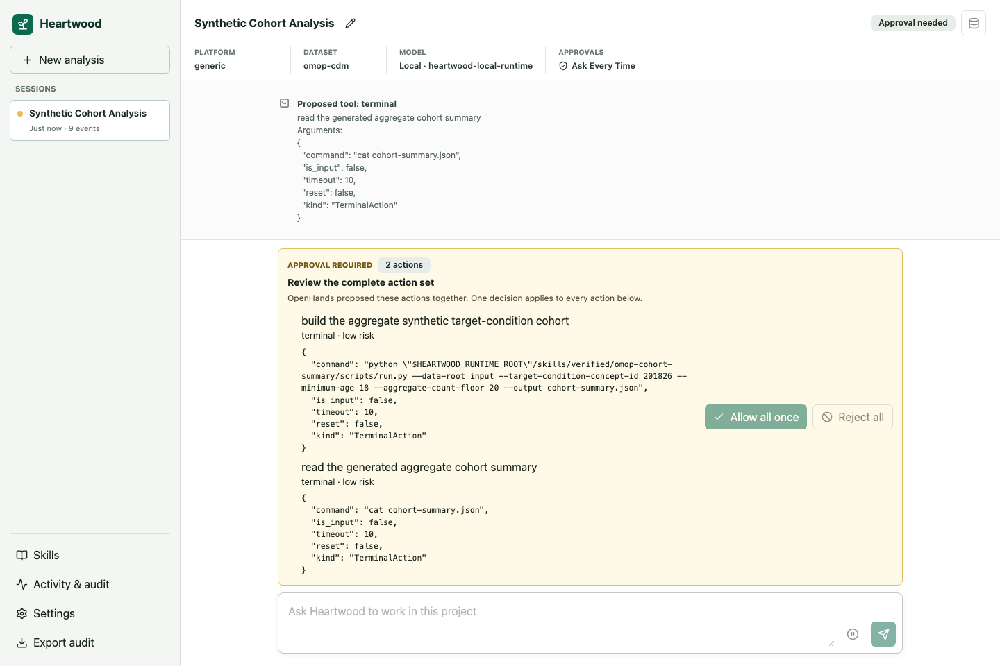

<!--

This source file is part of the Heartwood open-source project

SPDX-FileCopyrightText: 2026 Stanford University and the project authors (see CONTRIBUTORS.md)

SPDX-License-Identifier: MIT

-->

# Work with Heartwood

Heartwood provides an interactive coding conversation around one project. The normal cycle is request, proposal, review, execution, and result.

## Start or Resume

From the project directory, run:

```bash
heartwood
```

The first run opens model setup. Later runs resume the default session. A downloaded local model must be started with `heartwood launch`.

Use a session identifier when separate conversations should share the project files:

```bash
heartwood --session-id cohort-review
heartwood --session-id manuscript-review
```

## Ask for a Verifiable Result

A useful request identifies:

- the input files or directories;
- the output to create or update;
- the checks that should pass;
- any files, data, or network routes that must not be used; and
- whether only aggregate output is acceptable.

Prefer a bounded first step over a broad request to “analyze everything.” Ask Heartwood to report assumptions when the data or expected result is ambiguous.

## Follow the Activity

The terminal and browser show when Heartwood is waiting for the model, preparing an action group, waiting for review, running tools, or finalizing the response. Local-model downloads and startup report their own progress and elapsed time.

Long response times depend on model size, hardware, context length, and task complexity. Keep the active interface open while a turn is running. A waiting indicator confirms that the request is active; it does not prove that a specific analysis step has completed.

## Review Action Groups

OpenHands may propose one or several actions at one confirmation point. Heartwood displays them as one group because the backend applies one decision to the complete set.

Before approval, inspect every:

- terminal command;
- file operation and path;
- proposed content;
- network or package action; and
- output destination.

Choose **Allow all once** only when every member is appropriate. Choose **Reject all** when any member is unclear, unnecessary, or outside the request. A rejection executes none of the displayed actions.

**Ask Every Time** is the default. A deployment may permit **Auto-Approve Low Risk**, but actions classified as medium, high, or unknown risk still stop for review. Risk labels support review; they do not replace it.



## Use Session Controls

Inside the terminal interface:

| Command | Effect |
|---|---|
| `/status` | Show the active model, policy, and action mode |
| `/allow` | Allow the complete pending action group once |
| `/reject` | Reject the complete pending action group |
| `/pause` and `/resume` | Pause or resume the session |
| `/replay` | Reprint the persisted session history |
| `/audit-export` | Export the content-minimized audit record |
| `/help` | Show interactive commands |
| `/exit` | Close the interface without deleting state |

The full-screen terminal also supports keyboard navigation. Use `heartwood chat --plain` for a line-oriented terminal or automation.

## Use Skills

Bundled Skills give the agent repository-verified procedures for synthetic reference workflows. List them with:

```bash
heartwood skills list
```

Inspect a local extension before installing it:

```bash
heartwood skills inspect /path/to/skill
heartwood skills install /path/to/skill --approve
```

Remove a project extension by its installed name:

```bash
heartwood skills remove <name>
```

Inspection reports declared metadata and permissions; review the source files themselves before approval. An installed extension is project-specific. A verified Skill is not a clinical, statistical, security, or institutional certification.

## Inspect and Export Activity

Replay the current session:

```bash
heartwood --session-id cohort-review replay
```

Export its scrubbed audit record:

```bash
heartwood --session-id cohort-review audit export
```

The resumable session contains conversation, tool, and Skill invocation details. The audit export is a separate, content-minimized record of route decisions, action groups, approvals or rejections, and tool outcomes; invocation arguments are removed. Review any export before moving it outside the deployment boundary.

## Switch Interfaces

Wait for the active turn to finish, then open the same project and session from another interface. The terminal and browser expose the complete conversation workflow. The notebook bridge can submit tasks, decide action groups, replay, and export audit data, but initial setup, local-model supervision, and Skill management are clearer in the terminal or browser.
