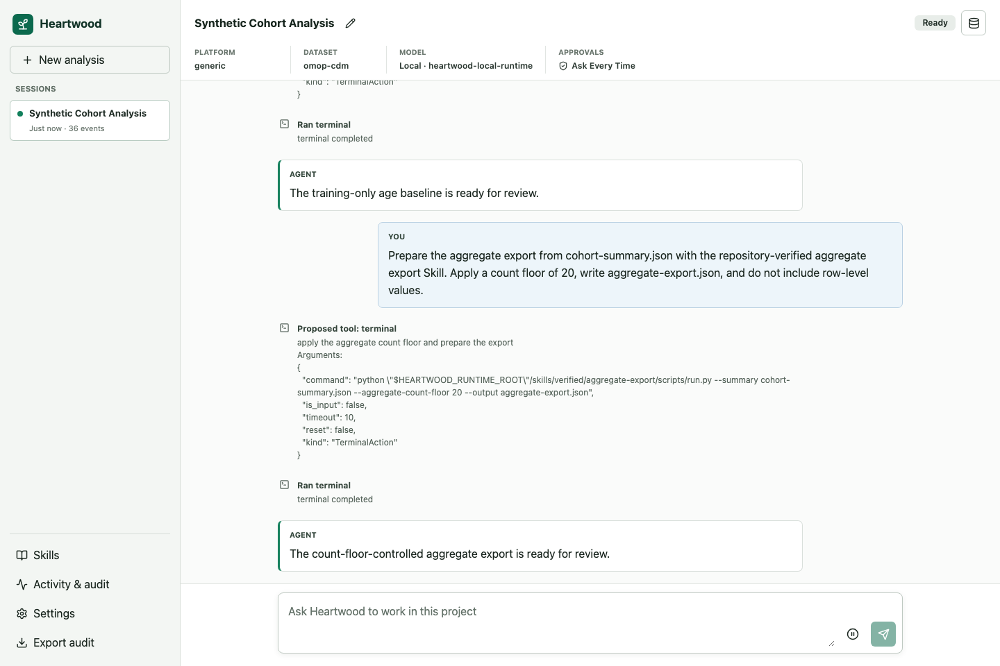

<!--

This source file is part of the Heartwood open-source project

SPDX-FileCopyrightText: 2026 Stanford University and the project authors (see CONTRIBUTORS.md)

SPDX-License-Identifier: MIT

-->

# Use the Browser and Notebooks

The browser and terminal are two views of the same Heartwood project. They use the same conversations, model selection, action review, Skills, and audit history. Both interfaces also report the same project readiness checks. Start either interface from the directory Heartwood should treat as the project; its private configuration and progress remain in `.heartwood/`.

## Choose an Interface

| Interface | Best for | How to start |
|---|---|---|
| Interactive terminal | Initial setup, reliable remote use, model startup, and repeated agent work | Run `heartwood`; use `heartwood launch` for a downloaded local model. |
| Browser | Visual model setup, conversation, grouped action review, and audit inspection | Run `heartwood serve`; use `heartwood launch --web` for a downloaded local model. |
| Notebook | Detecting project data, submitting a task, reviewing the shared session, and embedding results beside an analysis | Start from a configured project and use `NotebookSession`. |

The notebook API is not a separate agent or model runtime. Configure the project once through the terminal or browser. When using a Heartwood-managed local model, keep `heartwood launch --web` running while the notebook sends requests.

## Open the Interface

Start the browser interface from the project directory:

```bash
cd /path/to/analysis
heartwood serve
```

Open `http://127.0.0.1:8767/`. Use `heartwood launch --web` instead when Heartwood should start a downloaded local model and keep its inference server running with the browser.

The [container guide](container-images.md) is the shortest browser setup when Heartwood is not installed directly on the machine. On Terra, use the authenticated Jupyter proxy route described in [Use Heartwood on Terra](terra-jupyter-demo.md) instead of exposing the port publicly. The Terra tutorial notebook generates the complete runtime-specific link; a generic `/proxy/8767/` path is not sufficient there.

## Set Up the Project

When a project has no active model, Heartwood opens **Set up Heartwood** automatically. The **This project** summary shows the same readiness result as `heartwood doctor`:

- **Setup needed** means a model or credential still needs to be selected.
- **Model runtime needed** means a verified local model is ready but its server has not started.
- **Ready** means the selected model, credential binding, route policy, and action settings agree.
- **Needs attention** means the expanded project checks identify configuration that must be corrected.

Choose where the model will run, then choose one of the models reported by that source:

- **On this device** connects to a running local service, offers a short list of recommended models, or prepares another supported Hugging Face model from its `owner/model` identifier.
- **Research environment** shows connections supplied by the platform, including every model available to the current identity.
- **OpenAI** and **Anthropic** ask for a token for the current server process and request the model list directly from the provider.
- **Custom API** connects to another service that implements the OpenAI API format.

Heartwood stores the selected model and a non-secret credential binding. A token entered in the browser remains only in the running gateway process. The project policy must authorize both model discovery and model use before a connection succeeds. Switching sources keeps saved profiles but clears the active choice until a model from the new source is selected. See [Connect a Model](model-connections.md) for deployment and credential details.

Under **Local models**, each recommendation shows whether it uses CPU or an NVIDIA GPU, its download size, and approximate resource guidance. Expand **Other model** to enter a Hugging Face identifier. Heartwood inspects the repository without downloading it, selects a supported representation for the available runtime, and displays the immutable source, expected size, compute guidance, and source-reported license posture. Unsupported or ambiguous repositories return a not-yet-supported message and a link to report the model.

Selecting **Download model** starts a project-local transfer. The browser reports progress, verifies the completed content, persists the same selection used by the CLI, and then reports **Model runtime needed**. Stop a standalone `heartwood serve` process and start the model and browser together:

```bash
heartwood launch --web
```

Runtime startup and scheduler allocation remain terminal operations because they may replace the current server process or request platform compute. The browser keeps the conversation unavailable until that launch completes instead of attempting a request against a stopped model.

## Work with the Agent

Create or select a conversation, then describe the result you need. Heartwood displays messages, proposed commands and file edits, tool results, and completion status in one timeline.

After you submit a task, an activity indicator remains in the conversation until Heartwood responds or asks for approval. If the wait becomes noticeable, the indicator reports elapsed time and explains that response time depends on the selected model and task. Keep the page open while it is active. This waiting message does not claim that a particular analysis step is running; named workflow steps appear only when the agent reports them. Local-model downloads are separate and show measured bytes and percentage completion in **Settings**.



When an action needs confirmation, review every member of the displayed set. **Allow all once** continues the complete OpenHands action set; **Reject all** executes none of it. **Ask Every Time** is the default. A deployment may permit **Auto-Approve Low Risk**, but medium-, high-, and unknown-risk sets still require review.

The synthetic reference workflow in [Use Heartwood on Terra](terra-jupyter-demo.md#5-run-the-synthetic-workflow) demonstrates cohort creation, aggregate checks, approval, replay, and audit export without controlled data.

## Continue from Another Interface

Model and action settings are persisted as soon as they change. The browser refreshes shared project state when **Settings** opens, when the window regains focus, and while a local-model download is active. The session identifier is also shared by the browser, terminal, and notebook bridge. From the same project directory:

```bash
heartwood --session-id <session-id> replay
heartwood --session-id <session-id> chat
```

Use one active writer for a session. Wait for the current agent turn to become idle before opening that session from another interface. A fresh interface process reconstructs the same configuration and events from `.heartwood/`; browser storage is not the source of truth.

In a notebook process whose current directory is the configured project:

```python
from heartwood.notebook import NotebookSession

session = NotebookSession(session_id="<session-id>")
print(session.replay().event_count)
```

`NotebookSession` also exposes detection, model inspection and download planning, task submission, grouped approval, pause and resume, replay, and audit export through the same gateway contracts used by the other interfaces. [The Terra tutorial notebook](terra-jupyter-demo.ipynb) demonstrates the complete synthetic sequence.

## Inspect and Export Activity

Open **Activity & audit** to inspect ordered route decisions, action proposals, human decisions, tool outcomes, and errors. **Export audit** creates a content-minimized JSON Lines record. It omits prompts, model responses, action summaries, paths, row values, and secrets by default.

The notebook-width layout keeps the conversation and controls usable behind Jupyter's proxy:


Both documentation screenshots contain synthetic data only.
