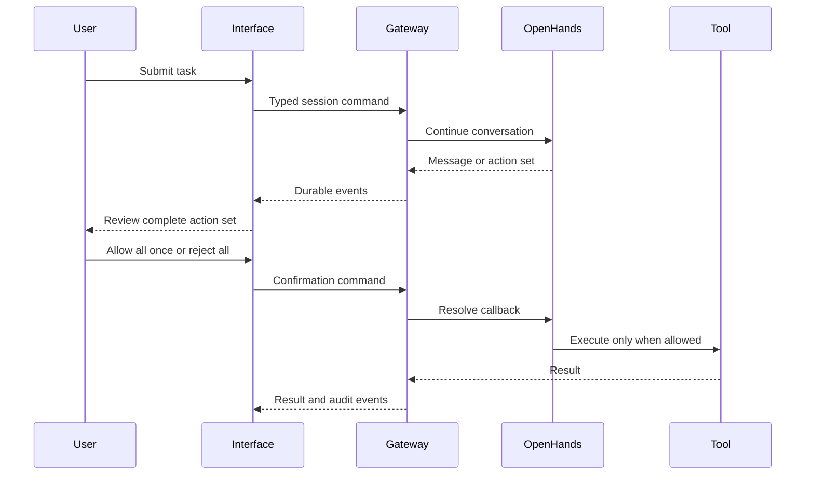

<!--
This source file is part of the Heartwood open-source project
SPDX-FileCopyrightText: 2026 Stanford University and the project authors (see CONTRIBUTORS.md)
SPDX-License-Identifier: MIT
-->

# Sessions and Audit

Heartwood separates presentation state from durable session evidence.
Terminal lines, browser cards, and notebook view models are projections of one ordered event stream.

## Command Flow

## Persistence

Session directories contain metadata, event records, audit records, exports, and OpenHands persistence for that conversation.
Session identifiers are validated before any state path is created.

Read-only replay returns no events for a new session without initializing the project.
The first mutating command registers the session and creates private state.

## Action Decisions

OpenHands can supply several proposed tool calls through one confirmation callback.
Heartwood displays every member as one action set and applies one decision to the complete set; it does not imply that members can be approved independently.

## Audit Integrity

Audit records are chained so replay and export can detect modification, reordering, or missing records within the available chain.
Each content-minimized audit record also authenticates the corresponding complete session event by hash; replay requires matching counts, sequence, type, time, chain link, and event hash and fails closed after tampering or a partial two-file write.
The chain alone cannot prove that an intact suffix was not deleted; deployments that require truncation detection must checkpoint the terminal hash or event count in independently retained storage.
The export path is itself recorded as an event.

The log minimizes content but cannot make every prompt, path, tool summary, or outcome non-sensitive.
Deployments must define retention, access, export, and deletion policy.

## Long Conversations

The OpenHands SDK backend receives explicit model input and output budgets.
A rolling-history condenser uses the same authorized model route to summarize older history before the active context exceeds the configured budget, while recent events and the condensed summary remain available to the agent.

Condenser calls use a separate usage identifier and do not bypass model-route policy.

## Move Between Interfaces

Use one writer for a session at a time.
Close or stop the active terminal, browser gateway, or notebook writer before continuing the same session from another process; use distinct session identifiers when interfaces must remain active side by side.
