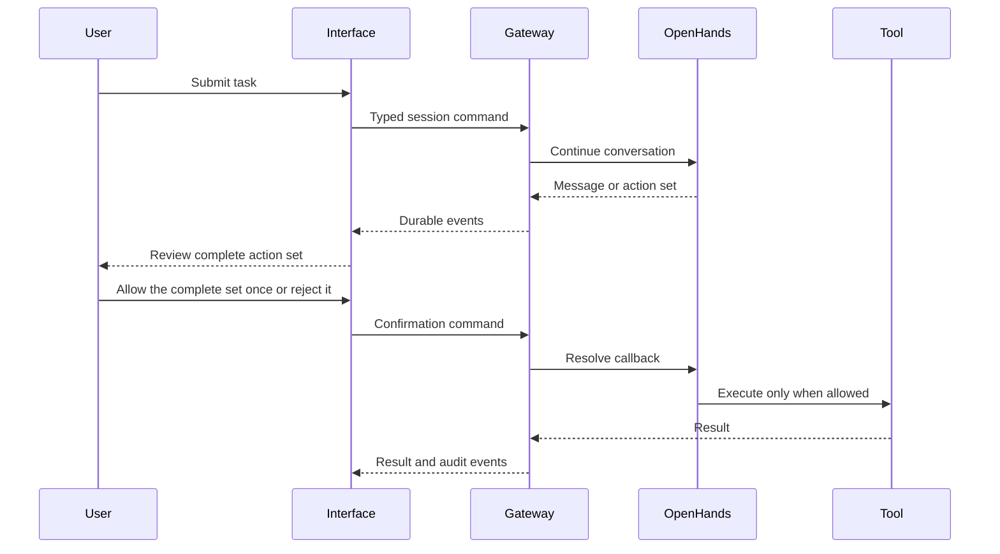

<!--
This source file is part of the Heartwood open-source project
SPDX-FileCopyrightText: 2026 Stanford University and the project authors (see CONTRIBUTORS.md)
SPDX-License-Identifier: MIT
-->

# Sessions and Audit

Heartwood separates presentation state from durable session evidence.
Terminal lines, browser cards, and notebook view models are projections of one ordered event stream.

## Command Flow

```mermaid
sequenceDiagram
    participant User
    participant Interface
    participant Gateway
    participant OpenHands
    participant Tool
    User->>Interface: Submit task
    Interface->>Gateway: Typed session command
    Gateway->>OpenHands: Continue conversation
    OpenHands-->>Gateway: Message or action set
    Gateway-->>Interface: Durable events
    Interface-->>User: Review complete action set
    User->>Interface: Allow the complete set once or reject it
    Interface->>Gateway: Confirmation command
    Gateway->>OpenHands: Resolve callback
    OpenHands->>Tool: Execute only when allowed
    Tool-->>Gateway: Result
    Gateway-->>Interface: Result and audit events
```

## Persistence

Session directories contain metadata, event records, audit records, exports, and OpenHands persistence for that conversation.
Session identifiers are validated before any state path is created.

Read-only replay returns no events for a new session without initializing the project.
The first mutating command registers the session and creates private state.

The gateway acquires an interprocess writer lease before mutating a session and retains it until that gateway closes the session service.
Another process may replay the completed event stream, but it cannot append commands to the same session until the owner exits.
Distinct sessions have independent leases.
Mutation acquires the writer lease before the paired-snapshot lock; recovery and replay never hold the snapshot lock while waiting for a writer lease.
This fixed ordering prevents deadlock as new gateway workers and presentation adapters reuse the store.

Session state must reside on storage that implements process-shared native advisory locks.
Heartwood disables existence-lock fallback because it cannot provide the same automatic release after process termination.
Local disks, attached persistent disks, and qualified project filesystems are the intended locations; object-store and file-transfer mounts are not session stores unless their native-lock behavior has been qualified.

Every command has an opaque identifier and a durable receipt.
An exact retry of a completed command returns its original event range without repeating a model call, confirmation callback, or tool action.
Reusing the identifier with different command content is rejected.
If a process stops after command acceptance but before completion is recorded, Heartwood marks the outcome as uncertain and refuses to execute that identifier again automatically.
The session rejects further mutation so a second approval or task cannot repeat an uncertain side effect.
After replaying and verifying the available evidence, continue in a new session.

Each session event and its corresponding audit record are committed through a private recovery journal.
After an interrupted append, the next writer verifies the journal, hash links, and existing records before completing only the missing write.
Malformed or inconsistent recovery state fails closed.

## Action Decisions

OpenHands can supply several proposed tool calls through one confirmation callback.
Heartwood displays every member as one action set and applies one decision to the complete set; it does not imply that members can be approved independently.

## Audit Integrity

Audit records are chained so replay and export can detect modification, reordering, or missing records within the available chain.
Each content-minimized audit record also authenticates the corresponding complete session event by hash; replay requires matching counts, sequence, type, time, chain link, and event hash.
The recovery journal repairs a verified interrupted two-file append before replay, while tampered or unexplained mismatches fail closed.
The chain alone cannot prove that an intact suffix was not deleted; deployments that require truncation detection must checkpoint the terminal hash or event count in independently retained storage.
The export path is itself recorded as an event.

The log minimizes content but cannot make every prompt, path, tool summary, or outcome non-sensitive.
Deployments must define retention, access, export, and deletion policy.

## Long Conversations

The OpenHands SDK backend receives explicit model input and output budgets.
A rolling-history condenser uses the same authorized model route to summarize older history before the active context exceeds the configured budget, while recent events and the condensed summary remain available to the agent.

Condenser calls use a separate usage identifier and do not bypass model-route policy.

## Move Between Interfaces

Heartwood enforces one writer for each session.
Close or stop the active terminal, browser gateway, or notebook writer before continuing that session from another process.
The next process can then acquire the lease and continue the same authoritative event sequence.
Use distinct session identifiers when interfaces must remain active side by side.
