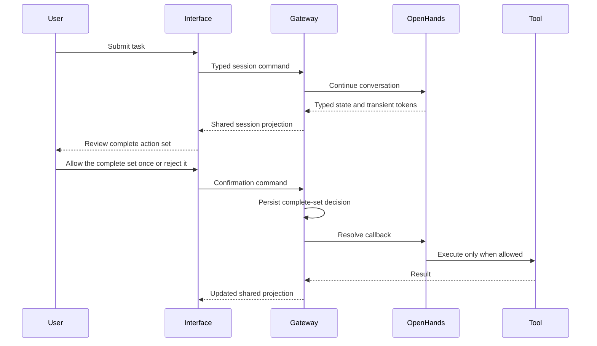

<!--
This source file is part of the Heartwood open-source project
SPDX-FileCopyrightText: 2026 Stanford University and the project authors (see CONTRIBUTORS.md)
SPDX-License-Identifier: MIT
-->

# Sessions and Audit

Heartwood separates presentation state from durable session evidence.
The gateway reduces one ordered event stream into the authoritative session projection used by terminal, browser, and notebook clients.

## Command Flow

```mermaid
sequenceDiagram
    participant User
    participant Interface
    participant Gateway
    participant OpenHands
    participant Tool
    User->>Interface: Submit task
    Interface->>Gateway: Typed session command
    Gateway->>OpenHands: Continue conversation
    OpenHands-->>Gateway: Typed state and transient tokens
    Gateway-->>Interface: Shared session projection
    Interface-->>User: Review complete action set
    User->>Interface: Allow the complete set once or reject it
    Interface->>Gateway: Confirmation command
    Gateway->>Gateway: Persist complete-set decision
    Gateway->>OpenHands: Resolve callback
    OpenHands->>Tool: Execute only when allowed
    Tool-->>Gateway: Result
    Gateway-->>Interface: Updated shared projection
```

## Persistence

Session directories contain metadata, event records, audit records, exports, and OpenHands persistence for that conversation.
Session identifiers are validated before any state path is created.
The gateway incrementally translates persisted OpenHands messages, actions, observations, lifecycle, task, usage, specialist, and error state into Heartwood events.
Incremental token deltas remain in process memory and disappear after the run reaches a stable boundary or the process stops.
Each REST, WebSocket, and server-sent-events response pairs an event batch with the projection produced from the same serialized snapshot.
A transient revision orders token-only updates that share a durable event revision.

Read-only replay returns no events for a new session without initializing the project.
The first mutating command registers the session and creates private state.

The gateway acquires an interprocess writer lease before mutating a session and retains it until that gateway closes the session service.
If an OpenHands worker does not stop during shutdown, Heartwood keeps the lease instead of allowing another writer to mutate the session.
A second process cannot reconcile or mutate that session until the owner exits.
Replay and live updates remain available through the interface connected to the owning gateway.
Distinct sessions have independent leases.
Mutation acquires the writer lease before the paired-snapshot lock; recovery and replay never hold the snapshot lock while waiting for a writer lease.
This fixed ordering prevents deadlock as new gateway workers and presentation adapters reuse the store.

Session state must reside on storage that implements process-shared native advisory locks.
Heartwood disables existence-lock fallback because it cannot provide the same automatic release after process termination.
Local disks, attached persistent disks, and qualified project filesystems are the intended locations; object-store and file-transfer mounts are not session stores unless their native-lock behavior has been qualified.

Every command has an opaque identifier and a durable receipt.
An exact retry of a completed command returns its original event range without repeating a model call, confirmation callback, or tool action.
Reusing the identifier with different command content is rejected.
If a process stops after command acceptance but before completion is recorded, Heartwood refuses to execute that identifier again unless its exact outcome can be derived from durable state.
An interrupted approval is completed automatically only when its recorded intent and OpenHands state unambiguously prove whether the complete action set was resolved.
Otherwise, the session rejects further mutation so a second approval or task cannot repeat an uncertain side effect.
After replaying and verifying the available evidence, continue in a new session.

Each session event and its corresponding audit record are committed through a private recovery journal.
After an interrupted append, the next writer verifies the journal, hash links, and existing records before completing only the missing write.
Malformed or inconsistent recovery state fails closed.
After process loss, a persisted OpenHands `RUNNING` state is reported as an unknown outcome and cannot be resumed or repeated automatically.

## Persisted Schema Compatibility

Every independently persisted Heartwood envelope declares a schema version.
The project state marker records the current versions for project configuration, session events and metadata, command receipts, commit recovery, writer ownership, audit events, Skill metadata, and OpenHands state.
A shared migration registry provides one deterministic, forward-only path for each supported older version without mutating its input.

Project-state migration runs under the initialization lock and replaces metadata atomically.
Domain loaders apply the same registry before typed validation, so migration routing cannot bypass the record owner.
Unknown versions, migration cycles, nondeterministic transforms, malformed records, and unsupported fields fail closed without including persisted content in error messages.

OpenHands persistence records the exact SDK version and Heartwood content-minimization policy that wrote the state.
Heartwood validates that marker before reading or rewriting conversation events.
An SDK change therefore requires an explicit, tested migration instead of silently adopting possibly incompatible state.

## Action Decisions

OpenHands can supply several proposed tool calls through one confirmation callback.
Heartwood displays every member as one action set and applies one decision to the complete set; it does not imply that members can be approved independently.
The gateway commits that complete-set decision before OpenHands can continue into model or tool execution.
The pending set is reconstructed from unmatched OpenHands actions after restart rather than from a separate Heartwood cache.

Each OpenHands proposal becomes one `heartwood.action-record.v1` projection correlated by stable action and tool-call identifiers.
The same record accumulates its group, decision, execution state, bounded result, and typed affected-path evidence across replay.
Terminal, file-editor, Task, and other actions use typed variants, while the exact OpenHands arguments remain available for review.
Unknown outcomes fail closed and are never converted into a successful result by an interface.

## Audit Integrity

Audit records are chained so replay and export can detect modification, reordering, or missing records within the available chain.
Each content-minimized audit record also authenticates the corresponding complete session event by hash; replay requires matching counts, sequence, type, time, chain link, and event hash.
The recovery journal repairs a verified interrupted two-file append before replay, while tampered or unexplained mismatches fail closed.
Standalone JSON Lines appenders serialize writers with a native lock and use a durable journal to recover an absent, partial, or completely written final record without duplication.
Normal append validates the chain head needed for the next record; replay, verification, export, and checkpoint operations verify the complete available history.
The export path is itself recorded as an event.

A deployment can create a canonical checkpoint outside the project that signs the audit digest, event count, terminal hash, session, deployment identifier, creation time, and retention declaration with Ed25519.
Verification requires a public key obtained through an independent trust path and rejects noncanonical or unexpected bundle content.
The chain and signature cannot prove that an intact suffix was not deleted before checkpoint creation.
The retention declaration also does not implement storage lifecycle controls; the deployment records system remains responsible for authoritative storage and policy enforcement.

Exact action arguments, commands, affected paths, file content, patches, tool output, and failure text stay out of the content-minimized audit payload.
The log still cannot make every operational identifier, decision, classification, count, or timestamp non-sensitive.
Deployments must define retention, access, export, and deletion policy.
See [Audit Checkpoints and Retention](../operate/audit-checkpoints.md) for the operator contract.

## Long Conversations

The OpenHands SDK backend receives explicit model input and output budgets.
A rolling-history condenser uses the same authorized model route to summarize older history before the active context exceeds the configured budget, while recent events and the condensed summary remain available to the agent.

Agent and condenser calls use separate usage identifiers and do not bypass model-route policy.
The shared projection reports each purpose and a combined total without storing completion content in usage events.

## Tasks and Specialists

OpenHands Task Tracker updates supply the title and status of each plan item.
Free-form task notes are not copied into Heartwood session or audit events.

Sequential specialist work is represented with its specialist name, task identifier, status, parent session, and parent action.
The parent OpenHands conversation remains authoritative and receives the specialist result before continuing.
Parallel delegation is not part of the current runtime contract.

## Move Between Interfaces

Heartwood enforces one writer for each session.
Close or stop the active terminal, browser gateway, or notebook writer before continuing that session from another process.
The next process can then acquire the lease and continue the same authoritative event sequence.
Use distinct session identifiers when interfaces must remain active side by side.
