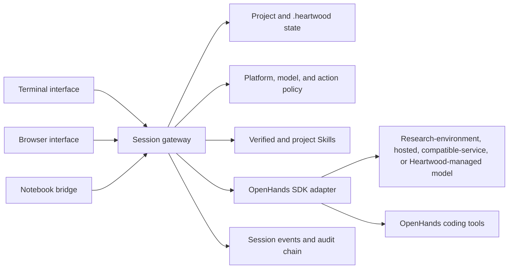

<!--
This source file is part of the Heartwood open-source project
SPDX-FileCopyrightText: 2026 Stanford University and the project authors (see CONTRIBUTORS.md)
SPDX-License-Identifier: MIT
-->

# System Architecture

The session gateway is the application boundary shared by every interaction surface.
It is the only path from Heartwood interfaces to the OpenHands SDK backend.

## Shared Contracts

### Project Context

`ProjectContext.current()` resolves the process current directory and reserves `.heartwood/` beneath it.
No interface accepts a separate public workspace path.

### Startup Plan

The startup planner combines read-only readiness with typed platform capabilities and returns one phase: project review, connection required, credential required, model required, compute required, ready, or recovery required.
Terminal, browser, and notebook clients consume the same projection.

### Session Commands and Events

Interfaces submit typed commands and render typed durable events.
The gateway publishes live events while retaining the same sequence for replay.

### Interface Projections

The gateway also owns researcher-facing setup choices, model-connection categories, readiness diagnostics, and action settings.
The terminal, browser, and notebook bridge may render these differently, but they do not infer separate labels, capabilities, or persistence behavior.

### OpenHands Adapter

The adapter creates an OpenHands conversation with the selected LiteLLM-compatible model profile, project workspace, Skills, persistence directory, and action-confirmation callback.
Heartwood translates OpenHands messages, tool proposals, decisions, and results into its stable event contract rather than duplicating the agent loop.

### Platform Adapter

The selected adapter supplies environment detection, capabilities, data-mount declarations, credential allowlists, and default policy.
Generic, Terra, and Carina behavior differs only through these boundaries and startup/runtime orchestration.

## Process Ownership

One Heartwood process should write a given session at a time.
Project configuration uses a scoped interprocess lock, but session event stores do not provide a general multi-process writer lock.

The browser gateway owns its sessions while running.
Do not open the same session for concurrent mutation from another process.
