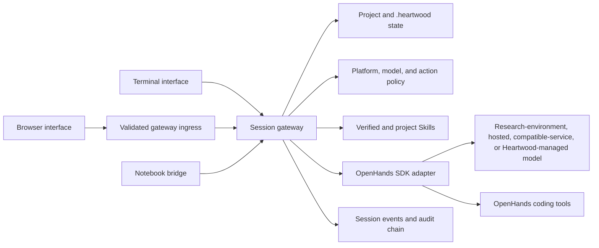

<!--
This source file is part of the Heartwood open-source project
SPDX-FileCopyrightText: 2026 Stanford University and the project authors (see CONTRIBUTORS.md)
SPDX-License-Identifier: MIT
-->

# System Architecture

The session gateway is the application boundary shared by every interaction surface.
It is the only path from Heartwood interfaces to the OpenHands SDK backend.

```mermaid
flowchart LR
    CLI["Terminal interface"] --> Gateway["Session gateway"]
    Web["Browser interface"] --> Ingress["Validated gateway ingress"]
    Ingress --> Gateway
    Notebook["Notebook bridge"] --> Gateway
    Gateway --> Project["Project and .heartwood state"]
    Gateway --> Policy["Platform, model, and action policy"]
    Gateway --> Skills["Verified and project Skills"]
    Gateway --> Adapter["OpenHands SDK adapter"]
    Adapter --> Model["Research-environment, hosted, compatible-service, or Heartwood-managed model"]
    Adapter --> Tools["OpenHands coding tools"]
    Gateway --> Audit["Session events and audit chain"]
```

## Shared Contracts

### Project Context

`ProjectContext.current()` resolves the process current directory and reserves `.heartwood/` beneath it.
No interface accepts a separate public workspace path.

### Startup Plan

The startup planner combines read-only readiness with typed platform capabilities and returns one phase: project review, connection required, credential required, model required, compute required, ready, or recovery required.
Terminal, browser, and notebook clients consume the same projection.

### Session Commands and Events

Interfaces submit typed commands to the gateway.
OpenHands work runs in a supervised background thread so an interface can send guidance, pause, resume, or review an action set while the task is active.
Final messages, actions, lifecycle changes, task plans, usage snapshots, specialist lineage, and errors become typed durable events.
Incremental token text is transient and is never appended to the session or audit log.
Progress can expose a terminal lifecycle before native execution has released its worker slot.
The adapter therefore emits a separate transient execution-settled signal after final reconciliation, and automatic review assessment waits for that boundary or an idle backend.
This signal does not authorize a new turn, grant tool permission, or cause replay to resume execution.

### Interface Projections

The gateway reduces durable events and current transient text into one session projection.
That projection contains the conversation, versioned correlated action records, lifecycle, complete pending action set, task plan, total and per-purpose model usage, specialist lineage, activity, available commands, researcher-facing status, and a bounded set of contextual next-step suggestions.
The gateway enforces those available commands before dispatch, so terminal, browser, and notebook clients share the same lifecycle rules.
REST and streaming transports return events and that projection from one serialized snapshot; a transient revision orders token-only updates between durable events.
The terminal, browser, and notebook bridge render the projection without maintaining their own event reducers.

The gateway also owns researcher-facing setup choices, model-connection categories, readiness diagnostics, lifecycle and task labels, usage-purpose labels, specialist summaries, contextual suggestions, and action settings.
Interfaces may present these differently, but they do not infer separate labels, capabilities, or persistence behavior.
Technical identifiers remain in the typed projection for diagnosis and correlation, while presentation adapters keep them out of the primary workflow.

### Research Workflow Contracts

A versioned workflow definition declares researcher inputs, ordered stages, expected artifacts, deterministic check identifiers, researcher gates, and bounded work budgets.
Definitions reference existing Skills and advisory specialists; they contain no provider routes, credentials, tool implementations, or platform-specific execution logic.
Artifact paths use the same project-relative validation as workspace inspection.
Each output has one producing stage and at least one required check, and a stage cannot depend on an output from a later stage.

The gateway exposes these definitions through one read-only workflow catalog, including required inputs, stages, artifacts, and budgets.
Availability derives from registered check implementations; a definition with a missing evaluator is not advertised as supported.
Catalog discovery does not create project state, load a model, qualify a provider, or authorize execution.

The evidence gate compares gateway-produced check results with the exact input and output digests they inspected.
Missing, failed, unknown, or stale evidence cannot be replaced by a model-reported success.
An assessment identifies its definition, stage, and evidence fingerprint and records whether researcher review is required.
Evidence eligibility does not grant permission to advance a workflow or execute a tool.
The researcher decision must bind to the workflow run, stage, and exact assessment, while tool actions retain the normal session review policy.

The gateway binds explicitly selected project-relative files and researcher text to their initial content digests.
Its read-only stage evaluator reuses workspace inspection, excludes private state and symbolic links, rejects unavailable or truncated inputs, and detects observed changes during inspection.
Changing an original input invalidates evidence even if a new artifact is internally consistent with the changed data.

Maintained tabular checks use a declared data dictionary for column roles, primary keys, permitted predictors, held-out partitions, validity rules, and optional group balance.
They verify aggregate readiness reports, analysis plans, group-disjoint splits, and univariate ordinary least-squares results, including held-out predictions, a training-mean comparator, and leave-one-group-out sensitivity.
Python's standard statistical routines compute the reference results independently of generated code; benchmark-specific expected answers remain in the compliance suite.
Static Python and nonempty-report checks establish syntax or presence, not execution or scientific correctness.
Matching copied artifacts cannot satisfy reproduction, which requires separate evidence from reviewed execution.

Evaluation accepts complete UTF-8 files within the workspace inspection limits, at most 10,000 table rows and 128 columns, and at most 128 training groups for omission sensitivity.
Unsupported evaluators remain unverified rather than passing by default.
The checks do not establish that an analysis is scientifically appropriate or replace researcher review.
They neither launch an agent nor grant permission to advance stages or approve tools.
Execution and recovery belong to the existing gateway and authoritative session command/event path, not a separate workflow persistence layer.

### Independent Review Evidence

Review proposals and independently verified findings have separate typed contracts.
The proposal schema works with OpenHands' structured `FinishTool` and contains only advisory candidates.
The caller attaches the review identity, reviewer, and evidence snapshot after parsing; these are not model-selected fields.
The gateway binds explicitly selected project files to their exact content hashes and byte counts through the existing confined workspace reader.
A submission references that snapshot; changed or unavailable context cannot support an actionable finding.
Review identities reject conflicting retries, and equivalent conditions on the same evidence produce one finding with the original reviewer claims retained separately.

The read-only verification service supports three bounded observations: empty or syntactically invalid Python source, baseline results inconsistent with independent recomputation, and byte differences between declared original and reproduced artifacts.
Unsupported conditions, invalid analysis prerequisites, and exhausted check limits remain unverified.
Verified claims and their severity come from the maintained check, not from the model's explanation.
A syntax check does not execute code, a byte comparison does not prove reproduction, and a matching numerical result does not establish scientific appropriateness.

These assessments are observations, not action permissions or proof that files remain unchanged afterward.
The service does not execute corrections, start a reviewer, persist session transitions, or authenticate a model-supplied reviewer identity.
Its caller owns the association between a submission and the actual reviewer; detailed proposals belong to scientific review context, not the content-minimized security audit.

Research workflow conversations configure their advisory specialists with the same structured proposal schema and supported-condition guidance.
The existing Task adapter captures the public structured response before OpenHands closes the child and retains it in the parent's typed task observation.
Missing or malformed structured results are task failures, even if the specialist's prose claims success.
Ordinary conversations retain unstructured specialist summaries.
The existing session event journal and shared projection preserve proposals and native task lineage across replay without repeating model work.
Terminal, browser, and notebook presentations explicitly distinguish these unverified proposals from independently assessed findings.

Explicit workflow review commands capture the declared stage files before model dispatch and record that intent through the existing command receipt and paired journal.
The gateway associates completed proposals only with selected native tasks that were proposed within that review and belong to the same session.
It re-reads the captured evidence for independent assessment; changed conversation context invalidates the association.
Serialized backend event handling assesses a settled review automatically through the same paired journal, without another model call or an interface command.
Reconciliation can finish an interrupted assessment from retained evidence without repeating reviewer work.
The automatic result references the initiating review command and identifies the gateway as its actor.
Assessment is read-only and runs even after the work budget expires, while further model work and stage acceptance remain budget-gated.
The shared workflow projection retains the review state and findings, and the security audit retains a digest of the review record rather than its file paths or findings.
An advisory review does not replace stage checks, authorize corrections, or turn the reviewer's finish status into the original stage's outcome.

Correction evidence uses separate, explicitly declared output paths while preserving every file in the reviewed snapshot.
The gateway's read-only correction planner recomputes the original assessment before selecting repairable outputs from the maintained verifier registry.
It refuses stale reviews, unsupported findings, existing destinations, and destinations overlapping reviewed files.
The rechecker applies the same independent validators to the new files and their unchanged dependencies.
A `not_observed` result means only that the original bounded defect was not observed in those bytes; it does not establish execution, successful reproduction, or scientific correctness.
For artifact comparisons, only the reproduced copy is replaceable, never the original reference.
These planning and inspection APIs neither start model work nor grant approval or advance a workflow stage.
They validate content and declared associations; authenticated task lineage still requires the owning session journal.

Workflow bindings retain a resolved project-relative path for every declared artifact.
Stage prompts, independent checks, reproduction instructions, provenance, and interface artifact links use that same map rather than reconstructing locations from the catalog.
The initial output directory is a preparation default, not an alternative source of current file locations.
A proposed correction binding may replace only the unaccepted stage's declared outputs after a fresh recheck; it preserves all input and earlier-stage bindings.
Constructing that candidate binding does not mutate the run or bypass the stage's ordinary checks and researcher acceptance.

### Journaled Stage Execution

The gateway accepts explicit workflow start, run, evaluate, review, and cancel commands through the existing session command journal.
A workflow starts in an unused session, before OpenHands creates its conversation, and enables the SDK's structured `FinishTool` outcome for that conversation only.
Ordinary conversations retain their existing finish behavior.
Each transition records a run identity and revision in the paired event and audit journal; command receipts prevent repeated submissions across retries and restarts.
An interruption with an uncertain dispatch outcome requires the existing session recovery procedure rather than automatic resubmission.

A stage runs as an ordinary OpenHands turn with the existing coding tools and action-confirmation policy.
Advancement requires settled workers, resolved tool approvals, a structured outcome from the latest stage turn, and independent artifact checks.
Previously accepted inputs and results are checked again before another stage starts.
Researcher review binds the exact assessment to the observed run revision and does not approve future tool actions.
The shared session projection includes the persisted workflow state; clients do not reconstruct it from model prose.

The projection also supplies typed stage controls, including the exact run revision and evidence fingerprint for each decision.
Clients submit the displayed request unchanged; they do not replace it with a newer revision when the researcher acts.
Active work and unresolved tool approvals suppress stage controls, while command handling independently rechecks those boundaries.
Browser artifact previews use the existing bounded workspace reader and invalidate displayed content when its workspace revision changes.

Reproduction preparation and completion are recorded in the same session journal, not a separate execution cache.
Before approving a separately proposed canonical rerun, the gateway checks the original inputs, accepted artifacts, and absence of the destination through confined workspace inspection.
Completion links that preparation to the actual OpenHands terminal observation, its reported working directory, and the intervening single-action approval.
The gateway captures protected-file and output hashes at live completion and rechecks them during stage assessment.
Missing completion observations remain unverified after restart; replay never inspects later files to manufacture execution evidence.
These observations establish the bounded reproduction contract, not an adversarial filesystem sandbox or scientific validity.

Run and stage budgets use the same observed usage contract as research benchmarks.
Known overruns prevent acceptance, and exhausted limits prevent further model continuations; already-counted tool proposals exactly at the action limit can still be approved.
Elapsed-time limits include waiting for review, and unavailable provider measurements remain unknown.
These are admission checks at observed boundaries, not hard spending caps or preemption within an uninterrupted model run.
Cancellation requires settled work and no pending tool approvals; pausing and rejecting tools remain separate session controls.

### Model Artifact Lifecycle

The gateway owns one local-model choice contract for catalog recommendations, inspected Hugging Face repositories, raw imports, downloads, and transferred bundles.
Every successful path converges on the same project-local selection, resource planner, integrity verifier, and runtime launcher.

Downloads resolve repository metadata to an immutable revision before writing project state.
A portable transfer first verifies the selected model, records the exact payload and runtime configuration in a canonical manifest, and writes a reproducible uncompressed ZIP64 bundle.
Import validates archive structure, path safety, sizes, and every SHA-256 digest before atomically publishing private files under `.heartwood/models/`.
Existing destinations are reverified on retries, and incomplete staging is never selected.

The shared transfer manager owns byte progress, lifecycle, warnings, cancellation, and results for the terminal, browser, and notebook adapters.
An explicit license decision is required before import, and the request is bound to the SHA-256 identity of the exact manifest shown during review.
Bundle integrity is not treated as source authorization or platform qualification: exact catalog identities are rehydrated from trusted local catalog metadata, while every other transferred model is marked unvalidated.
Transferred models remain outside the repository-download registry, so an offline restart cannot silently turn an imported artifact into a network request.

### Skill Artifact Lifecycle

The curated `heartwood-skills` source owns complete Agent Skill validation and deterministic catalog artifacts.
Heartwood pins one exact source revision for bundled content and uses deployment-owned TUF roots for additional connected or offline sources.

The gateway refreshes signed metadata, projects catalog entries for every interface, binds explicit approval to the reviewed tree digest, and atomically activates the complete verified directory under `.heartwood/skills/`.
It reapplies signed revocations and revalidates source metadata and installed content before supplying active roots to OpenHands.
Local directories use the same complete-tree verifier and content-addressed store but remain visibly unreviewed.
See [Skill Trust and Distribution](skills.md) for the trust and ownership boundaries.

### Workspace Inspection

The gateway owns one bounded read-only workspace service for project trees, UTF-8 text files, changed paths, and per-file diffs.
It accepts normalized project-relative paths, excludes `.heartwood/` and `.git/` at every depth, does not follow symbolic links, and rejects special files.
Every operation applies fixed count, depth, line, and byte bounds.
Tree and changed-path responses publish the active limits, and all responses report unavailable, binary, truncated, non-Git, or unsupported state when applicable.

For Git projects, the service delegates changed-file and diff inspection to the pinned OpenHands `LocalWorkspace` API.
For non-Git projects, it projects only successful paths attributed to typed OpenHands file-editor actions in the selected session.
Terminal command text is never parsed into file evidence.
The terminal, REST API, browser, and notebook bridge adapt this service without maintaining separate workspace roots or change stores.

### Gateway Ingress

`IngressPolicy` is the transport boundary for HTTP and WebSocket requests.
It models direct loopback, a local Jupyter proxy, and an explicitly trusted proxy with one canonical external origin and base path.
It rejects undeclared non-loopback exposure, untrusted forwarding metadata, origin and host mismatches, duplicate security headers, and ambiguous paths before the REST, streaming, or static-asset adapters see a route.

The browser reads its base path from server-injected non-secret metadata.
It does not derive platform proxy paths or reduce gateway events itself.
The selected platform adapter advertises supported ingress modes, while deployment configuration supplies exact proxy values.

### OpenHands Adapter

Gateway lifecycle startup imports the SDK before accepting concurrent browser requests, avoiding competing cold imports through the Skill and specialist catalogs.
This initializes modules only; model clients, conversations, and tool executors are created when agent work is requested.

The adapter creates an OpenHands conversation with `OpenHandsAgentSettings`, the selected LiteLLM-compatible model profile, project workspace, Skills, persistence directory, and confirmation policy.
It uses public typed OpenHands events and conversation state to derive lifecycle, unmatched actions, task progress, usage, and errors.
OpenHands' privacy-safe failure classifications are translated into stable Heartwood diagnostics, and raw conversation-error detail is minimized at the OpenHands file-store boundary before persistence.
OpenHands owns the agent loop, conversation persistence, coding tools, Task Tracker, and specialist execution.
The gateway supplies a catalog-scoped Task adapter that reuses OpenHands orchestration while rejecting agents outside the executable catalog, supervising child interruption, and applying the same content-minimized persistence policy to parent and child conversations.
Specialist conversations use OpenHands' asynchronous run API inside its blocking Task worker so interruption can cancel active model I/O.
The adapter reads running children from the native task manager rather than maintaining a separate active-child registry, and attempts interruption of every running child even if one reports an error.
Heartwood translates that state into its stable event contract instead of maintaining a parallel agent loop or pending-action cache.
Persisted non-token progress is reconciled while a run is active, while raw token deltas remain transient.
The gateway's bounded idle wait includes final worker callbacks, not only the SDK's reported lifecycle or the availability of its execution slot.
It releases gateway and session command locks while waiting, keeping pause and shutdown available, and invalidates its result if the owning service changes.
An idle session may still need action approval or may have failed; callers must assess the reconciled lifecycle and evidence separately.
Standard provider routes use OpenHands' LiteLLM-backed LLM interface.
ChatGPT account access uses OpenHands' native subscription registry, OAuth credential store and refresh, and Codex Responses API transport without a Heartwood token implementation.

The default tool contract enables the OpenHands terminal, project file editor, Task Tracker, and sequential Task tool.
Global tool concurrency is one, model switching and Model Context Protocol servers are disabled, and critic refinement is disabled.

The adapter can bind an optional gateway-owned authorizer for structured advisory Task batches.
The authorizer must recheck qualification and record exact action identities before returning a scoped review plan; it is not exposed as model input or an interface eligibility flag.
The adapter checks the native tool and executor types, selected roles, distinct action identities, and absence of task resumption before using OpenHands' bounded `ParallelToolExecutor`.
Terminal, editor, mixed, unconfigured, and ordinary Task batches retain sequential execution.
There is no separate worker pool, agent loop, pending-action cache, or usage ledger.
Each usage projection takes one temporary snapshot of OpenHands metrics so a completing child cannot change the metric collection between per-purpose rows and totals.
Slow authorization runs off the agent event loop so cancellation can prevent dispatch while shared storage is being checked.
Prepared children retain the parent's native cancellation token and check it before asynchronous startup, preventing a pre-start pause from being mistaken for permission to resume.
The normal grouped-action policy still applies before this execution boundary; qualification does not approve actions.

### Research Specialist Catalog

The gateway loads the maintained specialist catalog through OpenHands `AgentDefinition` and registers enabled roles with OpenHands' public agent factory and Task tool.
Heartwood validates presentation metadata, model inheritance, confirmation mode, iteration and usage limits, tool capability, and repository-verified Skill references before registration.
It injects verified OpenHands `Skill` objects directly and disables user, public, and project Skill discovery for child agents.

The enabled planning and review roles are advisory and tool-free.
They inherit the parent's model route, run sequentially by default through OpenHands, and receive only the evidence delegated by the parent agent.
Heartwood projects OpenHands Task lifecycle, lineage, result, failure, and combined usage into the same gateway-owned session view used by every interface.
It does not add a scheduler, child-agent loop, conversation store, or role-specific interface reducer.

The catalog includes a project-action implementation role but does not register it.
The pinned public OpenHands task interface does not expose nested child actions for gateway-owned review or restore their lineage after a restart, so a tool-capable child fails closed instead of receiving project tools.

The gateway exposes only non-secret subscription status and short-lived device-code sign-in values to interfaces.
The terminal delegates the complete interactive login to OpenHands; the browser uses OpenHands' supported device-code sign-in methods and retains the opaque pending handle only in gateway memory.

### Model Credential Boundary

The gateway classifies the active model route against the selected platform capability.
A credential-free model requires no model secret.
An application-scrubbed route excludes provider material from supported tool inputs and durable or interface state, but OpenHands model calls and tools still share an operating-system identity.
A platform-isolated route requires a separately authorized model transport plus live synthetic qualification.

The classification is part of the shared model-settings and readiness projections.
The gateway disables Low-Risk Automation for a secret-backed application-scrubbed route and rejects stale persisted combinations before an agent starts.
Terminal, browser, and notebook clients render that decision rather than implementing credential rules.

OpenHands Agent Server and RemoteWorkspace are retained as upstream deployment options, but they place the model client and tools in the same remote agent environment.
They are not treated as model-only isolation without an additional platform boundary.

### Platform Adapter

The selected adapter supplies environment detection, capabilities, ingress modes, model-credential boundary, data-mount declarations, credential allowlists, and default policy.
Generic, Terra, and Carina behavior differs only through these boundaries and startup/runtime orchestration.

## Process Ownership

Project configuration writes use a project-scoped interprocess lock.
Session mutation uses a separate interprocess lease for each session, owned by the gateway process that first handles a command.
The lease remains active until that session service closes.

Command receipts make completed requests idempotent across retries and restarts.
A paired event-and-audit recovery journal completes verified interrupted appends without duplicating either record.
Writer metadata left by a stopped process is treated as stale only after the operating-system lock can be acquired; the new owner then validates recovery state before continuing.

The browser, terminal, and notebook interfaces therefore cannot fork one session by writing from separate processes.
They may continue the session sequentially after the current owner stops, or use distinct session identifiers concurrently.
