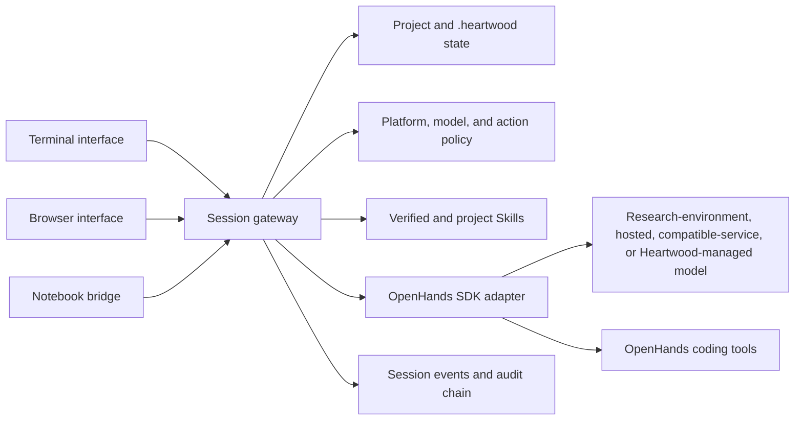

<!--
This source file is part of the Heartwood open-source project
SPDX-FileCopyrightText: 2026 Stanford University and the project authors (see CONTRIBUTORS.md)
SPDX-License-Identifier: MIT
-->

# System Architecture

The session gateway is the application boundary shared by every interaction surface.
It is the only path from Heartwood interfaces to the OpenHands SDK backend.

```mermaid
flowchart LR
    CLI["Terminal interface"] --> Gateway["Session gateway"]
    Web["Browser interface"] --> Gateway
    Notebook["Notebook bridge"] --> Gateway
    Gateway --> Project["Project and .heartwood state"]
    Gateway --> Policy["Platform, model, and action policy"]
    Gateway --> Skills["Verified and project Skills"]
    Gateway --> Adapter["OpenHands SDK adapter"]
    Adapter --> Model["Research-environment, hosted, compatible-service, or Heartwood-managed model"]
    Adapter --> Tools["OpenHands coding tools"]
    Gateway --> Audit["Session events and audit chain"]
```

## Shared Contracts

### Project Context

`ProjectContext.current()` resolves the process current directory and reserves `.heartwood/` beneath it.
No interface accepts a separate public workspace path.

### Startup Plan

The startup planner combines read-only readiness with typed platform capabilities and returns one phase: project review, connection required, credential required, model required, compute required, ready, or recovery required.
Terminal, browser, and notebook clients consume the same projection.

### Session Commands and Events

Interfaces submit typed commands to the gateway.
OpenHands work runs in a supervised background thread so an interface can send guidance, pause, resume, or review an action set while the task is active.
Final messages, actions, lifecycle changes, task plans, usage snapshots, specialist lineage, and errors become typed durable events.
Incremental token text is transient and is never appended to the session or audit log.

### Interface Projections

The gateway reduces durable events and current transient text into one session projection.
That projection contains the conversation, lifecycle, complete pending action set, task plan, total and per-purpose model usage, specialist lineage, activity, and available commands.
The gateway enforces those available commands before dispatch, so terminal, browser, and notebook clients share the same lifecycle rules.
REST and streaming transports return events and that projection from one serialized snapshot; a transient revision orders token-only updates between durable events.
The terminal, browser, and notebook bridge render the projection without maintaining their own event reducers.

The gateway also owns researcher-facing setup choices, model-connection categories, readiness diagnostics, and action settings.
Interfaces may present these differently, but they do not infer separate labels, capabilities, or persistence behavior.

### OpenHands Adapter

The adapter creates an OpenHands conversation with `OpenHandsAgentSettings`, the selected LiteLLM-compatible model profile, project workspace, Skills, persistence directory, and confirmation policy.
It uses public typed OpenHands events and conversation state to derive lifecycle, unmatched actions, task progress, usage, and errors.
OpenHands owns the agent loop, conversation persistence, coding tools, Task Tracker, and sequential specialist execution.
Heartwood translates that state into its stable event contract instead of maintaining a parallel agent loop or pending-action cache.
Persisted non-token progress is reconciled while a run is active, while raw token deltas remain transient.
Standard provider routes use OpenHands' LiteLLM-backed LLM interface.
ChatGPT account access uses OpenHands' native subscription registry, OAuth credential store and refresh, and Codex Responses API transport without a Heartwood token implementation.

The default tool contract enables the OpenHands terminal, project file editor, Task Tracker, and sequential Task tool.
Tool concurrency is one, model switching and Model Context Protocol servers are disabled, and critic refinement is disabled unless a future reviewed contract enables them.
The verified `research-planner` specialist is tool-free and can produce a bounded analysis plan before the parent agent changes project files.

The gateway exposes only non-secret subscription status and short-lived device-code sign-in values to interfaces.
The terminal delegates the complete interactive login to OpenHands; the browser uses OpenHands' supported device-code sign-in methods and retains the opaque pending handle only in gateway memory.

### Platform Adapter

The selected adapter supplies environment detection, capabilities, data-mount declarations, credential allowlists, and default policy.
Generic, Terra, and Carina behavior differs only through these boundaries and startup/runtime orchestration.

## Process Ownership

Project configuration writes use a project-scoped interprocess lock.
Session mutation uses a separate interprocess lease for each session, owned by the gateway process that first handles a command.
The lease remains active until that session service closes.

Command receipts make completed requests idempotent across retries and restarts.
A paired event-and-audit recovery journal completes verified interrupted appends without duplicating either record.
Writer metadata left by a stopped process is treated as stale only after the operating-system lock can be acquired; the new owner then validates recovery state before continuing.

The browser, terminal, and notebook interfaces therefore cannot fork one session by writing from separate processes.
They may continue the session sequentially after the current owner stops, or use distinct session identifiers concurrently.
