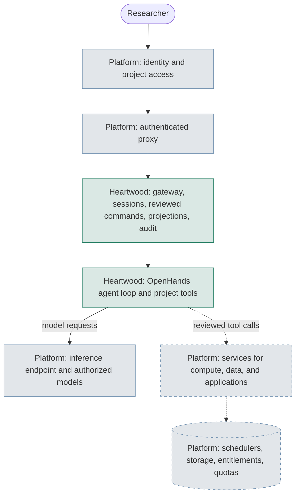
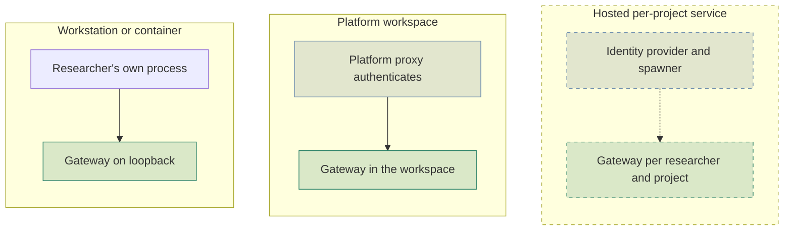
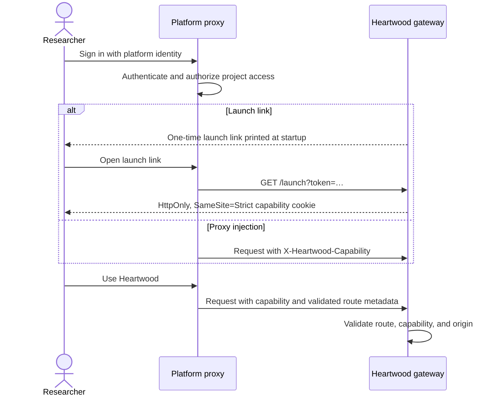
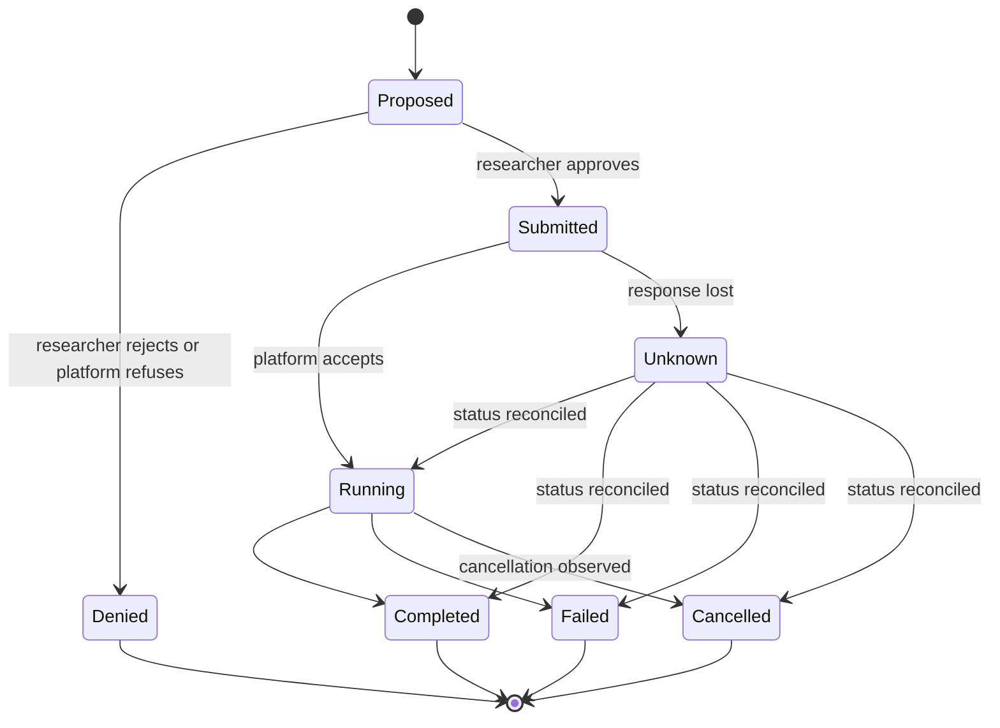
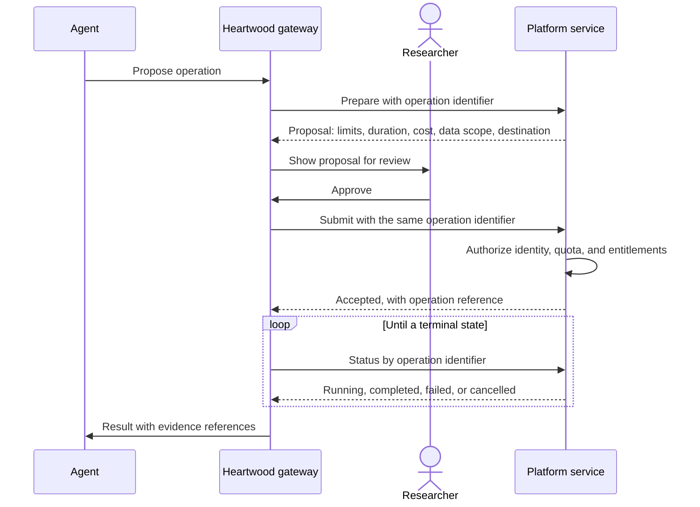
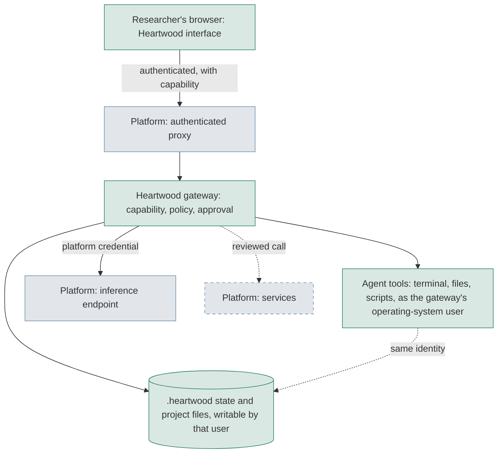

<!--
This source file is part of the Heartwood open-source project
SPDX-FileCopyrightText: 2026 Stanford University and the project authors (see CONTRIBUTORS.md)
SPDX-License-Identifier: MIT
-->

# Platform Contract

A research platform can embed Heartwood as its research interaction layer without handing Heartwood its compute, identity, storage, or inference infrastructure.
This contract defines that boundary: what Heartwood owns, what the platform owns, what a platform provides for each capability, and the security properties both sides must preserve.
Use it to scope a platform integration, to review one, and as the list of what Heartwood asks a platform to provide.

!!! planned "This contract includes capabilities that are not yet implemented"
    This page describes the complete contract so platforms can prepare for all of it.
    Every part that current Heartwood does not implement is marked with a box like this one and links the GitHub issue that owns it.
    A capability is supported only after the conformance evidence in [Validate a Platform](#validate-a-platform) exists for that exact platform.
    The contract as a whole is tracked in [#150](https://github.com/SchmiedmayerLab/heartwood/issues/150) and scheduled in the [0.5.0 milestone](https://github.com/SchmiedmayerLab/heartwood/milestone/3).

## Contract at a Glance

| Part | What it covers | Status |
|---|---|---|
| [Hosting](#hosting) | Running the published artifact with a persistent project | Implemented |
| [Access and identity](#access-and-identity) | Authenticated routing and the launch capability | Implemented for one person per gateway; verified per-user identity in [#164](https://github.com/SchmiedmayerLab/heartwood/issues/164) |
| [Deployment policy](#deployment-policy) | Restrictions the platform imposes on every project | Partial; deployment-owned enforcement in [#154](https://github.com/SchmiedmayerLab/heartwood/issues/154) |
| [Inference](#inference) | Model endpoints and authorized model discovery | Partial; platform-managed routes in [#151](https://github.com/SchmiedmayerLab/heartwood/issues/151) |
| [Platform services](#platform-services) | Compute, data, and application tools through MCP | Not implemented; [#138](https://github.com/SchmiedmayerLab/heartwood/issues/138) and [#152](https://github.com/SchmiedmayerLab/heartwood/issues/152) |
| [Agent isolation](#agent-isolation) | Keeping agent tools away from Heartwood's own controls | Not implemented; [#163](https://github.com/SchmiedmayerLab/heartwood/issues/163) |
| [Controlled data](#controlled-data) | Read-only inputs, enforced egress denial, and reviewed release of outputs | Not implemented; [#129](https://github.com/SchmiedmayerLab/heartwood/issues/129) |
| [Audit and provenance](#audit-and-provenance) | Signed checkpoints, retention, and operation references | Partial; [#160](https://github.com/SchmiedmayerLab/heartwood/issues/160) and [#128](https://github.com/SchmiedmayerLab/heartwood/issues/128) |
| [Contract artifacts](#contract-artifacts) | Versioned schemas, API descriptions, and a conformance kit | Not implemented; [#150](https://github.com/SchmiedmayerLab/heartwood/issues/150) |

## The Boundary

Heartwood owns the research session.
The platform owns the infrastructure and the authority to use it.



In the figures on this page, green marks what Heartwood owns, blue marks what the platform owns, and dashed outlines mark what is not yet implemented.
Heartwood consumes two independent platform capabilities, inference and platform services, on top of a hosting and access baseline.
Either capability can be absent or unavailable without breaking the other: a platform can supply models without services, services without models, or neither while Heartwood runs a standalone model route.

## Responsibilities

| Area | Heartwood | Platform |
|---|---|---|
| Researcher identity | Records the launching principal as the actor of every accepted command and ignores an actor claimed in a request | Authenticates the person, authorizes project access, and ends the session |
| Gateway access | Requires the [launch capability](security.md#launch-capability) on every API request, event stream, and WebSocket, and validates the declared [ingress route](security.md#gateway-ingress) | Routes only authenticated users to the gateway, removes client-supplied forwarding and identity headers, terminates TLS, and delivers the capability |
| Research session | Owns the OpenHands conversation, reviewed commands, and terminal, browser, and notebook projections | Keeps the gateway process, its project directory, and its network route available |
| Approval | Binds each approval to the pending action set and accepts it only from an authorized interface | Enforces its own authorization on every operation, whether or not Heartwood approved it |
| Policy | Evaluates model routes, review modes, and credentials against the active policy | Defines the restrictions every project on the platform must obey |
| Inference | Selects an authorized route and keeps model credentials out of model context, tools, and exports | Operates endpoints, backend translation, data-use agreements, eligibility, spend limits, and egress |
| Platform services | Presents proposals, records state and evidence, and projects progress to every interface | Owns scheduling, quotas, cost, dataset entitlements, application services, and infrastructure policy |
| Project storage | Keeps `.heartwood/` state single-writer with durable locking and recovery | Provides persistent, backed-up storage with native advisory locks |
| Audit and provenance | Writes content-minimized session audit and experiment records, and requests signed checkpoints | Retains checkpoints, enforces retention and immutability, and keeps its own operation audit log |
| Controlled data | Makes no compliance claim from compatibility | Decides data eligibility, agreements, egress controls, monitoring, and incident response |

Heartwood still authenticates requests and enforces its own policy inside an authenticated platform.
Platform authentication does not replace gateway controls, and a Heartwood approval never grants platform authority.

## Deployment Topologies

The gateway is the unit of hosting.
Only who runs the gateway process, and who authenticates the person in front of it, changes between topologies; the contract below it is the same.



| Topology | Runs the gateway | Authenticates the person | Status |
|---|---|---|---|
| Workstation or container | The researcher | The operating system and the launch link | Implemented |
| Platform workspace | The platform, in the researcher's workspace | The platform proxy | Implemented for the terminal on Terra and Stanford Carina and the notebook on Terra |
| Hosted per-project service | The platform, one gateway per researcher and project | The institution's identity provider, verified by Heartwood | Not implemented |

!!! planned "Not yet implemented: hosted per-project service"
    Heartwood does not verify a person's identity itself, does not attribute commands to individual people, and has no supported deployment that starts, stops, and routes per-project gateways.
    The hosted topology verifies an OpenID Connect identity at ingress, derives the command actor from the verified subject, exchanges rather than forwards user tokens for platform calls, and reuses an existing spawner and proxy.
    Tracked in [#164](https://github.com/SchmiedmayerLab/heartwood/issues/164).

## Hosting

A platform runs the published Heartwood artifact with the researcher's project as the working directory.

- **Required:** run the published image or native release without replacing its entrypoint, user, or bundled browser assets.
- **Required:** provide the project as a persistent directory; `.heartwood/` session storage needs native advisory locks, so object-store and file-transfer mounts are not session stores unless qualified.
- **Required:** keep model weights, credentials, and deployment secrets out of image layers and the project directory.
- **Required:** run Heartwood-managed local model servers and checkpoint signers only where other operating-system users cannot reach their loopback ports.
- **Recommended:** back up the project storage and preserve it across compute recreation.
- **Optional:** provide Jupyter where the platform offers the [notebook bridge](../use/notebooks.md).
- **Recommended:** verify the published release attestations before admitting an artifact.

!!! planned "Not yet implemented: signed artifacts and bills of materials"
    Releases carry build attestations, but release images and native assets are not yet signed and do not yet ship software bills of materials or third-party notices.
    Tracked in [#48](https://github.com/SchmiedmayerLab/heartwood/issues/48).

!!! planned "Not yet implemented: authenticated local servers"
    A Heartwood-managed model server and the local checkpoint signer listen on fixed loopback ports without authenticating the listener, so another user on a shared host can take a port and receive prompts or signer tokens.
    Heartwood will serve both over owner-only sockets or verify the listener before sending anything.
    Tracked in [#161](https://github.com/SchmiedmayerLab/heartwood/issues/161) and [#162](https://github.com/SchmiedmayerLab/heartwood/issues/162).

See [Package the Shared Application](platform-integration.md#package-the-shared-application) and [Persist the Right Data](index.md#persist-the-right-data).

## Access and Identity

The platform authenticates the person; Heartwood authorizes the caller of its own API.



- **Required:** authenticate every user before traffic reaches the gateway, and restrict the gateway's network route to the platform proxy.
- **Required:** remove client-supplied forwarding and identity headers before setting the proxy's own values.
- **Required:** deliver the launch capability, either by letting the researcher open the one-time launch link, or by injecting `X-Heartwood-Capability` for callers the platform has already authenticated.
- **Required:** keep the capability away from the agent workspace, other users, and logs.
- **Recommended:** run one gateway per researcher and project; Heartwood records one launching principal per gateway and does not distinguish people who share it.

A proxy that injects the capability authenticates on the researcher's behalf, so it must inject it only for the one user who owns that gateway.
A trusted identity header is an exact route marker, not a credential.

For example, a platform proxy at `https://research.example.org` that strips the `/heartwood/project-a` prefix and forwards from `10.0.0.2` starts the gateway with a secret supplied by the platform's secret manager:

```bash
HEARTWOOD_GATEWAY_CAPABILITY="$(cat /run/secrets/heartwood-capability)" \
heartwood gateway serve \
  --ingress-mode trusted-proxy \
  --host 10.0.0.5 \
  --port 8767 \
  --public-origin https://research.example.org \
  --base-path /heartwood/project-a \
  --trusted-proxy-source 10.0.0.2/32 \
  --proxy-strips-prefix
```

The proxy then adds `X-Heartwood-Capability` with the same secret to each authenticated request.
See the [serve options](../reference/cli.md#operator-commands) and [HW-INGRESS-003](../reference/troubleshooting.md#gateway-ingress).

!!! planned "Not yet implemented: capability delivery without the environment"
    The gateway keeps `HEARTWOOD_GATEWAY_CAPABILITY` out of the processes it starts, but the operating system still exposes a process's initial environment to other processes of the same user, including approved agent commands.
    Use the environment route only when agent tools run under a different identity.
    With direct loopback, browsers also send the capability cookie to every port of the host.
    Heartwood will accept an operator secret through an inherited file descriptor or a read-once owner-only file, scope the capability to its own origin, and print the launch link only after it owns its port.
    Tracked in [#156](https://github.com/SchmiedmayerLab/heartwood/issues/156).

## Deployment Policy

A platform defines restrictions that every project on it must obey: the model and catalog endpoints a project may reach, the action-review modes it may select, the credential references it may use, and whether egress is denied by default.

- **Required:** define the policy per platform, deny egress by default, and list exact model and catalog endpoints.
- **Required:** let researchers narrow the policy for a project, never widen it.
- **Recommended:** offer Review Every Action as the only review mode for secret-backed or unqualified routes.
- **Optional:** publish approved Skill sources through the deployment-owned registry at `/etc/heartwood/skill-sources.toml`; only that registry can approve a Skill for controlled data.

Heartwood builds each platform's default policy in its [platform adapter](platform-integration.md#define-policy-and-connections) and evaluates model routes, review modes, and credentials against it.

!!! planned "Not yet implemented: deployment-owned enforcement"
    Heartwood currently stores the active policy, the selected review mode, and model routes in the project's `.heartwood/config.toml`, and re-reads that file on every command.
    An approved terminal command can rewrite it, so project state cannot enforce a platform restriction today.
    Heartwood will build the policy from the platform on every load, let project configuration only narrow it, and journal on-disk changes to review modes and model settings.
    Tracked in [#154](https://github.com/SchmiedmayerLab/heartwood/issues/154).

## Inference

A platform can supply the models a researcher may use, so the researcher chooses a model without entering platform-managed credentials or knowing where it runs.

- **Required:** an OpenAI-compatible Chat Completions endpoint with streaming and native tool calls.
- **Recommended:** the Responses API for models that support it; Heartwood selects Chat Completions or Responses per model from the OpenHands model capabilities and does not assume every compatible endpoint implements both.
- **Required:** a model list endpoint that returns only the models the authenticated identity may use.
- **Recommended:** report each model's context window, tool-calling support, and permitted data classes.
- **Required:** keep credentials platform-held, through a managed identity, a process-only variable, or a mounted file outside the project.
- **Required:** state which data classes each route may receive; Heartwood cannot infer eligibility from compatibility.
- **Required:** return distinguishable failures for rejected credentials, exhausted quota, rate limits, invalid model configuration, and temporary unavailability.
- **Recommended:** restrict the workspace's network egress to the approved inference endpoints.
- **Optional:** provide GPU or CPU compute on which Heartwood [runs a Heartwood-managed model](../models/run-with-heartwood.md) when no hosted route is available.
- **Optional:** for air-gapped platforms, provide an approved process to [import verified model bundles](../models/offline.md).

Heartwood discovers models through a connection's catalog endpoint after checking it against the deny-by-default policy, and it never implements a second provider proxy.
It currently consumes platform-managed inference through built-in connections, such as the [Stanford AI API Gateway](../models/connections.md#stanford-ai-api-gateway), and through [compatible services](../models/connections.md#other-compatible-services) that an operator configures.
A route's credential boundary determines whether actions can run without review; secret-backed routes are application-scrubbed unless the platform demonstrates a [platform-isolated boundary](platform-integration.md#model-credential-isolation), which no current adapter claims.

!!! planned "Not yet implemented: platform-managed model routes"
    Heartwood does not currently read a platform connection manifest, so each platform-managed route needs a platform adapter.
    It also relies on the OpenHands model table to choose a protocol, which does not recognize platform model aliases.
    Heartwood will load connections from a deployment-owned manifest outside the project, accept declared protocol, context window, and tool support for unrecognized aliases, and report unknown values as unknown.
    Tracked in [#151](https://github.com/SchmiedmayerLab/heartwood/issues/151).

A platform that describes its models should return this metadata with each entry of its model list:

| Field | Meaning | Level |
|---|---|---|
| Model identifier | The exact value Heartwood sends in each request | Required |
| Protocols | Chat Completions, Responses, or both | Required |
| Context window | Maximum input tokens, or unknown | Recommended |
| Tool calling | Whether native tool calls are supported | Required |
| Data classes | The data classes the route may receive under the platform's agreements | Required |
| Deprecation | Whether the model is being withdrawn, so Heartwood never silently substitutes another model | Recommended |

!!! planned "Not yet implemented: model metadata schema"
    OpenAI-compatible model lists define only identifiers, so these fields need an agreed extension and a data-class vocabulary.
    Tracked in [#150](https://github.com/SchmiedmayerLab/heartwood/issues/150) and [#151](https://github.com/SchmiedmayerLab/heartwood/issues/151).

### Realtime Voice

A platform can offer realtime speech models for an optional voice interface.

- **Required:** create realtime sessions on the server side, so no long-lived key reaches the browser.
- **Required:** state whether realtime audio is covered by the route's data-use agreements; text-route eligibility does not extend to audio.
- **Recommended:** support a server-owned session in which Heartwood executes and approves every tool call.

!!! planned "Not yet implemented: voice"
    Heartwood has no voice interface.
    An ephemeral browser credential is a convenience rather than an enforcement boundary, and speech never grants approval.
    Tracked in [#139](https://github.com/SchmiedmayerLab/heartwood/issues/139).

## Platform Services

Platform services let a researcher ask Heartwood to submit an analysis, request compute, attach an authorized dataset, or open a platform application through the research session.
Services connect through the [Model Context Protocol](https://modelcontextprotocol.io/specification/) without a platform-specific agent loop.

!!! planned "Not yet implemented: platform services"
    Heartwood does not currently connect to MCP servers; it disables them in its OpenHands configuration and advertises no platform service.
    One read-only research or platform metadata service comes first in [#138](https://github.com/SchmiedmayerLab/heartwood/issues/138).
    Operations that change platform state follow in [#152](https://github.com/SchmiedmayerLab/heartwood/issues/152).

### Discovery and Authorization

- **Required:** expose services over MCP Streamable HTTP with a stable server identity.
- **Required:** describe each tool's purpose, input and output schemas, and the permission it requires; read access never implies permission to allocate resources or attach data.
- **Required:** annotate each tool with the MCP [tool annotations](https://modelcontextprotocol.io/specification/2025-06-18/server/tools) `readOnlyHint`, `destructiveHint`, `idempotentHint`, and `openWorldHint`.
- **Required:** enforce identity, quotas, and dataset entitlements on every call, independently of Heartwood's approval.
- **Required:** treat a changed tool set as a new review; discovery does not authorize execution or certify a tool's advertised safety.
- **Required:** accept delegated or platform-held credentials that never reach model context, tool environments, or exports.

Heartwood treats annotations as hints from the server, not as authorization: a tool marked read-only still runs under Heartwood's review policy, and the platform still authorizes every call.

### Operations That Change Platform State

A tool that allocates compute, submits work, attaches data, or starts an application is an operation.
Each operation follows one lifecycle.





- **Required:** before approval, return a proposal with the resource limits, expected duration, estimated cost when available, data scope, and destination.
- **Required:** accept a caller-supplied operation identifier and treat a repeated submission with the same identifier as the same operation.
- **Required:** report status by operation identifier, so an uncertain outcome is reconciled rather than retried.
- **Required:** report cancellation as the observed platform result, without promising rollback of completed work.
- **Required:** return a reference that joins the platform's audit record to Heartwood's session audit without copying data payloads.

### Capability Families

A platform offers any subset of these families; each is discovered, never assumed.

| Family | Typical operations | Recommended backing |
|---|---|---|
| Compute jobs | Submit a sized job, check status, cancel | [GA4GH Task Execution Service](https://ga4gh.github.io/task-execution-schemas/) or the platform's scheduler |
| Workflows | Run a workflow, check status, cancel | [GA4GH Workflow Execution Service](https://ga4gh.github.io/workflow-execution-service-schemas/) |
| GPU resources | Request a named resource profile | The platform's scheduler, through named profiles rather than raw resource numbers |
| Datasets | List authorized datasets, request access, attach read-only | [GA4GH Data Repository Service](https://ga4gh.github.io/data-repository-service-schemas/) |
| Applications | Discover and open a platform application for the researcher | The platform's application catalog |
| Quota and cost | Report remaining budget and estimated cost before submission | The platform's billing interface |

Heartwood requires none of these standards; the contract is the MCP behavior above, and wrapping an existing standard avoids inventing a new vocabulary.
An application opened for the researcher is a hand-off to a person, not an agent action that changes data.
A researcher's identity behind delegated calls should come from [OpenID Connect](https://openid.net/specs/openid-connect-core-1_0.html).

## Controlled Data

A platform that admits controlled or regulated data owns that decision and the controls around it.

- **Required:** decide data eligibility for every model route, dataset, and interface under the platform's agreements.
- **Required:** provide read-only input snapshots, enforced egress denial, and ephemeral, encrypted execution storage for controlled work.
- **Required:** keep outputs in quarantine until an authorized data steward approves an exact release manifest.
- **Required:** report these controls as typed evidence, so Heartwood can refuse to start when a required control is missing.

Heartwood is not a controlled-data boundary on its own; see [Security and Controlled Data](security.md).

!!! planned "Not yet implemented: isolated execution and quarantine"
    Heartwood does not provision or verify read-only inputs, enforced egress denial, ephemeral execution, output quarantine, or steward-controlled release.
    Tracked in [#129](https://github.com/SchmiedmayerLab/heartwood/issues/129).
    Platform validation cases for this work are the Terra and BigQuery OMOP workflow in [#43](https://github.com/SchmiedmayerLab/heartwood/issues/43), guided dataset ingest in [#126](https://github.com/SchmiedmayerLab/heartwood/issues/126), and the standard research environment pilot in [#127](https://github.com/SchmiedmayerLab/heartwood/issues/127).

## Agent Isolation

Every guarantee above assumes agent tools cannot change the controls that govern them.

- **Required:** keep platform credentials, service tokens, and signer material out of the environment and file system that agent tools can reach.
- **Recommended:** run agent tools under an identity that can read and write project files but not `.heartwood/`, the gateway process, credentials, or signer material.
- **Recommended:** keep the approval-deciding interfaces, the gateway and the researcher's browser, outside the agent's reach.

Agent tools currently run with the gateway's operating-system identity.
An approved command can read anything that identity can read and can change `.heartwood/` state, including project settings, installed Skills, and session and audit files.

!!! planned "Not yet implemented: separate tool identity"
    Terminal and file-editor tools will run under a separate identity, with the boundary qualified per platform before any platform claims it.
    Tracked in [#163](https://github.com/SchmiedmayerLab/heartwood/issues/163).

!!! planned "Not yet implemented: supporting agent-isolation controls"
    - Terminals receive the Heartwood environment with only the project's configured model-credential variables and the capability masked, so other secrets pass through; an allowlist will replace that mask in [#155](https://github.com/SchmiedmayerLab/heartwood/issues/155).
    - Low-Risk Automation decides from the model's own risk label; a deterministic allowlist will make that label advisory in [#157](https://github.com/SchmiedmayerLab/heartwood/issues/157).
    - An approval binds to model-supplied tool-call identifiers; binding it to the reviewed content comes in [#158](https://github.com/SchmiedmayerLab/heartwood/issues/158).
    - A verified Skill's neighboring directories also load; loading exactly the verified Skills comes in [#159](https://github.com/SchmiedmayerLab/heartwood/issues/159).

See [Threat Boundaries](security.md#threat-boundaries) for the current limits.

## Audit and Provenance

- **Recommended:** operate a deployment-owned checkpoint signer, installed through `/etc/heartwood/checkpoint-signers.toml` or `HEARTWOOD_CHECKPOINT_SIGNER_REGISTRY`, with keys the agent cannot use.
- **Recommended:** enforce retention, immutability, and deletion for exported audit and experiment records.
- **Required for platform services:** keep an audit log of operations performed through the contract, joinable to Heartwood's audit by operation reference.

Heartwood's project-local audit and experiment records detect corruption but remain writable by the identity that runs the project.
See [Audit Checkpoints and Retention](audit-checkpoints.md) and [Sessions and Audit](../architecture/sessions-audit.md#audit-integrity).

!!! planned "Not yet implemented: tamper-resistant history and retained provenance"
    Checkpoints do not yet reference earlier checkpoints, so a later checkpoint can sign rewritten history; continuity checks come in [#160](https://github.com/SchmiedmayerLab/heartwood/issues/160).
    Experiment records are not yet published to platform storage; retention-locked publication comes in [#128](https://github.com/SchmiedmayerLab/heartwood/issues/128).

## Security Requirements



Both sides must preserve these properties.

1. **Agent output cannot grant authority.** No model output, tool output, service response, or dataset content can approve an action, widen policy, or grant platform permissions.
2. **Approval is necessary, never sufficient.** Heartwood approves the exact proposal; the platform still authorizes every call.
3. **Secrets stay outside the session.** Credentials never appear in project configuration, model context, tool environments, events, logs, or exports.
4. **External content is data.** Service results, tool descriptions, annotations, and platform responses are untrusted input, bounded in size, and never treated as instructions.
5. **Uncertain outcomes are reconciled.** A timeout or lost response is resolved by status, not by resubmitting an operation as though it were idempotent.
6. **Egress is denied by default.** Heartwood policy denies undeclared model endpoints, and the platform network is the authoritative egress control.

!!! planned "Not yet implemented: full enforcement of these properties"
    Properties 1 through 3 hold only as far as [agent isolation](#agent-isolation) reaches today: Low-Risk Automation trusts the model's risk label, approvals bind to identifiers rather than content, unselected secrets reach terminals, and the policy lives in agent-writable project state.
    Review Every Action and a platform that enforces restrictions outside the gateway's identity are the current mitigations.
    Tracked in [#154](https://github.com/SchmiedmayerLab/heartwood/issues/154), [#155](https://github.com/SchmiedmayerLab/heartwood/issues/155), [#157](https://github.com/SchmiedmayerLab/heartwood/issues/157), [#158](https://github.com/SchmiedmayerLab/heartwood/issues/158), and [#163](https://github.com/SchmiedmayerLab/heartwood/issues/163).

## Failure States

A platform's failures must be distinguishable so every interface can show the same next step.

| Condition | The platform returns | Heartwood shows |
|---|---|---|
| Capability not offered | No advertised support | The choice is hidden in every interface |
| Missing or invalid launch capability | Not applicable | [HW-INGRESS-003](../reference/troubleshooting.md#gateway-ingress) |
| Request does not match the declared route | Not applicable | [HW-INGRESS-002](../reference/troubleshooting.md#gateway-ingress) |
| Expired or rejected model credential | An authentication error | HW-AGENT-008 |
| Exhausted quota or budget | A quota error | HW-AGENT-009 |
| Rate limit | A rate-limit error with a retry interval when known | HW-AGENT-010 |
| Denied or misconfigured model | A model or authorization error | HW-AGENT-011 |
| Service temporarily unavailable | An unavailability error | HW-AGENT-012 |
| Platform operation denied, failed, or of unknown outcome | The operation state and a reason | Not yet implemented; [#152](https://github.com/SchmiedmayerLab/heartwood/issues/152) |

See [Diagnostics and Troubleshooting](../reference/troubleshooting.md) for each code's recovery steps.

## Contract Artifacts

A contract a platform can implement against needs exact, versioned artifacts, not only this page.

| Artifact | Defines | Status |
|---|---|---|
| Capability manifest | What a platform supports, served at `GET /project/capabilities` | Implemented; see the [capability matrix](../reference/capabilities.md#current-capability-matrix) |
| API body schemas | JSON Schemas for gateway request and response bodies, generated from the shared Pydantic contract | Implemented; internal, not published |
| Gateway OpenAPI description | The routes, methods, streams, and launch-capability security scheme a platform proxy serves | Not implemented |
| Platform connection manifest | Model connections a deployment supplies, as `heartwood.model-connections.v1` | Schema implemented; not loaded or published |
| Deployment policy | Platform restrictions, as `heartwood.policy-profile.v1` | Schema implemented; not deployment-owned |
| Model metadata | Protocols, context window, tool support, and data classes per model | Not implemented |
| Data-class vocabulary | The shared names for data classes that routes and datasets declare | Not implemented |
| Operation schemas | Proposal, operation identifier, status, and audit reference for platform operations | Not implemented |
| Contract version | One version identifier for the artifacts above, with compatibility rules | Not implemented |
| Conformance kit | Deterministic fakes and tests a platform runs against its own endpoints | Not implemented |

!!! planned "Not yet implemented: versioned contract artifacts and conformance kit"
    The schemas, API description, vocabulary, and conformance kit will ship with one contract version so a platform can test its endpoints before live validation.
    Tracked in [#150](https://github.com/SchmiedmayerLab/heartwood/issues/150); operation schemas are implemented with [#152](https://github.com/SchmiedmayerLab/heartwood/issues/152).

## Validate a Platform

A platform integration advances through the evidence levels in [Testing and Evidence](../architecture/testing.md#claims), and Heartwood advertises a capability only at the level its evidence reaches.

1. **Implemented:** a platform adapter reports capabilities, detection, and policy, with contract tests.
2. **CI validated:** adapter conformance, ingress adversarial, credential-boundary, persistence, and interface tests pass in a production-derived image.
3. **Live synthetic validated:** the published artifact completes a synthetic task on the platform with approval, file verification, replay, and audit export.
4. **Institution approved:** separate institutional evidence covers the deployment; it is never inferred from the previous levels.

Follow [Validate Conformance](platform-integration.md#validate-conformance) and [Validate the Deployment](index.md#validate-the-deployment) for the exact checks.
Before a wider rollout, [record a standard environment](index.md#record-a-standard-environment), confirm the [deployment security checklist](security.md#deployment-security-checklist), and [run a pilot evaluation](index.md#run-a-pilot-evaluation).

!!! planned "Not yet implemented: expansion checklist"
    One maintained checklist for proposing a new platform, covering ownership, reuse of shared contracts, security and privacy review, and the evidence required before a support claim, is tracked in [#49](https://github.com/SchmiedmayerLab/heartwood/issues/49).

## What Heartwood Asks of a Platform

| Area | Request | Level | Heartwood consumes it today |
|---|---|---|---|
| Hosting | Run the published artifact with the project as a persistent working directory on storage with native advisory locks | Required | Yes |
| Access | Authenticate users, restrict the gateway route to the proxy, strip client identity headers, and deliver the launch capability | Required for the browser | Yes |
| Identity | One gateway per researcher and project, and a documented session expiry | Recommended | Yes |
| Identity | OpenID Connect identity at ingress, and token exchange for platform calls | Recommended | No, [#164](https://github.com/SchmiedmayerLab/heartwood/issues/164) |
| Policy | Exact model and catalog endpoints, permitted review modes, and credential references, denying egress by default | Required | Through a platform adapter; [#154](https://github.com/SchmiedmayerLab/heartwood/issues/154) |
| Inference | Chat Completions with streaming and tool calls, Responses where available, and an authorized model list | Optional | Built-in and operator-configured routes; [#151](https://github.com/SchmiedmayerLab/heartwood/issues/151) |
| Inference | Per-model protocols, context window, tool support, and permitted data classes | Required with inference | No, [#151](https://github.com/SchmiedmayerLab/heartwood/issues/151) |
| Inference | Platform-held credentials and distinguishable failures | Required with inference | Yes |
| Voice | Server-created realtime sessions and a statement of audio coverage | Optional | No, [#139](https://github.com/SchmiedmayerLab/heartwood/issues/139) |
| Services | MCP Streamable HTTP with schemas, annotations, permissions, and per-call authorization | Optional | No, [#138](https://github.com/SchmiedmayerLab/heartwood/issues/138) |
| Services | Proposals, idempotent operation identifiers, status, cancellation, and audit references | Required with operations | No, [#152](https://github.com/SchmiedmayerLab/heartwood/issues/152) |
| Isolation | Credentials and signer material outside the agent tools' reach, and a separate tool identity where available | Recommended | No, [#163](https://github.com/SchmiedmayerLab/heartwood/issues/163) |
| Controlled data | Eligibility decisions, read-only inputs, enforced egress denial, quarantine, and steward-approved release | Required for controlled data | No, [#129](https://github.com/SchmiedmayerLab/heartwood/issues/129) |
| Skills | Approved Skill sources in a deployment-owned registry | Optional | Yes |
| Audit | A deployment-owned checkpoint signer, retention controls, and an operation audit log | Recommended | Signer and retention: yes |
| Security | Network egress limited to approved endpoints | Recommended | Platform-enforced |
| Evidence | A synthetic test environment and a named technical contact for live validation | Required for support | Yes |

## Related Pages

- [Deployment Responsibilities](index.md)
- [Add a Platform](platform-integration.md)
- [Security and Controlled Data](security.md)
- [System Architecture](../architecture/system.md#platform-adapter)
- [Product Boundaries](../architecture/index.md#outside-the-product-boundary)
