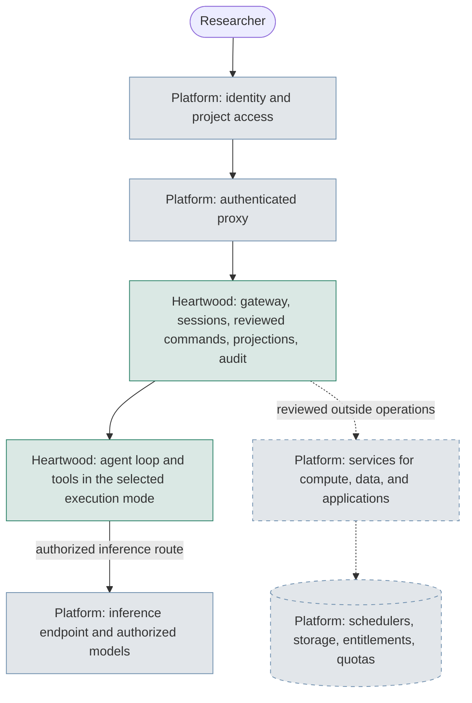
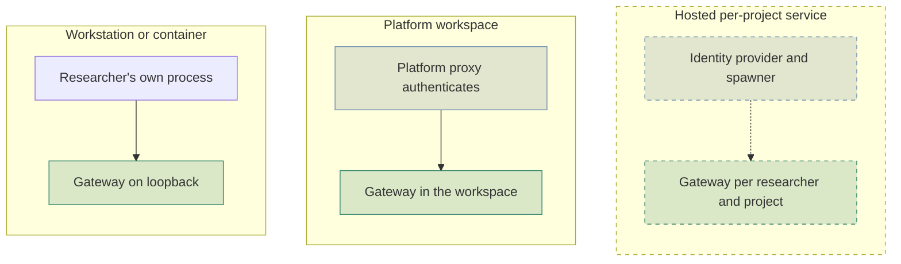
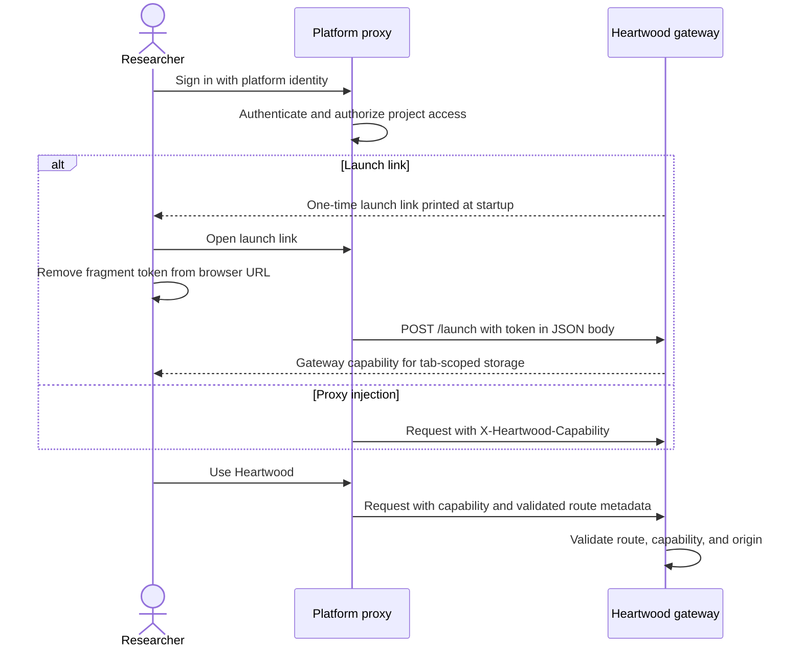
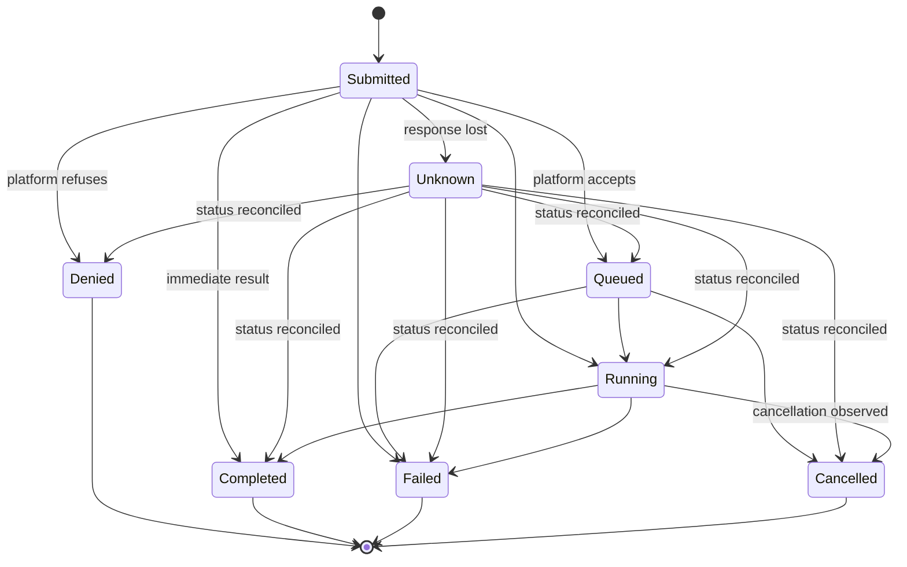
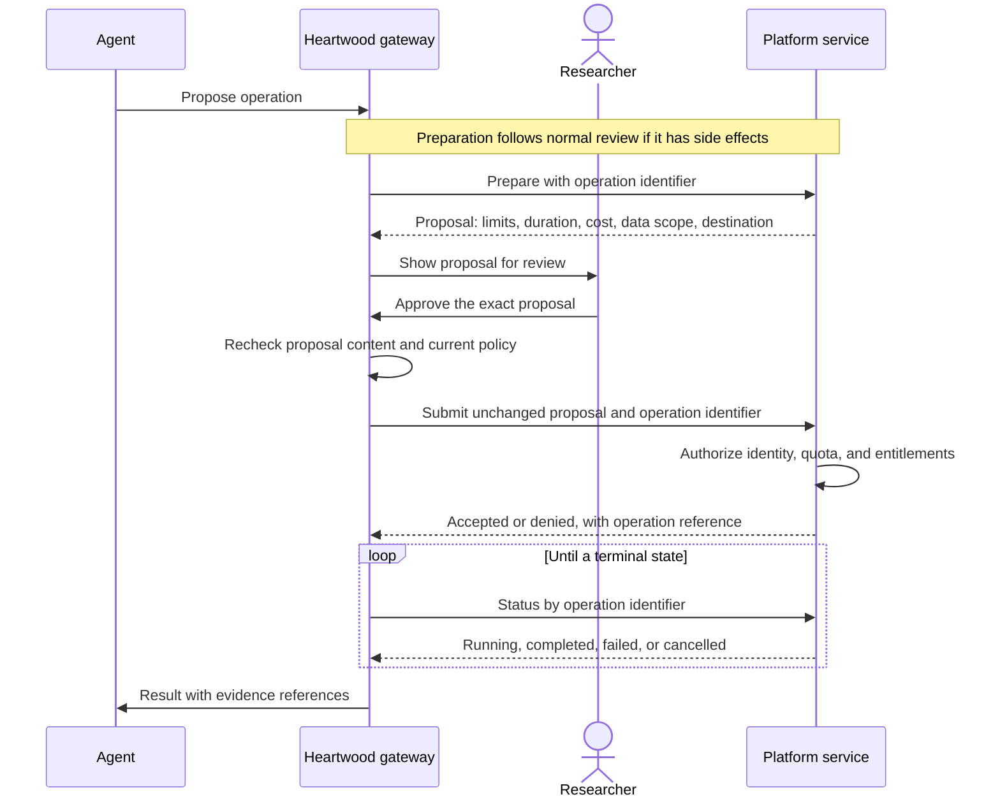
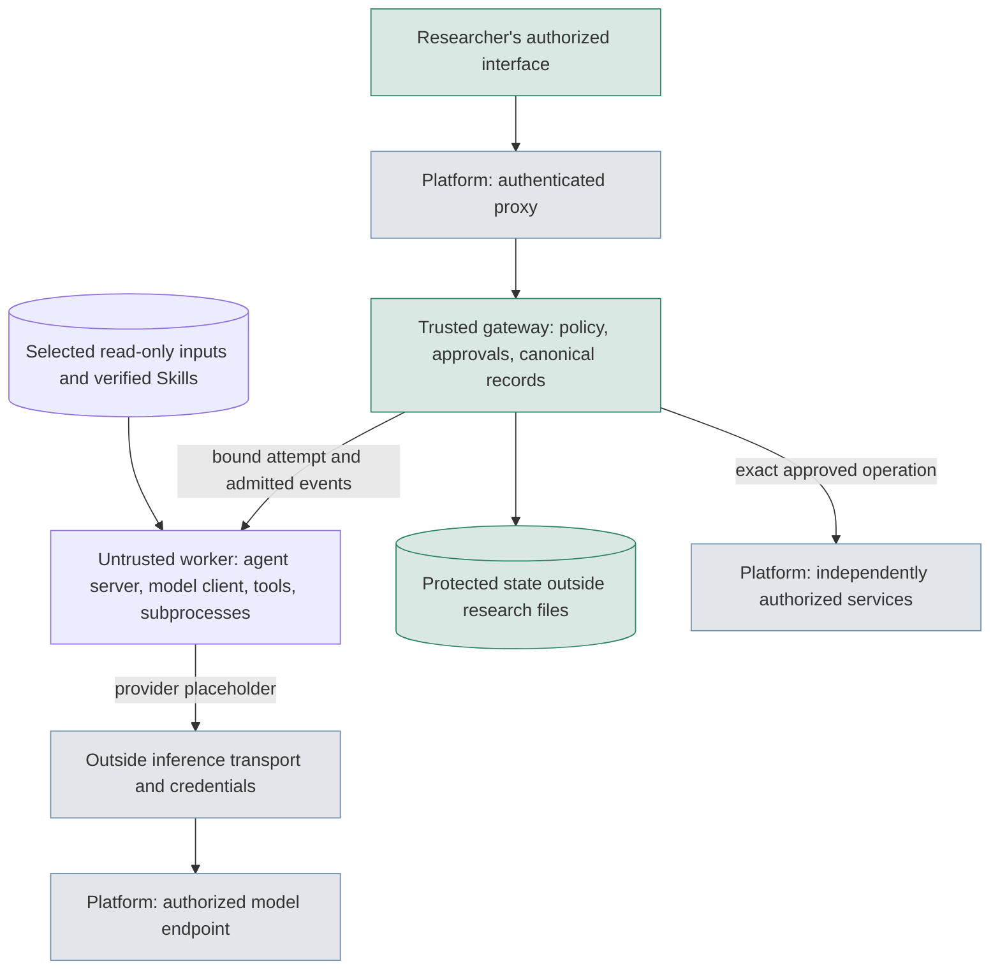

<!--
This source file is part of the Heartwood open-source project
SPDX-FileCopyrightText: 2026 Stanford University and the project authors (see CONTRIBUTORS.md)
SPDX-License-Identifier: MIT
-->

# Platform Contract

A research platform can embed Heartwood as its research interaction layer without handing Heartwood its compute, identity, storage, or inference infrastructure.
This contract defines that boundary: what Heartwood owns, what the platform owns, what a platform provides for each capability, and the security properties both sides must preserve.
Use it to scope and review an integration.
For an access request to a platform operator, start with [Platform API and Access Requirements](platform-requirements.md).

!!! info "Implementation and schema availability"
    Current interfaces, draft schemas and unavailable runtime capabilities are distinguished below.
    A schema describes a message; it does not enable the service, authorize a request or establish deployment qualification.
    Support claims require evidence for the exact platform and artifact, as described in [Validate a Platform](#validate-a-platform).

## Reading the Contract

There are two directions of interaction.
A platform proxy serves Heartwood's existing gateway API to the researcher; Heartwood calls the platform's optional inference and research services using platform-authorized credentials.
The gateway API description documents the first direction, while the current and draft connection, model, workload, estimate, and operation schemas describe the second.
A schema describes a message, not permission to send it or evidence that its capability is available.

Start with the responsibility table, then select the capabilities the platform will provide.
For each selected capability, review its messages, failure behavior, and conformance evidence together.
Standalone operation does not require a platform budget service or hosted project launcher.

### Existing Standards and Heartwood Additions

This is an integration profile: it identifies the upstream interfaces a platform exposes and the additional information Heartwood needs to use them safely.
The generated gateway API describes Heartwood's own projects, sessions, commands, and observations; it does not define an inference or scheduler API.

| Area | Existing interface to reuse | Heartwood-specific contract |
|---|---|---|
| Research sessions | Existing Heartwood gateway, described with OpenAPI and shared JSON Schemas | Launch, policy, reviewed commands, and researcher/agent projections |
| Inference | Provider APIs supported by the existing SDK, including Chat Completions and Responses for compatible services | Connection configuration, alias capability declarations, and explicit route eligibility |
| Platform tools | MCP discovery, calls, structured results, errors, and negotiated capabilities | Required integration metadata, policy checks, and review of side effects |
| Jobs, workflows, and data | Existing scheduler/storage APIs; GA4GH TES, WES, and DRS where supported | References linking native resources to plans, estimates, reviewed proposals, and audit records |
| Cost evidence | FOCUS definitions and the pinned draft mappings below | Workload assumptions, estimate coverage and validity, and links to platform budget observations |
| Researcher decisions | Heartwood's review flow and the platform's authorization system | Exact versioned operation sets and their content binding; platform enforcement remains authoritative |

Upstream definitions remain authoritative for their own messages, streaming, errors, and lifecycle semantics.
Contract artifacts should identify the upstream revision or supported profile and describe additions explicitly, rather than copying those APIs into a competing schema.
The Heartwood artifact-bundle version is separate from upstream protocol versions and negotiated capabilities.

## Contract at a Glance

| Part | What it covers | Status |
|---|---|---|
| [Hosting](#hosting) | Running the published artifact with a persistent project | Implemented |
| [Access and identity](#access-and-identity) | Authenticated routing and the launch capability | Implemented for one launching principal per gateway; per-user identity verification unavailable |
| [Deployment policy](#deployment-policy) | Restrictions the platform imposes on every project | Operator-bound policy ceiling implemented; requires explicit managed launch and outside enforcement |
| [Inference](#inference) | Model endpoints and authorized model discovery | Built-in and operator-configured routes; deployment connection-manifest startup unavailable |
| [Platform services](#platform-services) | Compute, data, and application tools through MCP | Unavailable; draft service and operation schemas only |
| [Agent isolation](#agent-isolation) | Keeping the complete worker away from Heartwood's controls | Native reference implementation; exact artifact and deployment qualification required |
| [Controlled data](#controlled-data) | Read-only inputs, enforced egress denial, and reviewed release of outputs | Selected-input staging and native read-only mounts implemented; quarantine and steward-approved release unavailable |
| [Audit and provenance](#audit-and-provenance) | Signed checkpoints, retention, and operation references | Checkpoint signing implemented; checkpoint continuity and platform publication unavailable |
| [Contract artifacts](#contract-artifacts) | Schemas, API descriptions, and conformance checks | Versioned current/draft schema exports, gateway OpenAPI, and offline conformance checks |

## The Boundary

Heartwood owns the research session.
The platform owns the infrastructure and the authority to use it.


```mermaid
flowchart TB
    Researcher(["Researcher"])
    Identity["Platform: identity and project access"]
    Proxy["Platform: authenticated proxy"]
    Gateway["Heartwood: gateway, sessions, reviewed commands, projections, audit"]
    Agent["Heartwood: agent loop and tools in the selected execution mode"]
    Inference["Platform: inference endpoint and authorized models"]
    Services["Platform: services for compute, data, and applications"]
    Infrastructure[("Platform: schedulers, storage, entitlements, quotas")]
    Researcher --> Identity --> Proxy --> Gateway --> Agent
    Agent -- "authorized inference route" --> Inference
    Gateway -. "reviewed outside operations" .-> Services
    Services -.-> Infrastructure
    classDef heartwood fill:#0b694d26,stroke:#2b8268
    classDef platform fill:#3f5b7426,stroke:#6f8fae
    classDef planned stroke-dasharray: 5 5
    class Gateway,Agent heartwood
    class Identity,Proxy,Inference,Services,Infrastructure platform
    class Services,Infrastructure planned
```

In the figures on this page, green marks what Heartwood owns, blue marks what the platform owns, and dashed outlines mark what is not yet implemented.
The integration contract separates two independent platform capabilities, inference and platform services, on top of a hosting and access baseline.
Inference connections are implemented; authenticated platform-service integration remains unavailable.
Either capability can be absent or unavailable without breaking the other: a platform can supply models without services, services without models, or neither while Heartwood runs a standalone model route.

## Responsibilities

| Area | Heartwood | Platform |
|---|---|---|
| Researcher identity | Records the launching principal as the actor of every accepted command and ignores an actor claimed in a request | Authenticates the person, authorizes project access, and ends the session |
| Gateway access | Requires the [launch capability](security.md#launch-capability) on every API request, event stream, and WebSocket, and validates the declared [ingress route](security.md#gateway-ingress) | Routes only authenticated users to the gateway, removes client-supplied forwarding and identity headers, terminates TLS, and delivers the capability |
| Research session | Owns canonical session records, reviewed commands and interface projections; delegates the agent loop to the admitted worker | Keeps the trusted gateway, authorized research files, protected state and network route available |
| Approval | Binds each approval to the pending action set and accepts it only from an authorized interface | Enforces its own authorization on every operation, whether or not Heartwood approved it |
| Policy | Evaluates model routes, review modes, and credentials against the active policy | Defines the restrictions every project on the platform must obey |
| Inference | Selects an authorized route and excludes model credentials from model context, supported tool inputs and outputs, and exports; process isolation has the limitations below | Operates endpoints, backend translation, data-use agreements, eligibility, spend limits, and egress |
| Platform services | Defines draft operation messages and offline conformance checks; authenticated service integration is unavailable | Owns scheduling, quotas, cost, dataset entitlements, application services, and infrastructure policy |
| Project and billing context | Binds the local project through the operator deployment manifest; hosted identity and billing-context integration is unavailable | Selects the platform project and billing or grant attribution through the launch flow |
| Workload prediction | Defines draft prediction messages; automated workload forecasting is unavailable | Supplies authorized resource profiles and observed execution evidence where available |
| Budgets and estimates | Defines draft estimate, proposal and overview messages; runtime budget integration is unavailable | Produces estimates and authoritative budget and approval records; owns spending thresholds, monitoring, reservations, accounting, and enforcement |
| Project storage | Keeps canonical state single-writer; managed launch binds it outside the research directory | Provides separate persistent research and protected-state storage with native advisory locks, backup and access enforcement |
| Audit and provenance | Writes content-minimized session audit and experiment records, and requests signed checkpoints | Retains checkpoints, enforces retention and immutability, and keeps its own operation audit log |
| Controlled data | Makes no compliance claim from compatibility | Decides data eligibility, agreements, egress controls, monitoring, and incident response |

Heartwood still authenticates requests and enforces its own policy inside an authenticated platform.
Platform authentication does not replace gateway controls, and a Heartwood approval never grants platform authority.

### Project and Billing Context

The working directory remains Heartwood's local project boundary.
A platform project is the platform's authorization and resource context; its billing account or grant attribution is a separate platform-owned binding.
The platform establishes that context through its authorized project-selection and launch flow.
The draft launch-context contract represents this platform-owned binding; Heartwood does not consume it at runtime or choose a billing account.
An integration must prevent agent-writable project preferences from changing the binding.
Any change to that binding follows the platform's authorization process.
Credentials and billing details that are not needed for planning stay outside the model context.

The configuration boundaries are the same in both launch modes:

| Input | Standalone project | Managed project |
|---|---|---|
| Working directory | Researcher's existing local project | Authorized persistent project selected by the platform |
| Project preferences | Existing `.heartwood/config.toml` | Configuration in the operator-bound protected state directory; preferences may only narrow deployment policy |
| Model connections | Existing local or configured provider routes | Built-in or explicitly configured routes; connection-manifest startup is unavailable |
| Launch context | Omitted when no platform supplies one | Implemented project deployment binding; platform-issued billing and hosted identity context remains a separate draft capability |
| MCP services | Authenticated service integration unavailable | Draft deployment-owned service profiles and offline discovery checks |

The implemented `heartwood.project-deployment.v1` manifest establishes local launch authority for the research directory, protected state and policy ceiling.
It is distinct from the draft platform launch-context document below: it does not implement hosted identity, billing attribution or budget services.

For example, a draft managed launch-context document is:

```json
{
  "schema_version": "heartwood.platform-launch-context.v1",
  "project_context_id": "launch-synthetic-1",
  "platform_id": "synthetic-platform",
  "project_id": "research-project-a",
  "billing_attribution_ref": "binding-a",
  "authority_ref": "platform-authority",
  "policy_ref": "policy-v1",
  "issued_at": "2026-10-17T10:00:00Z"
}
```

This is a draft platform-issued document, not a new project preference or an automatically loaded configuration file.
Keep it and deployment restrictions outside agent-writable project state; possession of a copied document does not authenticate its issuer.
Standalone launch continues to use its existing configuration and does not need a fabricated platform project or billing service.

!!! info "Unavailable: platform launch and budget context"
    Draft launch-context and budget schemas are available in the contract bundle; they do not enable deployment startup or budget services.

## Deployment Topologies

The gateway is the unit of hosting.
Only who runs the gateway process, and who authenticates the person in front of it, changes between topologies; the contract below it is the same.
The recommended hosted topology starts one gateway on demand for each researcher and project, with multiple conversations served by that gateway.
The platform owns its launch, authenticated routing, shutdown, and recovery; project selection also establishes the authorized billing context.


```mermaid
flowchart TB
    subgraph Hosted["Hosted per-project service"]
        direction TB
        H1["Identity provider and spawner"] -.-> H2["Gateway per researcher and project"]
    end
    subgraph Workspace["Platform workspace"]
        direction TB
        P1["Platform proxy authenticates"] --> P2["Gateway in the workspace"]
    end
    subgraph Workstation["Workstation or container"]
        direction TB
        W1["Researcher's own process"] --> W2["Gateway on loopback"]
    end
    classDef heartwood fill:#0b694d26,stroke:#2b8268
    classDef platform fill:#3f5b7426,stroke:#6f8fae
    classDef planned stroke-dasharray: 5 5
    class W2,P2,H2 heartwood
    class P1,H1 platform
    class H1,H2 planned
    style Hosted stroke-dasharray: 5 5
```

| Topology | Runs the gateway | Authenticates the person | Status |
|---|---|---|---|
| Workstation or container | The researcher | The operating system and the launch link | Implemented |
| Platform workspace | The platform, in the researcher's workspace | The platform proxy | Implemented for the terminal on Terra and Stanford Carina and the notebook on Terra |
| Hosted per-project service | The platform, one gateway per researcher and project, started on demand | The institution's identity provider, verified by Heartwood | Not implemented |

!!! info "Unavailable: hosted per-project service"
    Heartwood does not verify a person's identity itself, does not attribute commands to individual people, and has no supported deployment that starts, stops, and routes per-project gateways.
    The hosted topology verifies an OpenID Connect identity at ingress, derives the command actor from the verified subject, exchanges rather than forwards user tokens for platform calls, and reuses an existing spawner and proxy.

### Hosted Lifecycle and Scaling

For a hosted integration, the platform manages these lifecycle requirements:

- **Required:** preserve research files and separately protected canonical state across compute replacement, using state storage that supports session ownership locks.
- **Required:** route each researcher only to their authorized gateway and project context; separate gateways do not by themselves establish operating-system isolation or shared-project collaboration.
- **Required:** determine idleness from agent and local-tool activity as well as client connections; closing a browser is not sufficient reason to terminate active work.
- **Required:** drain or pause local work before a planned shutdown, preserve references to outstanding platform operations, and reconcile their status on restart before resubmitting anything.
- **Required:** recover session ownership after the previous process has stopped; replicas must not write the same session concurrently.
- **Recommended:** scale the number of active researcher/project gateways independently of platform inference and batch capacity.

The contract leaves virtual machines, containers, Kubernetes, and the choice of existing spawner open.
Several isolated gateway instances can share worker capacity; a dedicated virtual machine per gateway is not required.
Persistent storage and external jobs can remain allocated while gateway compute is stopped, so gateway shutdown does not establish that spending stopped.
Size each deployment from measured gateway, SDK, and local-tool resource use; remote inference alone does not establish a minimum memory or CPU requirement.
These requirements do not describe implemented autoscaling or recovery orchestration.

## Hosting

A platform runs the published Heartwood artifact with the researcher's project as the working directory.

- **Required:** run the published image or native release without replacing its entrypoint, user, or bundled browser assets.
- **Required:** provide persistent research files and state storage with native advisory locks; object-store and file-transfer mounts are not session stores unless qualified. Managed workers must not receive the protected state mount.
- **Required:** keep model weights, credentials, and deployment secrets out of image layers and the project directory.
- **Required:** run Heartwood-managed local model servers only where other operating-system users cannot reach their loopback ports.
- **Required:** keep local checkpoint signer sockets in owner-only directories outside worker access; production signing uses an independently authorized HTTPS service.
- **Recommended:** back up the project storage and preserve it across compute recreation.
- **Optional:** provide Jupyter where the platform offers the [notebook bridge](../use/notebooks.md).
- **Recommended:** verify the published release attestations before admitting an artifact.

!!! info "Unavailable: signed artifacts and bills of materials"
    Releases carry build attestations, but release images and native assets are not yet signed and do not yet ship software bills of materials or third-party notices.

!!! info "Unavailable: authenticated local model servers"
    A Heartwood-managed model server listens on a fixed loopback port without authenticating the listener, so another user on a shared host can take the port and receive prompts.
    Isolate this service from other operating-system users; loopback alone does not authenticate its identity.

See [Package the Shared Application](platform-integration.md#package-the-shared-application) and [Persist the Right Data](index.md#persist-the-right-data).

## Access and Identity

The platform authenticates the person; Heartwood authorizes the caller of its own API.


```mermaid
sequenceDiagram
    actor R as Researcher
    participant P as Platform proxy
    participant G as Heartwood gateway
    R->>P: Sign in with platform identity
    P->>P: Authenticate and authorize project access
    alt Launch link
        G-->>R: One-time launch link printed at startup
        R->>P: Open launch link
        R->>R: Remove fragment token from browser URL
        P->>G: POST /launch with token in JSON body
        G-->>R: Gateway capability for tab-scoped storage
    else Proxy injection
        P->>G: Request with X-Heartwood-Capability
    end
    R->>P: Use Heartwood
    P->>G: Request with capability and validated route metadata
    G->>G: Validate route, capability, and origin
```

- **Required:** authenticate every user before traffic reaches the gateway, and restrict the gateway's network route to the platform proxy.
- **Required:** remove client-supplied forwarding and identity headers before setting the proxy's own values.
- **Required:** deliver the launch capability, either by letting the researcher open the one-time launch link, or by injecting `X-Heartwood-Capability` for callers the platform has already authenticated.
- **Required:** keep the capability away from the agent workspace, other users, and logs.
- **Recommended:** run one gateway per researcher and project; Heartwood records one launching principal per gateway and does not distinguish people who share it.

A proxy that injects the capability authenticates on the researcher's behalf, so it must inject it only for the one user who owns that gateway.
A trusted identity header is an exact route marker, not a credential.

For example, a platform proxy at `https://research.example.org` that strips the `/heartwood/project-a` prefix and forwards from `10.0.0.2` starts the gateway with a secret supplied by the platform's secret manager:

```bash
heartwood gateway serve --capability-fd 3 3</run/secrets/heartwood-capability \
  --ingress-mode trusted-proxy \
  --host 10.0.0.5 \
  --port 8767 \
  --public-origin https://research.example.org \
  --base-path /heartwood/project-a \
  --trusted-proxy-source 10.0.0.2/32 \
  --proxy-strips-prefix
```

The proxy then adds `X-Heartwood-Capability` with the same secret to each authenticated request.
See the [serve options](../reference/cli.md#operator-commands) and [HW-INGRESS-003](../reference/troubleshooting.md#gateway-ingress).

The gateway consumes and closes the inherited descriptor, rejects environment capability delivery, and prints generated launch links only after owning a listening socket.
The platform must protect the descriptor source from workers and other users.
The browser keeps the capability in origin- and tab-scoped storage, keyed by gateway base path, and explicitly supplies it only to that gateway.
HTTP requests reject redirects; WebSockets authenticate before receiving project events.
Scripts on the same origin can access this storage: use separate authenticated origins for mutually untrusted projects.
A Jupyter proxy base path does not isolate the gateway from other scripts on the notebook origin.

## Deployment Policy

A platform defines restrictions that every project on it must obey: the model and catalog endpoints a project may reach, the action-review modes it may select, the credential references it may use, and whether egress is denied by default.

- **Required:** define the policy per platform, deny egress by default, and list exact model and catalog endpoints.
- **Required:** let researchers narrow the policy for a project, never widen it.
- **Recommended:** offer Review Every Action as the only review mode for secret-backed or unqualified routes.
- **Optional:** publish approved Skill sources through the deployment-owned registry at `/etc/heartwood/skill-sources.toml`; only that registry can approve a Skill for controlled data.

Heartwood builds each platform's default policy in its [platform adapter](platform-integration.md#define-policy-and-connections) and evaluates model routes, review modes, and credentials against it.

The explicit managed launch path supplies an operator-owned project deployment manifest outside the research tree and canonical state.
It binds the exact research directory, project UUID, protected state directory and policy ceiling before stores are opened.
The state directory's final component must match the project UUID; mismatched, writable, symlinked or unavailable authority stops startup.
Existing local state requires an explicit verified migration, never silent adoption or fallback.
See [Operator-Bound External State](../start/project.md#operator-bound-external-state) and the [manifest reference](../reference/cli.md#operator-commands).

Every project configuration read, update and restore is checked against the supplied ceiling.
Project preferences can narrow allowed endpoints, credentials, capability tiers and confirmation modes, or increase the aggregate-count floor; they cannot broaden those permissions, disable default-deny egress or change platform identity.
Research files do not select the ceiling or protected state path.
Launchers without an explicit deployment binding retain local operation and do not acquire this managed guarantee.
The platform still enforces filesystem, process and network restrictions outside the worker; application policy validation alone cannot constrain a compromised process.

## Inference

A platform can supply the models a researcher may use, so the researcher chooses a model without entering platform-managed credentials or knowing where it runs.

The requirements below describe the compatible-service integration profile.
Existing provider-specific connections continue to use their SDK-supported APIs; this profile does not require those providers to implement a different wire protocol.
Request bodies, streamed events, tool calls, usage records, and errors retain their upstream definitions, including [Chat Completions](https://developers.openai.com/api/reference/resources/chat/subresources/completions/methods/create).

- **Required:** an OpenAI-compatible Chat Completions endpoint with streaming and native tool calls.
- **Recommended:** the Responses API for models that support it; Heartwood selects Chat Completions or Responses per model from the OpenHands model capabilities and does not assume every compatible endpoint implements both.
- **Required:** a model list endpoint that returns only the models the authenticated identity may use.
- **Recommended:** report each model's context window, tool-calling support, and permitted data classes.
- **Required:** keep credentials platform-held, through a managed identity, a process-only variable, or a mounted file outside the project.
- **Required:** state which data classes each route may receive; Heartwood cannot infer eligibility from compatibility.
- **Required:** return distinguishable failures for rejected credentials, exhausted quota, rate limits, invalid model configuration, and temporary unavailability.
- **Recommended:** restrict the workspace's network egress to the approved inference endpoints.
- **Optional:** provide GPU or CPU compute on which Heartwood [runs a Heartwood-managed model](../models/run-with-heartwood.md) when no hosted route is available.
- **Optional:** for air-gapped platforms, provide an approved process to [import verified model bundles](../models/offline.md).

Heartwood discovers models through a connection's catalog endpoint after checking it against the deny-by-default policy, and it never implements a second provider proxy.
It currently consumes platform-managed inference through built-in connections, such as the [Stanford AI API Gateway](../models/connections.md#stanford-ai-api-gateway), and through [compatible services](../models/connections.md#other-compatible-services) that an operator configures.
A route's credential boundary determines whether actions can run without review; secret-backed routes are application-scrubbed unless the platform demonstrates a [platform-isolated boundary](platform-integration.md#model-credential-isolation), which no current adapter claims.

!!! info "Unavailable: connection-manifest startup"
    Deployment startup does not load a platform connection manifest; use a built-in adapter connection or an explicitly configured compatible route.
    It also relies on the OpenHands model table to choose a protocol, which does not recognize platform model aliases.
    The exported manifest describes deployment-owned connections and model aliases, but runtime startup does not consume those declarations.

A platform that describes its models should make the following metadata available for each model identity, reusing provider and SDK facts where available.
The extension's placement and alias declarations remain part of the draft schema; this table does not prescribe a replacement model-list API.

| Field | Meaning | Level |
|---|---|---|
| Model identifier | The exact value Heartwood sends in each request | Required |
| Protocols | Supported SDK/provider protocol; Chat Completions, Responses, or both for compatible services | Required |
| Context and token limits | Context window and distinct input/output limits where known; missing values remain unknown | Recommended |
| Tool calling | Whether native tool calls are supported | Required |
| Data classes | The data classes the route may receive under the platform's agreements | Required |
| Deprecation | Whether the model is being withdrawn, so Heartwood never silently substitutes another model | Recommended |

Protocol identifiers belong to the referenced upstream API or SDK capability profile, not a Heartwood-wide provider registry.
For example, the SDK provider identifier `openai` alone does not select Chat Completions versus Responses; the declared capability profile must make that distinction explicit.
MCP capability names such as `tools` retain their upstream meaning, and extension references identify the exact upstream revision.
Backend protocol references identify the service's existing API and version, such as GA4GH TES, rather than defining a new execution format.

!!! info "Draft model metadata; runtime discovery remains separate"
    The upstream [model list](https://developers.openai.com/api/reference/resources/models/methods/list) already defines identity and lifecycle metadata, including ownership and creation time.
    It does not fully describe tool support, token limits, or platform-specific data eligibility.
    The model-metadata supplement reuses that identity and supplies missing declarations and exact-class eligibility observations.
    Its draft schema does not replace provider model discovery or the existing SDK capability lookup.

### Realtime Voice

A platform can offer realtime speech models for an optional voice interface.

- **Required:** create realtime sessions on the server side, so no long-lived key reaches the browser.
- **Required:** state whether realtime audio is covered by the route's data-use agreements; text-route eligibility does not extend to audio.
- **Recommended:** support a server-owned session in which Heartwood executes and approves every tool call.

!!! info "Unavailable: voice"
    Heartwood has no voice interface.
    An ephemeral browser credential is a convenience rather than an enforcement boundary, and speech never grants approval.

## Platform Services

Platform services let a researcher ask Heartwood to submit an analysis, request compute, attach an authorized dataset, or open a platform application through the research session.
Services connect through the [Model Context Protocol](https://modelcontextprotocol.io/specification/) without a platform-specific agent loop.

!!! info "Unavailable: platform services"
    Heartwood does not currently connect to MCP servers; it disables them in its OpenHands configuration and advertises no platform service.

### Discovery and Authorization

- **Required:** expose services over MCP Streamable HTTP with a stable server identity.
- **Required:** describe each tool's purpose, input and output schemas, and the permission it requires; read access never implies permission to allocate resources or attach data.
- **Required:** annotate each tool with the MCP [tool annotations](https://modelcontextprotocol.io/specification/2025-06-18/server/tools) `readOnlyHint`, `destructiveHint`, `idempotentHint`, and `openWorldHint`.
- **Required:** enforce identity, quotas, and dataset entitlements on every call, independently of Heartwood's approval.
- **Required:** treat a changed tool set as a new review; discovery does not authorize execution or certify a tool's advertised safety.
- **Required:** accept delegated or platform-held credentials that never reach model context, tool environments, or exports.

Heartwood treats annotations as hints from the server, not as authorization: a tool marked read-only still runs under Heartwood's review policy, and the platform still authorizes every call.

### Budget-Aware Planning

This section describes the exported draft planning contract.
Heartwood does not provide runtime workload prediction, budget discovery, estimation or the shared budget overview.

A platform can expose budget information and workload estimation so the agent and researcher can plan within an existing allocation.
The contract covers bounded interactive exploration, batch analysis, and model inference, including alternative runtime configurations.
The agent develops workload predictions with researcher input, using research Skills, declared assumptions, and available evidence about comparable work.
Predictions describe expected work such as task counts, input sizes, resource needs, execution duration, retries, and inference token volumes, with uncertainty and missing information made explicit.
The platform applies its pricing rules to the supplied workload predictions and produces structured cost estimates for the complete plan and its operations or high-cost elements.
Heartwood compares those estimates; it does not calculate provider prices from rate tables.
Heartwood helps the researcher compare estimates, revise the scope of work, and review a concrete proposal.
It responds to platform-reported budget changes or denials by explaining the result and proposing alternatives.

The platform owns spending thresholds, monitoring, reservations, accounting for concurrent work, and enforcement.
Heartwood does not operate a spending monitor or promise a billing cap from its local execution budgets.
A researcher approving work in Heartwood does not raise a platform limit or change billing attribution.
Requests for additional allocation follow the platform's approval process.

An estimate describes expected cost under stated workload and runtime assumptions; it is neither a reservation nor authorization to execute.
A reported available balance is a platform observation, not a guarantee that the same balance will remain available at submission.
Missing or partial budget and cost information must remain explicit rather than being interpreted as zero cost or unlimited spending.
The platform remains authoritative when it authorizes an operation.

#### FOCUS Design Basis

The pricing and cost portions of this contract use the FinOps Open Cost and Usage Specification ([FOCUS](https://focus.finops.org/)) as their starting point, including the proposed FOCUS 1.5 SKU Price dataset and price-estimation definitions.
Reuse applicable definitions for prices, currencies, units, eligibility, effective dates, and cost records rather than creating a separate pricing vocabulary.
The platform uses those definitions when producing structured estimates; Heartwood does not ingest a price catalog to calculate provider charges.

FOCUS cost and pricing datasets do not by themselves define the interaction contract for submitting workload assumptions, linking plan and element estimates, recording researcher approvals, or retrieving authoritative budget status.
Map each requirement to the applicable FOCUS definition and identify the remaining interaction fields before fixing the API schemas.
Workload duration and resource predictions come from the agent and researcher; the platform reports the pricing assumptions, coverage, and limitations of its resulting cost estimate.
Neither a workload prediction nor a price record establishes an enforcement guarantee.
An estimate is not an incurred-cost record, and a platform spending reservation is not a provider purchase commitment.
Keep those meanings distinct when linking estimates and approval records to cost data.

!!! info "Design reference: FOCUS 1.5 proposals"
    The [SKU Price dataset](https://github.com/FinOps-Open-Cost-and-Usage-Spec/FOCUS_Spec/pull/2424) and [supported estimation features](https://github.com/FinOps-Open-Cost-and-Usage-Spec/FOCUS_Spec/pull/2595) are draft references, not a claim of final FOCUS 1.5 conformance or provider availability.
    Record the reviewed revisions and reassess the mapping against the ratified specification before declaring compatibility.

The reviewed SKU Price reference is revision `005a30566a754db4e0f346d20c7063daba579080`; the supported-features reference is revision `a2f9f93cb618ab490b90098d0456dfcdb813c5e7`.
These pins identify the design inputs even if a proposal changes.

| Requirement | Reused definition or boundary |
|---|---|
| Rate amount and basis | [UnitPrice](https://github.com/FinOps-Open-Cost-and-Usage-Spec/FOCUS_Spec/blob/005a30566a754db4e0f346d20c7063daba579080/specification/datasets/sku_price/columns/unitprice.md) and UnitPriceType preserve decimal rate precision and distinguish list, base, and contracted rates |
| Measurement scale | [PricingUnit](https://github.com/FinOps-Open-Cost-and-Usage-Spec/FOCUS_Spec/blob/005a30566a754db4e0f346d20c7063daba579080/specification/datasets/sku_price/columns/pricingunit.md) describes the rate's unit; a workload token count must not be mistaken for a million-token pricing quantity |
| Denomination | [PricingCurrency](https://github.com/FinOps-Open-Cost-and-Usage-Spec/FOCUS_Spec/blob/005a30566a754db4e0f346d20c7063daba579080/specification/datasets/sku_price/columns/pricingcurrency.md) distinguishes currency or consumption credits from physical resource quantities |
| Price identity and effective period | [SKU Price dataset](https://github.com/FinOps-Open-Cost-and-Usage-Spec/FOCUS_Spec/blob/005a30566a754db4e0f346d20c7063daba579080/specification/datasets/sku_price/dataset.md) supplies provider, SKU, contract, and price-period context; a price ID alone is not a universal key |
| Price eligibility | [SkuPriceEligibility](https://github.com/FinOps-Open-Cost-and-Usage-Spec/FOCUS_Spec/blob/005a30566a754db4e0f346d20c7063daba579080/specification/datasets/sku_price/columns/skupriceeligibility.md) describes pricing eligibility, not authority to use a resource |
| Workload, plan coverage, and decisions | Heartwood interaction records connect predictions, plan elements, estimates, and researcher decisions; these are not additional FOCUS columns |
| Budget observation and estimate expiry | Platform interaction records provide observation time and validity; neither is the price's effective period |

When a platform supplies FOCUS pricing evidence, retain its source version and field meanings instead of reducing tiers, eligibility, or commitments to an average rate.
The platform remains responsible for interpreting that evidence and calculating its estimate.

#### Workload Prediction and Execution Evidence

Research Skills guide workload decomposition and the questions needed to refine a prediction with the researcher.
The draft contract distinguishes interactive exploration, batch analysis and model inference through shared workload-prediction and evidence records; dedicated prediction Skills are unavailable.
The harness supplies the shared contracts and evidence needed to relate a prediction to its plan, platform cost estimate, researcher decisions, and observed execution.
Workload observations and platform-reported charges remain distinct, so a prediction error is not confused with a pricing change.
Researcher corrections and revised predictions preserve the assumptions and evidence used for the earlier estimate.
Prediction evidence is retained and reused within the current project, including comparisons between predicted and observed workloads and researcher corrections.
The agent can use comparable prior runs from that project to refine its next prediction; this does not establish a cross-project evidence service or an automatically trained predictor.

A benchmark or sample run proposed to improve a prediction is itself work subject to the existing action review and platform authorization.
The agent cannot launch an unapproved experiment or treat unavailable measurements as evidence of zero consumption.
Prediction quality and evidence reuse do not grant spending authority or replace platform constraints.

!!! info "Unavailable: workload-prediction Skills and harness support"
    Workload-prediction Skills, runtime forecasting and budget projections are unavailable.
    The existing research planner and experiment records provide integration points, but do not yet implement workload forecasting or complete resource-usage observations.

#### Shared Plan and Budget Overview

The agent and researcher need the same overview of the plan, its estimated cost, approved elements, and applicable budget constraints.
Heartwood records researcher decisions in its session audit and associates them with the corresponding platform records.
The platform supplies the authoritative status of approved budget allocations, reservations or commitments, incurred spending, and remaining availability.
Heartwood presents that status with its observation time and reports missing or stale information explicitly.
An estimate, a researcher approval, a platform authorization, and a spending reservation are distinct states.

The overview relates each operation or high-cost element to its plan and identifies which components are already included in plan totals, so a component is not counted again as additional spending.
Planning revisions preserve the distinction between the previously approved proposal and work that still needs approval.
Estimating or agreeing on a whole plan does not authorize every operation in it; executable operations retain their own approval and platform-authorization path.
The initial approval scope is an exact versioned set of operations, not a reusable spending envelope.
Estimates may complete immediately or remain pending with a platform-tracked reference; either path resolves to the same estimate content.
The agent receives the platform constraints and uses them to plan, while platform enforcement remains independent of the agent following those instructions.
Heartwood's copy of the overview is not an accounting ledger or an independent spending monitor.

#### Workload Examples

These examples describe contract behavior with synthetic workloads; they are not provider prices or execution authorizations.

| Workload | Estimate request | Researcher and agent overview |
|---|---|---|
| Bounded exploration | A two-hour analysis plan with a named runtime profile, one dataset scan, and an explicit inference allowance; separate estimates for the scan and model work | The complete plan and its included elements, assumptions, approvals still needed, and platform-reported available budget |
| Batch analysis | One hundred tasks with stated input sizes, runtime assumptions, concurrency, retry allowance, and shared setup; alternatives with different runtime profiles | A platform-produced batch total and component estimates, identifying setup and retries already included, with the reviewed batch submission and its platform status |
| Model inference | A named model with input/output token assumptions and cache assumptions where applicable, or a named hosted runtime with an allocation duration | Separate alternatives for token-priced and allocated inference, included cost components, the approved operation, and platform-reported spending and availability |

The checked-in examples under `fixtures/synthetic/platform-contract/` include a complete overview, exact proposal bytes, and native-request bytes for each workload.
Exploration shows a platform-authorized bounded run, batch shows platform denial after concurrent spending, and inference shows an unknown price and unavailable budget observation.
The native requests use a synthetic test service; real integrations preserve their upstream backend request format.
The `mcp-tasks.json` fixture in the same directory contains immediate and deferred exchanges with identical completed estimates, plus a cancellation acknowledgement followed by continued backend work and spending.

Read each exchange in this order:

1. `prediction` supplies quantities, units, assumptions, and project-local evidence for one exact plan revision.
2. `estimates` supplies platform prices for that prediction; `scope` distinguishes a plan quote from an element quote, while `coverage` describes how complete its cost information is.
3. `operation_sets` supplies exact native-request references, declared hard limits, and embedded estimate snapshots for review.
4. `researcher_decisions` binds the proposal revision and exact document hash; the platform's independent decision appears in `authorizations`.
5. `operations` and `budgets` preserve separately observed backend execution and accounting state, including unknown or stale information.

An estimate total already includes components marked `included_in_total`; do not add them again.
Separate estimates for the same work are comparisons, not additive charges.
Runtime alternatives use their own prediction revisions and estimates, so selecting one does not silently alter an approved configuration.
Amounts are decimal strings; `null` means unknown, while `"0"` is an explicit zero.
Currency or allocation denominations must match before comparing amounts; Heartwood performs no conversion or pricing calculation.

The proposal digest is SHA-256 over the exact UTF-8 JSON document bytes, including whitespace, not a custom canonical JSON representation.
The document embeds reviewed estimate snapshots; each native request also carries the digest of its exact bytes.
`reviewed_operation_set()` rejects duplicate JSON object keys, and `verify_reviewed_operation_set()` checks a stored envelope against the original document before its binding is trusted.
Reserializing or changing the reviewed document requires a new binding and decision.
These helpers verify content consistency; the gateway and platform still authenticate the decision-maker, check current policy and estimate validity, and enforce limits at submission.

!!! info "Unavailable: budget discovery and workload estimation"
    Draft budget and estimate schemas and synthetic examples are available; they do not enable runtime estimation or spending authority.

### Operations That Change Platform State

A tool that allocates compute, submits work, attaches data, or starts an application is an operation.
Researcher decisions and platform execution have separate states: approval does not mean a platform accepted or started the operation.
The following diagram describes platform execution after a reviewed submission; rejection by the researcher prevents submission entirely.
These are observations for the researcher and agent, not a replacement for a scheduler's state machine or a new set of wire methods.
Preserve native backend references and states when relating them to this overview.


```mermaid
stateDiagram-v2
    [*] --> Submitted
    Submitted --> Denied: platform refuses
    Submitted --> Queued: platform accepts
    Submitted --> Running
    Submitted --> Completed: immediate result
    Submitted --> Failed
    Submitted --> Unknown: response lost
    Queued --> Running
    Queued --> Cancelled
    Queued --> Failed
    Unknown --> Denied: status reconciled
    Unknown --> Queued: status reconciled
    Unknown --> Running: status reconciled
    Unknown --> Completed: status reconciled
    Unknown --> Failed: status reconciled
    Unknown --> Cancelled: status reconciled
    Running --> Completed
    Running --> Failed
    Running --> Cancelled: cancellation observed
    Denied --> [*]
    Completed --> [*]
    Failed --> [*]
    Cancelled --> [*]
```


```mermaid
sequenceDiagram
    participant A as Agent
    participant G as Heartwood gateway
    actor R as Researcher
    participant S as Platform service
    A->>G: Propose operation
    Note over G,S: Preparation follows normal review if it has side effects
    G->>S: Prepare with operation identifier
    S-->>G: Proposal: limits, duration, cost, data scope, destination
    G->>R: Show proposal for review
    R->>G: Approve the exact proposal
    G->>G: Recheck proposal content and current policy
    G->>S: Submit unchanged proposal and operation identifier
    S->>S: Authorize identity, quota, and entitlements
    S-->>G: Accepted or denied, with operation reference
    loop Until a terminal state
        G->>S: Status by operation identifier
        S-->>G: Running, completed, failed, or cancelled
    end
    G->>A: Result with evidence references
```

- **Required:** before approval, return a proposal with the resource limits, expected duration, estimated cost when available, data scope, and destination.
- **Required:** accept a caller-supplied operation identifier and treat a repeated submission with the same identifier as the same operation.
- **Required:** scope that identifier to the authorized platform project and service, bind it to the exact proposal contents, and reject different contents under the same identifier as a conflict.
- **Required:** an estimate or preparation call that persists data, incurs charges, or reserves resources follows the normal action review and platform-authorization path; its name does not make it read-only.
- **Required:** report status by operation identifier, so an uncertain outcome is reconciled rather than retried.
- **Required:** report cancellation as the observed platform result, without promising rollback of completed work.
- **Required:** return a reference that joins the platform's audit record to Heartwood's session audit without copying data payloads.

An unknown outcome is Heartwood's lack of an authoritative observation, not proof that nothing happened.
Cancellation can leave completed work and incurred charges; status and cost observations must preserve both.

#### Outside Operation Admission

A trusted embedding can supply `ExternalActionAdapter` to a managed `SessionService` and prepare an outside operation from a retained worker tool proposal with `propose_external_action`.
The adapter resolves native service requests and immutable input references from deployment configuration; preparation must have no external effects.
This optional boundary is disabled by default and is not installed by the built-in launchers.

The gateway issues a separate operation identifier and presents the complete request, input digests, destination, worker identity, policy revision, and five-minute validity interval through the shared action review.
The existing approve and deny commands bind the full proposal digest.
Immediately before submission, the gateway rechecks the live worker attempt, current project and policy, actor entitlement, validity interval, and input contents.
It submits the exact verified input bytes without reopening worker paths.
The trusted adapter must bound reads, exclude credentials from the reviewable request, and resolve input references without granting worker-selected filesystem access.

The decision and submission intent are committed through the paired session and audit journal before contacting the service.
The private session retains review content; the audit records operation identifiers, digests, decisions, and status without copying request or input payloads.
A worker acknowledgement or completion event cannot settle the separately identified outside operation.

`reconcile_external_actions` queries the existing operation identifier after an interrupted submission or an uncertain result.
It does not repeat submission, restore a worker lease, or fall back to local tool execution.
A platform observation must match the project, service, operation, and exact proposal digest.
Cancellation requires the service's native operation contract; denying an already submitted operation does not cancel it.

The service must independently authenticate the caller and enforce actor entitlement, project scope, current attempt revocation, policy, expiry, and transactional idempotency.
A command's actor identifier is a claim, not authentication; the embedding must bind it to an authenticated researcher and the service's own identity context.
The worker must have no alternate credential or network route to the privileged service.
These requirements need deployment-specific qualification, including revocation races, interruption, input storage isolation, and service-side duplicate suppression.
The adapter interface and local journal checks alone do not establish those infrastructure guarantees.

#### Result Release to the Worker

An outside operation's approval does not authorize disclosing its result to a worker or inference provider.
A trusted embedding can call `propose_external_result` for a terminal, observed operation from the current worker attempt.
The native service adapter must independently authorize and bound the result read, omit credentials, and return sanitized JSON data.
The gateway rejects ambiguous or oversized JSON and limits the complete message, including its provenance envelope, to 64 KiB.

The shared action review binds the exact result, outside observation, worker identity, service policy revision, declared model identifier and route, and a fresh five-minute validity interval.
Approval checks current service disclosure policy, the live worker lease, an idle conversation without pending native actions, and the existing model and workflow admission rules.
The adapter's disclosure check must enforce the researcher's entitlement and data eligibility for the exact worker and inference destination.
Sender labels are descriptive metadata and never establish approval or authenticated identity.

The paired journal retains the decision and delivery intent before sending the reviewed snapshot through the native conversation message and run APIs.
Result data is untrusted context; the worker retains its enforced tool and network restrictions.
The operational audit records release and operation identifiers, digests, actor, command, and phase without copying the result.
A submitted result means the native delivery path accepted it; it does not establish that the worker used it correctly or completed subsequent work.

There is one result-release review per outside operation.
Denial is final for that release; changed content or destinations require a separately authorized workflow.
An interrupted or uncertain delivery is never retried automatically, including after gateway restart.
The retained record and native conversation must be inspected before continuing in a new authorized session.
This optional boundary does not establish protected result storage, deployed isolation, provider eligibility, or controlled-data readiness.

#### Asynchronous Results

Pending results use the optional [MCP Tasks extension, revision 2026-07-28](https://tasks.extensions.modelcontextprotocol.io/specification/2026-07-28/tasks).
The bundle preserves its upstream schema unchanged, with a pinned commit, checksum, and license.
Heartwood defines the estimate payload; MCP defines how a caller receives it immediately or retrieves it later.

- The server advertises `io.modelcontextprotocol/tasks` under `capabilities.extensions`; each task-enabled `tools/call` also opts in through `params._meta["io.modelcontextprotocol/clientCapabilities"].extensions`.
- A call returns either the immediate tool result or a flat `resultType: "task"` handle.
- `tasks/get` returns status and, when completed, the original tool result; its `structuredContent` uses the same estimate schema as the immediate path.
- `tasks/update` supplies requested input; it does not bypass researcher review or platform authorization.
- `tasks/cancel` acknowledges the cancellation request; observe the task, backend operation, and spending separately afterward.

A completed task can contain a tool result with `isError: true`; it does not establish successful estimation or execution.
Expired or missing task state requires reconciliation with the platform operation identifier before resubmission.
The checked-in [synthetic exchanges](#workload-examples) demonstrate both estimate paths and cancellation followed by continued backend work.

!!! info "Tasks runtime integration remains separate"
    SDK type availability does not establish Heartwood runtime support for this extension.
    The contract exports and offline checks use the pinned upstream schema directly.
    Heartwood does not provide authenticated Tasks transport, polling, input handling or platform-operation reconciliation.

The exported `mcp-tasks.SOURCE.txt` records interpretation boundaries where upstream prose and examples differ: flat task handles, the versioned missing-capability error code, and nested original results that may omit `resultType`.
The checker accepts that nested example shape while requiring the outer result discriminator.
Its timestamp ordering and nonnegative duration checks are additional Heartwood profile checks, not guarantees of the upstream schema.

These operation requirements describe the draft integration profile; Heartwood does not execute platform operations through it.
Existing tool approvals bind the complete reviewed action contents; changed arguments, ordering or group membership invalidate that approval.
This implemented action binding does not enable the draft platform-operation transport.

### Capability Families

A platform offers any subset of these families; each is discovered, never assumed.

| Family | Typical operations | Recommended backing |
|---|---|---|
| Compute jobs | Submit a sized job, check status, cancel | [GA4GH Task Execution Service](https://ga4gh.github.io/task-execution-schemas/) or the platform's scheduler |
| Workflows | Run a workflow, check status, cancel | [GA4GH Workflow Execution Service](https://ga4gh.github.io/workflow-execution-service-schemas/) |
| GPU resources | Request a named resource profile | The platform's scheduler, through named profiles rather than raw resource numbers |
| Datasets | List authorized datasets, request access, attach read-only | [GA4GH Data Repository Service](https://ga4gh.github.io/data-repository-service-schemas/) |
| Applications | Discover and open a platform application for the researcher | The platform's application catalog |
| Budget and estimates | Report applicable budget information and estimate exploration, batch, and inference workloads | Platform-owned pricing and budget services; monitoring and enforcement stay with the platform |

Heartwood requires none of these standards; the contract is the MCP behavior above, and wrapping an existing standard avoids inventing a new vocabulary.
Where TES or WES is supported, retain its native job or workflow description and identifier instead of defining another execution payload.
DRS describes data objects and access methods; entitlement approval and attaching data to a workspace remain platform responsibilities, not DRS guarantees.
An application opened for the researcher is a hand-off to a person, not an agent action that changes data.
A researcher's identity behind delegated calls should come from [OpenID Connect](https://openid.net/specs/openid-connect-core-1_0.html).

## Controlled Data

A platform that admits controlled or regulated data owns that decision and the controls around it.

- **Required:** decide data eligibility for every model route, dataset, and interface under the platform's agreements.
- **Required:** provide read-only input snapshots, enforced egress denial, and ephemeral, encrypted execution storage for controlled work.
- **Required:** keep outputs in quarantine until an authorized data steward approves an exact release manifest.
- **Required:** report these controls as typed evidence, so Heartwood can refuse to start when a required control is missing.

Heartwood is not a controlled-data boundary on its own; see [Security and Controlled Data](security.md).

### Worker Input Staging

The trusted launcher can stage explicitly selected project files using `WorkerInputManifest` and `stage_worker_inputs` from `heartwood.gateway.worker_inputs`.
The manifest binds normalized paths, byte sizes, and SHA-256 digests; its canonical digest supplies the worker attempt's `input_manifest_sha256`.
Manifests accept at most 128 files, 16 MiB per file, and 64 MiB in total.
Staging rereads and verifies the exact bytes copied, rejects symbolic links, multiply linked files, and nonregular files, and excludes `.git` and `.heartwood` at every path component.
It creates a temporary private directory under an operator-owned directory outside the project and removes that temporary directory when the staging context ends, including after failure.
The launcher must keep this directory inaccessible to workers and complete transfer before leaving the context.
An abrupt process exit can leave an unused staging directory; recovery must remove it before reusing storage and must not adopt it as a verified snapshot.

Staging is neither data-access authorization nor a read-only sandbox mount.
The platform must authorize the selected inputs, verify the transferred manifest, and attach an immutable or read-only input snapshot separately from the writable workspace before admitting the worker.
Do not mount the project or private state merely to provide task context: relevant instructions, verified Skills, and other permitted context require an explicit projection without credentials, signer material, or authority-bearing records.
File digests establish content identity, not data eligibility or confidentiality; a file copied into a public project path still requires an authorized selection.

!!! info "Qualification and controlled-data release remain separate"
    The native launcher transfers verified inputs and Skills to read-only volumes and keeps the writable worker workspace separate.
    Those controls do not establish encrypted storage, institutional data eligibility, a quarantine service or steward-authorized release.

## Agent Isolation

The complete worker is untrusted: the agent server, conversation and model client, tools, scripts and subprocesses all belong inside the same externally enforced boundary.
The gateway retains canonical state, policy evaluation, approvals and interface projections outside that boundary.
The local execution mode still shares the gateway's operating-system identity and does not provide these managed isolation guarantees.

For managed isolated execution, a platform must provide:

- **Required:** a sandbox with mandatory filesystem and process restrictions, resource limits, deny-by-default network enforcement and a control plane unavailable to the worker.
- **Required:** selected read-only input and verified Skill projections, a private writable workspace, and no broad research-directory or protected-state mount.
- **Required:** provider credentials, signing authority, launch capabilities, management sockets and peer-worker state outside worker access.
- **Required:** independent authorization for privileged outside actions and output release, with no equivalent direct worker route that bypasses it.
- **Required:** authenticated admission bound to project, session, attempt and runtime identity; a changed generation or configuration fences the old attempt.
- **Required:** independently observed revocation before replacement or writer release; uncertain creation, cancellation or deletion requires reconciliation rather than duplicate execution.
- **Required:** task-relevant context supplied as an explicit projection; copying a policy or signed record into context never grants its authority.

The native reference adapter reuses OpenHands remote conversation, workspace and event contracts and the existing OpenShell sandbox and inference transport.
A worker receives a provider placeholder; credential substitution and network policy enforcement occur outside it.
Provider authorization must still enforce the approved account, model set, tenant and data eligibility, even when several models share one permitted hostname.
Credential rotation is not revocation; verify detachment or worker termination separately.

The Heartwood bindings retain project, session and attempt identities plus image, policy and input-manifest digests.
Worker-reported events and output are untrusted evidence; they cannot create approvals, authorize platform operations or prove that the worker has stopped.
The adapter rejects unsupported admission APIs and has no silent local fallback.
Native selection is explicit and requires the compatible worker dependency build and a qualified provider route.
A remote workspace alone does not establish provider-credential isolation.

OpenShell-specific names, policy objects and control credentials belong to this implementation profile, not to mandatory platform-facing messages.
Other platform adapters must preserve the same authority, lifecycle and evidence requirements while reusing their native infrastructure contracts.
The [worker ownership contract](../architecture/system.md#worker-attempt-ownership), [qualification workflow](../architecture/testing.md#installed-native-integration), and [security boundaries](security.md#threat-boundaries) describe the implementation and evidence limits.
Implementation availability does not advertise platform-isolated credentials for every adapter or permit sensitive data.
Qualification must cover the exact worker, gateway, provider authorization and surrounding infrastructure.

## Audit and Provenance

- **Recommended:** operate a deployment-owned checkpoint signer, installed through `/etc/heartwood/checkpoint-signers.toml` or `HEARTWOOD_CHECKPOINT_SIGNER_REGISTRY`, with keys the agent cannot use.
- **Recommended:** enforce retention, immutability, and deletion for exported audit and experiment records.
- **Required for platform services:** keep an audit log of operations performed through the contract, joinable to Heartwood's audit by operation reference.

Heartwood's canonical audit and experiment records detect corruption; managed launch places them outside worker access, while local execution retains the same-identity limitations.
External state placement does not make records immutable to the gateway or replace independently retained signed checkpoints.
See [Audit Checkpoints and Retention](audit-checkpoints.md) and [Sessions and Audit](../architecture/sessions-audit.md#audit-integrity).

!!! info "Unavailable: tamper-resistant history and retained provenance"
    Checkpoints do not reference earlier checkpoints, so a later checkpoint can sign rewritten history.
    Independent retention and verification remain necessary.
    Heartwood does not publish experiment records to retention-locked platform storage.

## Security Requirements

The diagram shows the managed worker boundary; local execution does not acquire it merely by using the same gateway API.


```mermaid
flowchart TB
    UI["Researcher's authorized interface"]
    Proxy["Platform: authenticated proxy"]
    Gateway["Trusted gateway: policy, approvals, canonical records"]
    Worker["Untrusted worker: agent server, model client, tools, subprocesses"]
    State[("Protected state outside research files")]
    Inputs[("Selected read-only inputs and verified Skills")]
    Transport["Outside inference transport and credentials"]
    Inference["Platform: authorized model endpoint"]
    Services["Platform: independently authorized services"]
    UI --> Proxy --> Gateway
    Gateway -- "bound attempt and admitted events" --> Worker
    Gateway --> State
    Inputs --> Worker
    Worker -- "provider placeholder" --> Transport --> Inference
    Gateway -- "exact approved operation" --> Services
    classDef trusted fill:#0b694d26,stroke:#2b8268
    classDef platform fill:#3f5b7426,stroke:#6f8fae
    class UI,Gateway,State trusted
    class Proxy,Transport,Inference,Services platform
```

Both sides must preserve these properties.

1. **Agent output cannot grant authority.** No model output, tool output, service response, or dataset content can approve an action, widen policy, or grant platform permissions.
2. **Approval is necessary, never sufficient.** Heartwood approves the exact proposal; the platform still authorizes every call.
3. **Secrets stay outside the session.** Credentials never appear in project configuration, model context, tool environments, events, logs, or exports.
4. **External content is data.** Service results, tool descriptions, annotations, and platform responses are untrusted input, bounded in size, and never treated as instructions.
5. **Uncertain outcomes are reconciled.** A timeout or lost response is resolved by status, not by resubmitting an operation as though it were idempotent.
6. **Egress is denied by default.** Heartwood policy denies undeclared model endpoints, and the platform network is the authoritative egress control.

!!! warning "Qualify the selected execution mode"
    The managed implementation binds approvals to reviewed contents and keeps canonical authority outside the worker, but its guarantees require the complete qualified deployment.
    Local execution still shares process authority; Low-Risk Automation retains the limitations described in [Security and Controlled Data](security.md#model-credential-isolation).
    A green schema check, a running sandbox, or an allowed network hostname does not prove these properties, tenant authorization, data eligibility or institutional approval.

## Failure States

A platform's failures must be distinguishable so every interface can show the same next step.

| Condition | The platform returns | Heartwood shows |
|---|---|---|
| Capability not offered | No advertised support | The choice is hidden in every interface |
| Missing or invalid launch capability | Not applicable | [HW-INGRESS-003](../reference/troubleshooting.md#gateway-ingress) |
| Request does not match the declared route | Not applicable | [HW-INGRESS-002](../reference/troubleshooting.md#gateway-ingress) |
| Expired or rejected model credential | An authentication error | HW-AGENT-008 |
| Exhausted quota or budget | A quota error | HW-AGENT-009 |
| Rate limit | A rate-limit error with a retry interval when known | HW-AGENT-010 |
| Denied or misconfigured model | A model or authorization error | HW-AGENT-011 |
| Service temporarily unavailable | An unavailability error | HW-AGENT-012 |
| Platform operation denied, failed, or of unknown outcome | The operation state and a reason | Runtime integration unavailable |

See [Diagnostics and Troubleshooting](../reference/troubleshooting.md) for each code's recovery steps.

## Contract Artifacts

A contract a platform can implement against needs exact, versioned artifacts, not only this page.
The artifact bundle follows [Semantic Versioning 2.0.0](https://semver.org/) independently of the application, beginning at `0.1.0`.
Its index records exact artifact digests, current, draft, or unchanged upstream status, and pinned upstream design sources.
Compatibility includes message structure, validation rules, and documented behavioral guarantees for producers and consumers.
Before `1.0.0`, minor bundle versions may break compatibility; patches preserve it.
From `1.0.0`, incompatible changes increment the major version, compatible additions increment the minor version, and compatible fixes increment the patch version.
An added field is not automatically compatible with a consumer that rejects unknown fields.
Published versions are immutable; changes require a new release.
Draft integrations pin the exact bundle version and reassess changes rather than assuming forward compatibility.
Document identifiers such as `heartwood.platform-estimate.v1` identify format families; they are not independent SemVer releases or promises of stability during `0.x` development.
The bundle version and artifact digest identify the exact contract revision.
Upstream specifications retain their own version schemes, including the date-based MCP Tasks revision; the bundle does not relabel them as Heartwood versions.
The approved common handling classes are `public`, `internal`, `confidential`, and `restricted`.
Provenance or transformation descriptors, such as synthetic or de-identified, remain separate and grant no permission; eligibility requires explicit platform authorization.

| Class | Handling meaning |
|---|---|
| `public` | The responsible owner has approved the material for public release. |
| `internal` | Nonpublic material intended for ordinary use within an authorized organization or project. |
| `confidential` | Sensitive nonpublic material restricted to authorized recipients and purposes. |
| `restricted` | Material requiring additional legal, contractual, institutional, or owner controls. |

These labels are not an ordered permission hierarchy or a compliance certification.
An allowance for one class on one route does not authorize other classes, datasets, purposes, or modalities.
Missing or unknown eligibility remains unknown.

| Artifact | Defines | Status |
|---|---|---|
| Capability manifest | What a platform supports, served at `GET /project/capabilities` | Implemented; see the [capability matrix](../reference/capabilities.md#current-capability-matrix) |
| API body schemas | JSON Schemas for gateway request and response bodies, generated from the shared Pydantic contract | Included in generated gateway OpenAPI components |
| Gateway OpenAPI description | The routes, methods, streams, and launch-capability security scheme a platform proxy serves | Generated from existing typed contracts with route conformance tests |
| Platform connection manifest | Model connections a deployment supplies, as `heartwood.model-connections.v1` | Shared structural schema and explicit loader implemented; deployment startup wiring unavailable |
| Deployment policy | Platform restrictions, as `heartwood.policy-profile.v1` | Schema implemented; an operator project deployment can bind it as an immutable ceiling |
| Model metadata | Missing protocol/capability declarations and exact route eligibility | Draft schema; runtime consumption unavailable |
| MCP service and annotation profile | Deployment service references and four required upstream boolean hints | Draft configuration and annotation-subset schemas; no replacement MCP wire format |
| MCP Tasks schema | Published asynchronous request/result messages | Unchanged upstream 2026-07-28 schema, license, and provenance; no runtime support claim |
| Data-class vocabulary | Shared handling classes for routes and datasets | Exported vocabulary; classification grants no authority |
| Launch and budget context | Authorized platform project, opaque billing binding, constraints, and budget observations | Draft schemas; runtime integration unavailable |
| Plan and element estimates | Predictions and structured platform estimates with coverage, uncertainty, units, and validity | Draft schemas with cross-field validation and worked examples |
| Approval and budget overview | Exact reviewed proposals, researcher decisions, platform authorization, and budget observations | Draft schemas; no accounting or enforcement engine |
| Operation schemas | Exact native-request references, hard limits, backend observations, and audit references | Draft schemas; execution unavailable |
| Contract version | Bundle index, maturity, compatibility rules, and content digests | Exported as `contract.json` |
| Conformance kit | Checks a platform runs on its integration responses | Offline model-catalog, MCP discovery, and captured Tasks exchange checks implemented; authenticated service integration unavailable |

!!! info "Contract artifacts and runtime availability"
    Current artifacts describe implemented parsers and routes; draft artifacts prepare the platform integration.
    Authenticated MCP, deployment-manifest model discovery and platform-operation integration are unavailable.
    The implemented policy and approval bindings still require qualification inside the selected deployment boundary.

### Runtime Bindings and Adapter Profiles

The platform contract and worker implementation have different scopes.
The gateway API remains the researcher-facing session interface; worker HTTP and event streams use the native SDK contracts behind the gateway's admission checks.
Sandbox creation, inference credential substitution and resource revocation use the infrastructure's control plane rather than new gateway endpoints.

| Binding | Authority and implementation |
|---|---|
| Research files and protected state | The operator project deployment loader validates the exact workspace, project UUID, external state directory and policy ceiling before opening state. The manifest is an operator input, not an agent-supplied API request. |
| Complete worker attempt | The trusted launcher retains project/session/attempt identity, native conversation identity, image and policy digests, and the selected input manifest. Runtime identity and revocation require outside observation. |
| Approved outside effects | The gateway binds the complete reviewed action contents; the destination service independently authorizes the native operation and supplies its authoritative result. Worker messages cannot replace either decision. |
| Inference | Existing provider APIs and model identifiers remain unchanged. The outside transport supplies credentials and enforces routes; provider authorization separately enforces account, model and tenant scope. |
| Native reference profile | `OpenShellWorkerDeployment` is the owning parser for the optional operator-selected Docker adapter. Its control paths and OpenShell identifiers are implementation-specific, not required fields in portable platform messages. |

The contract bundle exports the shared gateway, policy and platform-message schemas; it does not currently export the complete operator project manifest or native reference profile as portable platform schemas.
The [operator CLI reference](../reference/cli.md#operator-commands) documents those inputs and their filesystem authority checks.
Do not infer authorization from JSON Schema validity, a copied deployment document, a provider placeholder or a worker-reported completion event.
The [native integration checks](../architecture/testing.md#installed-native-integration) exercise these runtime bindings; they complement the artifact and response conformance checks below.

### Generate and Review the Current Artifacts

From an installed development checkout, generate the complete bundle:

```bash
uv run python packages/gateway/scripts/export_platform_contract.py /tmp/heartwood-contract
```

Choose a new output directory for each export; the exporter refuses to overwrite one that already exists.
Review `contract.json` first: it distinguishes current interfaces, draft platform messages, and unchanged upstream definitions, and records the SHA-256 of each exported schema and notice.
The individual schema and OpenAPI exporters remain available for narrower review.
Request schemas use validation mode and response schemas use serialization mode, so their fields match the owning parser or serializer.
The platform connection loader additionally checks endpoint normalization, credential-reference consistency, protocol requirements, and duplicate identities; JSON Schema validation alone does not perform those checks.
The model-connection loader does not yet wire that manifest into startup; the separate project deployment loader already binds protected state and the policy ceiling.

The OpenAPI description includes all implemented REST operations, launch-token exchange, and server-sent events.
The [Gateway API reference](../reference/gateway-api.md) provides client guidance for authentication, command envelopes, retries, approval targets and recovery.
Its `x-websocket` section describes the WebSocket transport using the same event/projection schema.
Gateway HTTP authentication requires the capability header after ingress validation; capability cookies are not accepted.
Browser WebSockets send `{ "type": "authenticate", "capability": "…" }` as their first frame within five seconds and before receiving events; trusted proxies may inject the capability header instead.
The capability does not establish per-person platform identity.
Streaming clients reconnect with the `after` query cursor; the server does not implement `Last-Event-ID` replay.
Shutdown closes admission to gateway calls, returns `503` for new REST and server-sent event requests, and closes WebSocket connections with code `1012`.
Project maintenance excludes new gateway registration; conflicting REST and server-sent event requests return `409`, and conflicting WebSocket connections close with code `1012`.
The terminal reports project unavailability with temporary-failure exit code `75`.
Existing event streams end during shutdown; clients reconnect to a new gateway instance with their last observed cursor.
Session command payloads remain generic JSON objects validated by their command handlers, rather than a separate schema for each command kind.

### Check Platform Service Responses

Use an independently authenticated platform client to obtain a model-catalog page or MCP `tools/list` result, then pass the decoded result to the offline helpers:

```python
from heartwood.adapters.service_conformance import (
    validate_mcp_tools_list,
    validate_model_catalog,
)

catalog_report = validate_model_catalog({"data": [{"id": "research-model"}]})
tools_report = validate_mcp_tools_list({"tools": []})
print(catalog_report.checks, catalog_report.limitations)
print(tools_report.checks, tools_report.limitations)
```

An empty result is valid when an identity has no available models or tools.
The model check validates identifiers and catalog structure; it does not qualify inference behavior or model eligibility.
It checks only the subset Heartwood consumes, not complete upstream model-list conformance.
The MCP check validates descriptions, unique tool names within a page, explicit boolean annotations, and object input/output schema syntax.
These are Heartwood integration-profile requirements: annotations and output schemas are optional in the upstream [MCP tool specification](https://modelcontextprotocol.io/specification/2025-06-18/server/tools).
It does not fetch schema references, invoke tools, validate subsequent pages, or verify a server's safety claims.
Every report states its checks and limitations; provider-supplied approval flags grant no authority.
For draft messages, `validate_platform_message(schema_filename, response)` also runs the owning parser’s cross-field checks; JSON Schema alone cannot establish linked-record consistency.

The command-line checker accepts captured result objects without contacting the service:

```bash
uv run python packages/adapters/scripts/check_platform_response.py mcp-tools /tmp/tools-result.json
uv run python packages/adapters/scripts/check_platform_response.py planning-overview.schema.json fixtures/synthetic/platform-contract/batch.overview.json
uv run python packages/adapters/scripts/check_platform_response.py mcp-tasks fixtures/synthetic/platform-contract/mcp-tasks.json
```

The Tasks command accepts a captured transcript with `server_capabilities` and an `exchanges` array of `request`/`response` pairs.
It checks each exchange independently; it does not establish transition history or input lineage.
For a single exchange, use `heartwood.adapters.mcp_tasks_conformance.validate_mcp_task_exchange(request, response, server_capabilities=capabilities)`.
Supply the optional caller-selected `result_schema="platform-estimate.schema.json"` to validate successful estimate `structuredContent` as well.
Reports distinguish tool errors and absent domain results; passing wire checks alone does not establish a valid estimate.
These checks cover the pinned Tasks definitions and limited base-envelope requirements, not complete core-protocol or live SDK conformance.

A successful check does not authenticate the issuer, verify referenced document bytes, or determine whether an observation is still valid.
Never interpret a parsed `authorized` field, tool hint, or researcher-decision record as an authorization token.

### Runtime Conformance

Schema validation and offline response checks do not establish runtime controls.
An integration must independently demonstrate:

- project preferences cannot widen the operator's policy ceiling;
- approvals bind the complete reviewed action contents and reject changed arguments or action groups;
- worker tools cannot reach credentials, launch capabilities, canonical state or management authority;
- inference and platform services remain independent optional capabilities; and
- external operations are reauthorized by the destination and uncertain outcomes are reconciled before retries.

## Validate a Platform

A platform integration advances through the evidence levels in [Testing and Evidence](../architecture/testing.md#claims), and Heartwood advertises a capability only at the level its evidence reaches.

1. **Implemented:** a platform adapter reports capabilities, detection, and policy, with contract tests.
2. **CI validated:** adapter conformance, ingress adversarial, credential-boundary, persistence, and interface tests pass in a production-derived image.
3. **Live synthetic validated:** the published artifact completes a synthetic task on the platform with approval, file verification, replay, and audit export.
4. **Institution approved:** separate institutional evidence covers the deployment; it is never inferred from the previous levels.

Follow [Validate Conformance](platform-integration.md#validate-conformance) and [Validate the Deployment](index.md#validate-the-deployment) for the exact checks.
Before a wider rollout, [record a standard environment](index.md#record-a-standard-environment), confirm the [deployment security checklist](security.md#deployment-security-checklist), and [run a pilot evaluation](index.md#run-a-pilot-evaluation).

## What Heartwood Asks of a Platform

| Area | Request | Level | Heartwood consumes it today |
|---|---|---|---|
| Hosting | Run the published artifact with the project as a persistent working directory on storage with native advisory locks | Required | Yes |
| Access | Authenticate users, restrict the gateway route to the proxy, strip client identity headers, and deliver the launch capability | Required for the browser | Yes |
| Identity | One gateway per researcher and project, and a documented session expiry | Recommended | Yes |
| Identity | OpenID Connect identity at ingress, and token exchange for platform calls | Recommended | Unavailable |
| Policy | Exact endpoints, permitted review modes and credential references, denying egress by default | Required | Operator-bound ceiling implemented; infrastructure enforcement remains platform-owned |
| Inference | Chat Completions with streaming and tool calls, Responses where available, and an authorized model list | Optional | Built-in and operator-configured routes |
| Inference | Per-model protocols, context window, tool support, and permitted data classes | Required with inference | Unavailable |
| Inference | Platform-held credentials and distinguishable failures | Required with inference | Yes |
| Voice | Server-created realtime sessions and a statement of audio coverage | Optional | Unavailable |
| Services | MCP Streamable HTTP with schemas, annotations, permissions, and per-call authorization | Optional | Unavailable |
| Services | Proposals, idempotent operation identifiers, status, cancellation, and audit references | Required with operations | Unavailable |
| Isolation | Complete worker confinement; credentials, canonical state and signer authority outside it | Required for managed isolated execution | Native reference implementation; exact artifact and deployment qualification required |
| Controlled data | Eligibility decisions, read-only inputs, enforced egress denial, quarantine, and steward-approved release | Required for controlled data | Input staging and native read-only mounts implemented; quarantine and steward-approved release unavailable |
| Skills | Approved Skill sources in a deployment-owned registry | Optional | Yes |
| Audit | A deployment-owned checkpoint signer, retention controls, and an operation audit log | Recommended | Signer integration and exports; retention is platform-owned |
| Security | Network egress limited to approved endpoints | Recommended | Platform-enforced |
| Evidence | A synthetic test environment and a named technical contact for live validation | Required for support | Yes |

## Related Pages

- [Deployment Responsibilities](index.md)
- [Add a Platform](platform-integration.md)
- [Security and Controlled Data](security.md)
- [System Architecture](../architecture/system.md#platform-adapter)
- [Product Boundaries](../architecture/index.md#outside-the-product-boundary)
