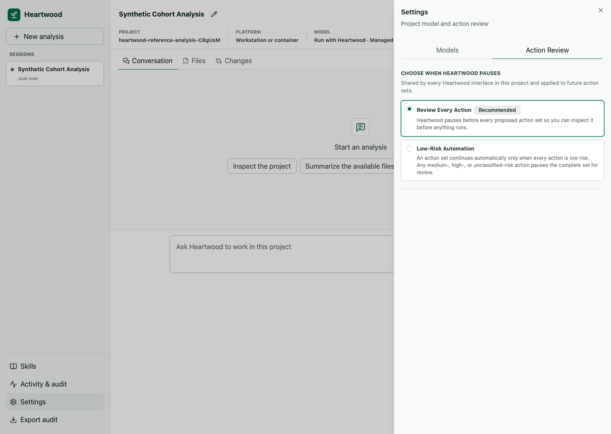

<!--
This source file is part of the Heartwood open-source project
SPDX-FileCopyrightText: 2026 Stanford University and the project authors (see CONTRIBUTORS.md)
SPDX-License-Identifier: MIT
-->

# Actions, Sessions, and Audit History

Heartwood separates a model suggestion from an executed action.
OpenHands proposes tools, Heartwood applies the selected confirmation policy, and the session records the decision and result.

## Choose When Heartwood Pauses

| Mode | Behavior |
|---|---|
| **Review Every Action** | Pause before every OpenHands action set so you can inspect it before anything runs |
| **Low-Risk Automation** | Continue only action sets made entirely of low-risk actions; pause the complete set when any action is medium risk, high risk, or unclassified |

The detected platform policy determines which modes are available.
**Review Every Action** is the default and the recommended mode while learning the system or working with sensitive projects.
The selected mode applies to future action sets in the project and is shared by the terminal, browser, and notebook bridge.

In the full-screen terminal, enter `/permissions` or press `Ctrl-P` and choose **Action Review**.
In the browser, select the current **Action review** value in the session header or open the **Action Review** settings tab.

For scripts and the plain terminal, use:

```bash
heartwood actions set ask-every-time
heartwood actions set auto-approve-low-risk
```



## Grouped Decisions

OpenHands may propose several related tool calls as one action set.
Heartwood displays those calls as one action set and resolves them together instead of presenting misleading per-item controls.

A set is allowed only after the user or policy resolves the pending review.
Allowing the set runs every member once.
Rejecting the set prevents all of its members from executing.

## Session History

Session events include user requests, model-route decisions, final assistant responses, proposed tools, confirmation decisions, tool outcomes, lifecycle, task status, model usage, specialist lineage, and stable errors.
The gateway turns that stream into one projection for terminal, browser, and notebook clients.
Incremental response tokens are visible while the model works but are not persisted.

Each proposed tool has one versioned action record.
It correlates the OpenHands action and tool-call identifiers, grouped decision, typed terminal, file-editor, Task, or other arguments, execution state, bounded outcome, and explicitly supported affected paths.
States distinguish proposed, awaiting review, approved, rejected, running, succeeded, failed, and outcome unknown.
Heartwood does not infer authoritative file changes from shell command text.

Use `/replay` in the terminal or the browser activity view to inspect it.
Replay verifies the audit chain and the one-to-one hash binding between each audit record and the complete session event before returning persisted history.

## Audit Export

Use `/audit-export` or the browser export control to create a JSON Lines file for review.
The export is scrubbed and content-minimized.
It records task counts and statuses instead of task titles or notes, usage totals instead of completion content, and stable error codes instead of provider details.
Exact action arguments, commands, affected paths, file content, diffs, tool output, and failure text remain in private session state and are not copied into the audit export.
Operational identifiers, decisions, classifications, counts, and timestamps may still be sensitive in context.

An audit record supports review and reproducibility; it is not proof that a scientific result is correct or that a deployment meets a regulatory requirement.
