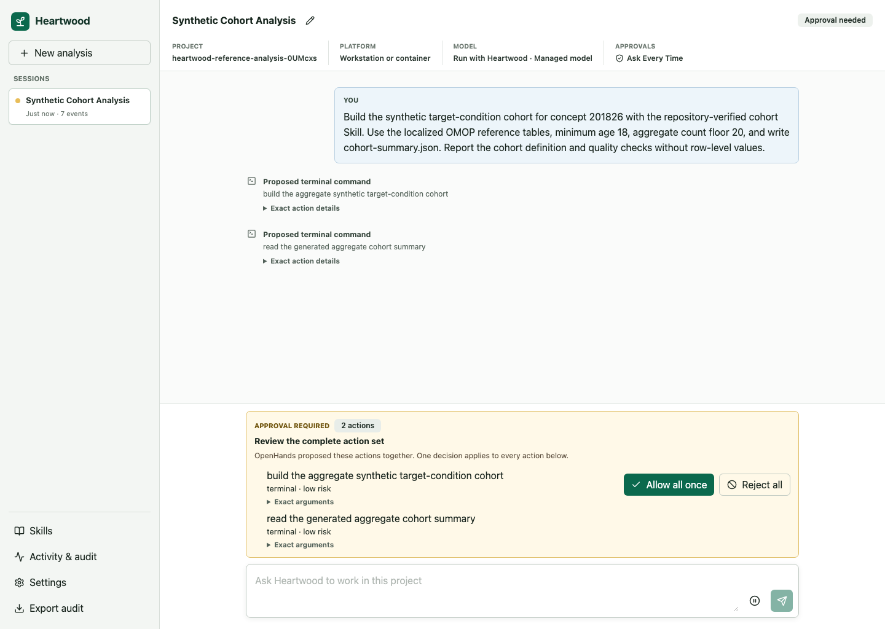

<!--
This source file is part of the Heartwood open-source project
SPDX-FileCopyrightText: 2026 Stanford University and the project authors (see CONTRIBUTORS.md)
SPDX-License-Identifier: MIT
-->

# Use the Browser

The browser interface presents conversations, action review, model setup, Skills, activity, and audit export without introducing a separate backend or project state.
It is available on workstations, in the generic container, and through Terra's authenticated Jupyter proxy.

## Open the Interface

From the project directory, run:

```bash
heartwood --interface web
```

Keep the terminal process running and open the exact URL Heartwood prints.
On a workstation the default is `http://127.0.0.1:8767/`.
On Terra, Heartwood prints the authenticated proxy path for the current runtime; open it on the same Terra Jupyter host, or use the tutorial notebook to render it as a clickable link.
Do not shorten or reuse a path from an old runtime.


## First Use

Opening the page is read-only until you select **Use this project**.
The setup panel then presents model sources available in the detected environment, models returned by the selected service, and credential handling supported by the platform.

The project, model selection, and action-confirmation setting are shared with the terminal and notebook bridge.
Provider tokens are never stored in browser storage.

## Work With a Session

The first browser conversation is the same **Main session** used by the terminal and notebook defaults. Choose a named session explicitly when you want a separate conversation.

- Use **New analysis** to create another persistent session.
- Enter requests in the composer after model readiness is confirmed.
- Open **Activity** to inspect route decisions, tool results, and errors.
- Open **Skills** to inspect repository-verified and installed Skills.
- Open **Settings** to change the selected model or action-confirmation mode.
- Export the audit record from the session controls.

## Review an Action Set



The review panel lists all proposed members together with tool names, risk labels, summaries, and relevant arguments.
**Allow all once** and **Reject all** resolve the complete OpenHands action set.

## Keep the Interface Reachable

Bind Heartwood to loopback unless a trusted authenticated proxy terminates access.
The development server and generic container do not add user authentication by themselves.

If the page loads but requests fail, keep the launching terminal open and run `heartwood doctor` in another terminal from the same project.
See [Diagnostics and Troubleshooting](../reference/troubleshooting.md#browser-access).
