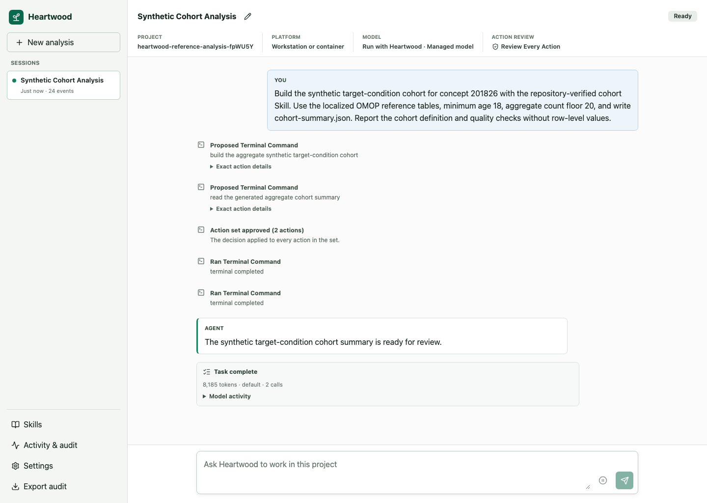
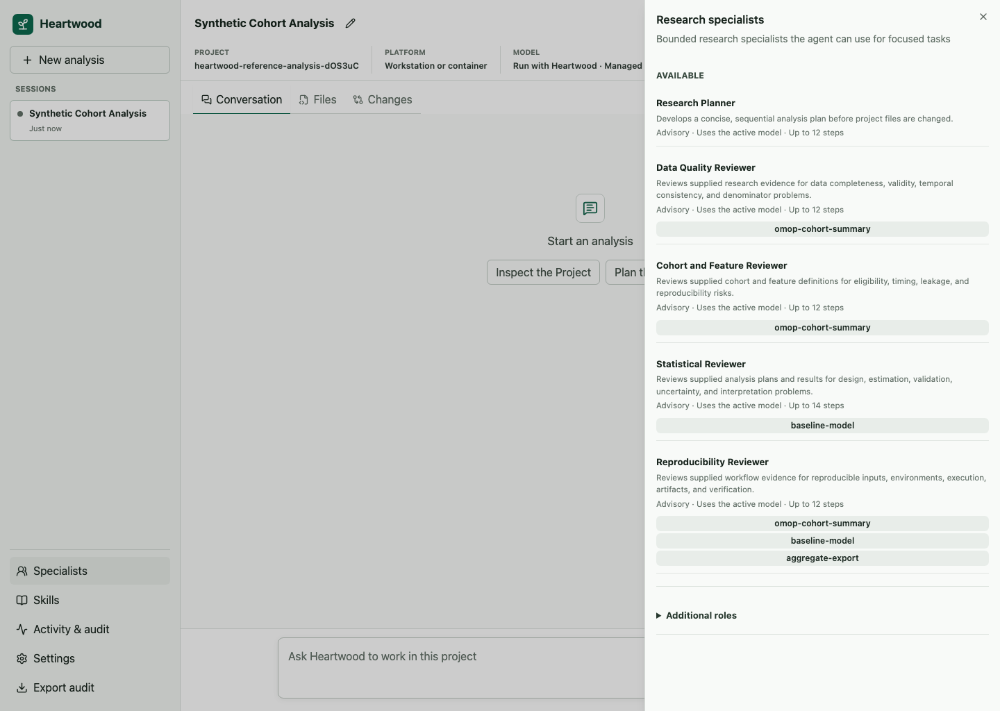
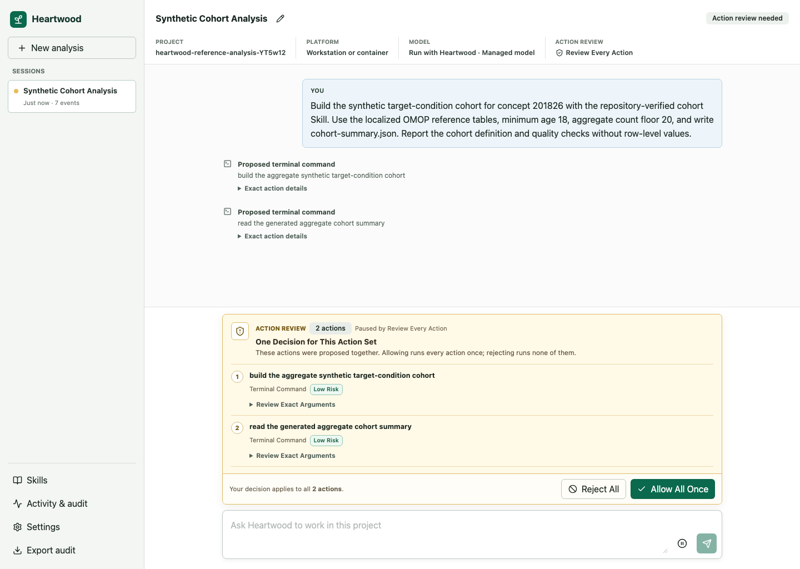
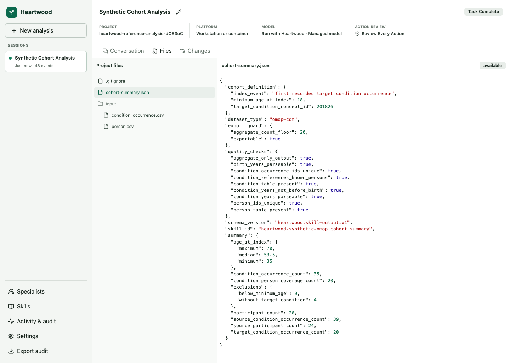
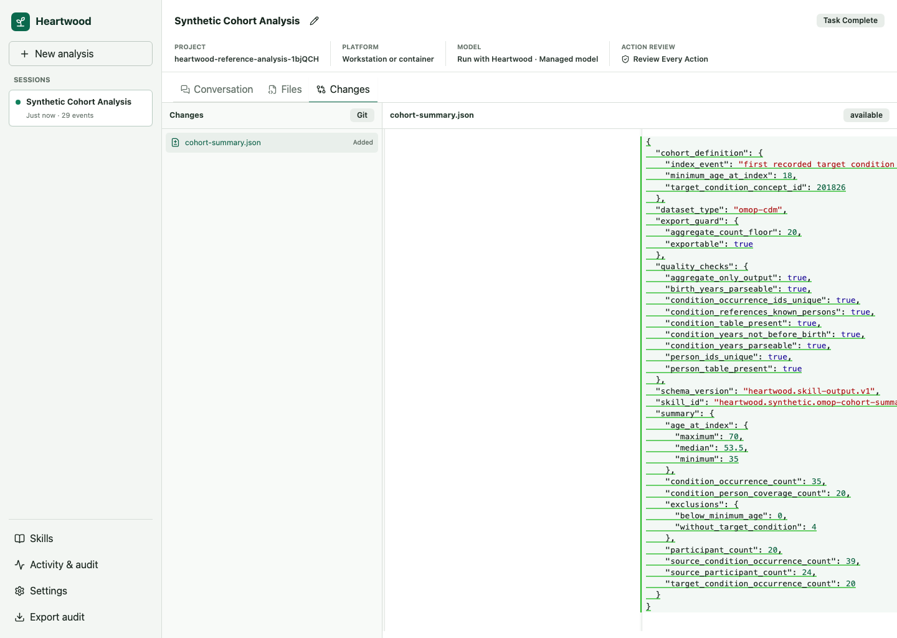

<!--
This source file is part of the Heartwood open-source project
SPDX-FileCopyrightText: 2026 Stanford University and the project authors (see CONTRIBUTORS.md)
SPDX-License-Identifier: MIT
-->

# Use the Browser

The browser interface presents conversations, action review, read-only project files and changes, model setup, Skills, activity, and audit export without introducing a separate backend or project state.
It is available on workstations and in the generic container.
Terra and Stanford Carina do not expose a supported Heartwood browser route; use their terminal or notebook interfaces instead.

## Open the Interface

From the project directory, run:

```bash
heartwood --interface web
```

Keep the terminal process running and open the exact URL Heartwood prints.
On a workstation the default is `http://127.0.0.1:8767/`.



## First Use

Opening the page is read-only until you select **Use this project**.
The setup panel then presents model sources available in the detected environment, models returned by the selected service, and credential handling supported by the platform.

The project, model selection, and action-review setting are shared with the terminal and notebook bridge.
Provider API keys and subscription tokens are never stored in browser storage.

For **Sign in with ChatGPT**, select the connection and choose **Sign in with ChatGPT**.
Open the displayed OpenAI page, enter the one-time code, and return to Heartwood.
The page updates when OpenHands has stored the account credential; you can then load the supported model list and make a selection.
Use **Sign out** in the same panel to remove the account from the OpenHands credential store.

If you download or import a model for Heartwood to run, wait for **Downloaded. Restart Heartwood to load this model.**
Stop the launching command with `Ctrl-C`, then run `heartwood --interface web` again from the same project.
Heartwood starts and supervises the selected model before reopening the page.
Hosted and Stanford AI API Gateway connections do not require this restart.

## Work With a Session

The first browser conversation is the same **Main session** used by the terminal and notebook defaults. Choose a named session explicitly when you want a separate conversation.

Heartwood offers at most two suggested next steps based on the current session state.
Selecting one places its full request in the composer so you can review or edit it before sending.
These suggestions come from the gateway and are the same ones shown by the terminal and notebook bridge; they do not infer scientific conclusions from project data.

- Use **New analysis** to create another persistent session.
- Enter requests in the composer after model readiness is confirmed.
- Send additional guidance or pause while OpenHands is working.
- Use **Files** to inspect the bounded project tree with read-only syntax highlighting.
- Use **Changes** to inspect Git changes or session-attributed non-Git changes with read-only per-file diffs.
- Inspect task progress, model-call totals, and sequential specialist status below the conversation.
- Open **Activity & audit** to inspect route decisions, tool results, and errors.
- Open **Skills** to inspect repository-verified and installed Skills.
- Open **Specialists** to inspect the bounded research specialists available to the parent agent.
- Select the current **Action review** value in the session header to change when Heartwood pauses.
- Open **Settings** to change the selected model or action-review mode.
- Export the audit record from the session controls.

The session header and conversation use the same gateway-owned states as the other interfaces, including ready, working, waiting for review, paused, complete, rejected, and recovery-required conditions.
When a command cannot be applied, the browser presents a separate request notice without replacing the authoritative agent lifecycle.
Task and specialist labels are shown in researcher-facing language; OpenHands identifiers remain available under **Technical details** when they are needed for diagnosis.



When the parent delegates work, the OpenHands Task action appears in the normal grouped review flow.
Heartwood runs one specialist at a time and shows its lifecycle and final result in the shared session projection.
See [Research Specialists](specialists.md) for the available roles and their boundaries.

Agent responses support headings, lists, tables, quotations, links, inline code, and code blocks.
Heartwood treats every response as untrusted content: raw HTML and unsafe links are removed, remote images are not loaded, invisible control characters are made visible, and very large responses are truncated for display.

## Review an Action Set



The review panel lists all proposed members together with tool names, risk labels, summaries, and relevant arguments.
One decision resolves the complete OpenHands action set: allowing runs every listed action once, while rejecting runs none of them.
Completed action records show the correlated state, exit status, bounded result, and affected paths when OpenHands supplied reliable typed evidence.
Keyboard focus moves to a newly proposed action set and returns to the task composer after the decision is resolved.

## Inspect the Project

The **Files** and **Changes** views are read-only.
They never provide a second editing path around action review.
Tree, file, changed-path, and diff responses have fixed depth, count, line, and byte limits; the interface labels truncated or unavailable content instead of silently omitting the condition.



Select a file to inspect its contents without leaving the session.



Select a changed path to compare its current contents with the Git baseline.
When the project does not use Git, Heartwood instead shows changes that OpenHands reported through typed file-editor actions in the selected session.

Heartwood excludes `.heartwood/` and `.git/` at every depth and refuses path traversal, symbolic links, special files, and non-UTF-8 text.
In a non-Git project, **Changes** includes only successful typed file-editor actions from the selected session.
Terminal command text is not treated as authoritative file evidence.

## Keep the Interface Reachable

Bind Heartwood to loopback unless a trusted authenticated proxy terminates access.
The development server and generic container do not add user authentication by themselves.
Platform operators must configure the typed ingress mode, exact origin, base path, and trusted source boundary rather than relying on forwarded headers implicitly.
See [Security and Controlled Data](../operate/security.md#gateway-ingress).

If the page loads but requests fail, keep the launching terminal open and run `heartwood doctor` in another terminal from the same project.
If live updates are interrupted, the page first reconnects through the supported fallback transport without changing the command state.
If both live transports stop, the saved conversation remains visible and the page provides **Reconnect**.
See [Diagnostics and Troubleshooting](../reference/troubleshooting.md#browser-access).
